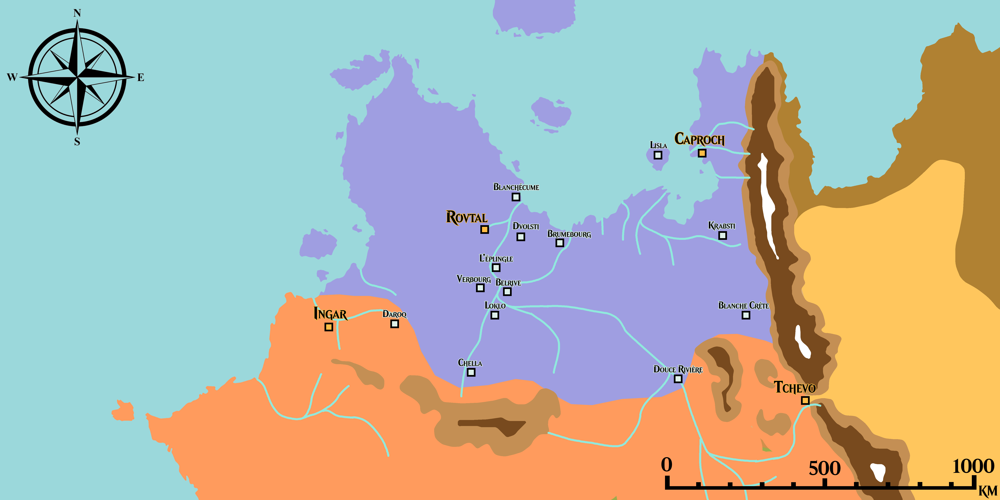

# Côte Épineuse

**Légende** :
* *Violet* - Climat sous-tropical humide
* *Orange* - Climat steppes chaudes
* *Marron* - Climat steppes froides
* *Jaune* - Climat désertique chaud
* *Le reste* - Topographie (montagnes)

## Climats 

### Sous-tropical humide
|||
|-|-|
|||

### Steppes chaudes
|||
|-|-|
|||

### Steppes froides
|||
|-|-|
|||

### Désert chaud
|||
|-|-|
|||