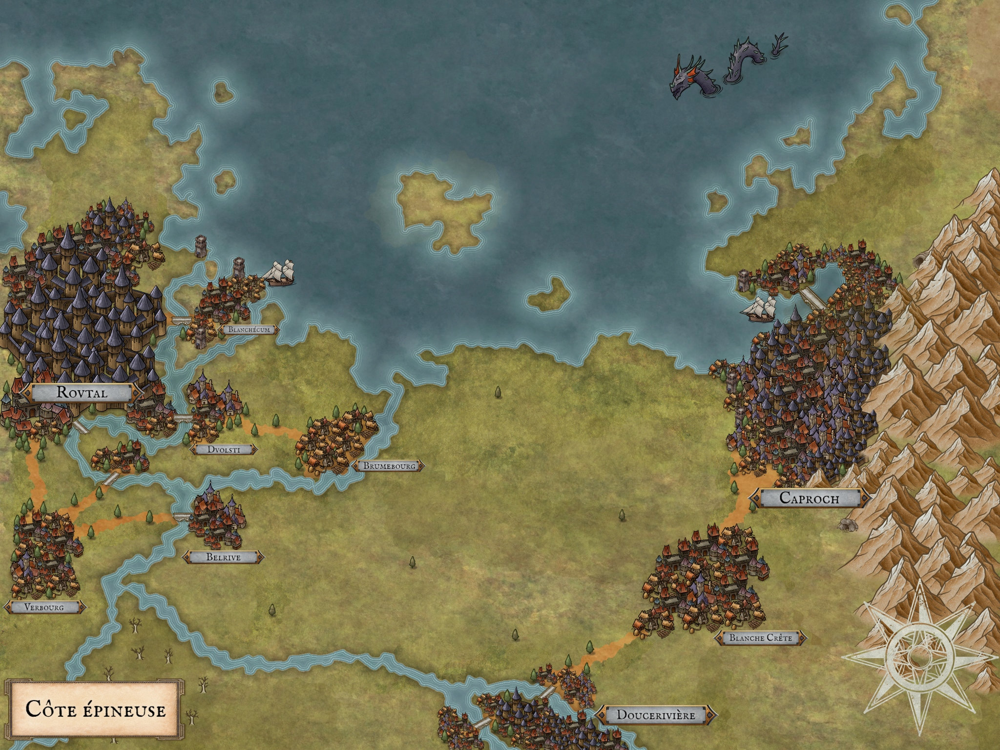
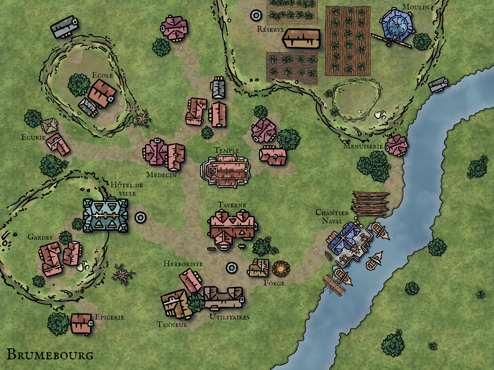

# JDR - Idées générales

# >> Scénario global <<

## Point de départ

Le scénario se passe dans le même univers que la campagne précédente, plusieurs centaines d'années dans le futur.

Les PJ sont initialement des habitants de Brumebourg. Brumebourg est un petit village de la partie Ouest de la Côte Epineuse, qui dépend beaucoup de l'influence des villes environnantes, notamment Dvolsti (environ 50km à l'Ouest) et Rovtal (100km environ à l'Ouest). 

Rovtal et Caproch sont deux villes majeurs dont la présence n'est permise que grâce à la présenc de deux cristaux naturels stabilisants les leylines. L'ensemble du reste des villes et villages de la région n'est présent que grâce à l'installation de stabilisateurs de mana artificiels.

Brumebourg se caractérise des autres villes par sa taille (beaucoup plus petite), ce qui justifie peu la présence d'un stabilisateur, qui est une denrée rare. 

De ce fait, et de part sa petitesse et son éloigement du reste du territoire, Brumebourg est un territoire qu'il est facile de conquérir ou contester, et le reste du territoire auquel Brumebourg est attaché y tient relativement peu. 

Au début de la campagne, c'est la société des **Tisserands** de Caproch, qui est la société de marchands par lequel tout passe (qui discrète mais pas secrète), qui souhaite établir un nouvel itinéraire commercial entre Caproch et Rovtal. Cet itinéraire commercial passerait par la mer, par une île inhabité proche de la côte. Le problème est le suivant : lors des premiers tests, le stabilisateur de leyline qui a été mis en test sur l'île s'est révélé non fonctionnel car il y a trop de tension "leyline-ique" proche de Rovtal (la leyline s'efforce de passer par Brumebourg tant qu'il y a un stabilisateur par là-bas.)

Pour remédier à cela, les **Tisserands** ont décidé de saboter le stabilisateur de Brumebourg pour libérer la tension "leyline-ique". Ils ont alors cherché des alliés au sein de Rovtal qui voudrait bien s'occuper de cela, vu que les Tisserands n'ont pas de contact dans la criminalité dans Rovtal. Les alliés que les Tisserands ont trouvé est : le **culte de Komorath**.

Le **culte de Komorath** est une église présente dans **Rovtal** et dans **Dvolsti** qui est particulièrement mal vue car elle vénère un dieu jugé mauvais et cruel : Komorath, le Prisme Brisé, dieu de la Tromperie et des Arts Obscurs. Certains membres de ce culte ont été magiquement altérés et sont devenus des **Sombraurs**, créatures magiques qui se nourissent de l'énergie magique des êtres vivants (tels des vampires avec le sang).

Afin que les **Sombraurs** aient plus de proies faciles, cela les arrangerait qu'il y ait plus de réfugiés qui trainent dans les rues, ou des sans abri, qui serait donc le cas si le village de Brumebourg était amené à disparaître. 

En première approche, le **culte de Komorath** ne jugeait pas cette tâche comme étant critique ou compliquée, et donc a mandaté une organisation criminelle de **Dvolsti**, les **Enfants de la Rue** afin d'effectuer la sale besogne.

Les **Enfants de la Rue**, qui comporte une branche de "gros bras", décident d'envoyer ces derniers à Brumebourg pour saboter le stabilisateur. C'est dans cette conjoncture que la campagne commence.

## Quêtes en cours

### Quête : Organiser le Festival des Brumes
Le **Festival des Brumes** approche ! Tous les printemps, le village de **Brumebourg** organise le Festival des Brumes, célébrant les nouvelles récoltes du village et la fin de l'hiver, marqué par ses brumes permanentes. A cette occasion, tout le village s'anime et tous les habitants se reconvertissent le temps du festival afin de l'organiser. Toutes les festivités sont animés par l'envoyé de **Rovtal** qui fait office de représentant du pouvoir.

## Quêtes disponibles

### Quête : Organiser le Festival des Brumes

#### Mission : Aider aux préparations
L'organisation du festival demande beaucoup de préparation en amont. Le festival durant plusieurs jours, il faut : 
* Préparer assez de nourriture afin de nourrir tous les visiteurs (voir le cuisinier de la taverne) ;
* Aider à monter tous les stands dans la place centrale du village et à les décorer (voir le menuisier et une personne en charge d'organiser le festival);
* S'occuper de rendre les lieux présentables en éliminant la vermine qui prolifère dans le village (il paraît que la taverne est infestée de rats...) (voir le patron de la taverne);
* Aller récupérer des herbes sauvages qui serviront à la conconction des mets délicats (voir l'herboriste et l'épicier);
* Aller récolter une contribution financière chez les retardataires (voir un PNJ random) ;
* Résoudre le conflit sur la présentation des fruits et des légumes des agriculteurs (voir un agriculteur) ;
* Travailler à la confection d'objets souvenirs (voir le forgeron) ;

#### Mission : Accueillir les visiteurs
La veille du festival, plusieurs visiteurs viennent de loin et souhaitent parler à des locaux : 
* Délégation officielle de Rovtal
* Aventuriers de Dvolsti
* Cuisiniers de Dvolsti
* Les marchands d'épices de Rovstal
* Artistes errants de Blanchécum
* Nobles en vacances de Blanchécum
* Le vieux mage du quartier nord de Dvolsti

#### Mission : Enquêter sur les visiteurs
Certains visiteurs semblent moins bavards que d'autres et participent moins aux activités

#### Mission : Faire la sécurité du Festival des Brumes
Cette année, les Aventuriers, travaillant d'habitude dans les alentours du village, sont désignés pour monter la garde lors du festival. Ce faisant, ils seront sans doute amenés à gérer des situations délicates.

### Quête : Retrouver les saboteurs des Enfants de la Rue
### Quête : Réparer le stabilisateur
### Quête : Défaire les Enfants de la Rue
### Quête : Remonter jusqu'au culte de Komorath

## Quêtes finies

## Les villes environnantes

### Résumé

|              | Brumebourg | Dvolsti | Rovtal | Caproch |
| ---          | --- | --- | --- | --- |
| Taille       | 240 | 3500 | 28500 | 17300 |
| Spécialité   | Cultures | Cuisiniers | Vins | Tissus, Livres, Cartes |
| Politique    | Vassal de Rovtal | Vassal de Rovtal | Féodalité | Oligarchie |
| Organisation | - | Les Enfants de la Rue | Les Sombres Peintres | Les Tisserands |

### Caproch
Cette ville a originellement était fondée par des **Léonins**, et cela se constate encore aujourd'hui dans la répartition ethnique. A l'origine une tribu qui a inventé des procédés de fabrication de papier, ils ont rapidement profité de cet avantage technologique pour commencer à cartographier leurs environs. Très vite, ils utilisèrent ces cartes afin de pouvoir naviguer efficacement vers d'autres tribus et forger leur esprit commercial.

A l'âge de l'apparition des stabilisateurs naturels, cette ancienne tribu a rusé afin de pouvoir vite s'installer dans la région, dans une étroit espace, entre une montagne et un accès à la mer, facile à défendre et avec ouverture sur l'extérieur et accès à des ressources naturelles.

L'esprit commercial a encore plus fleuri une fois que la population a pu se sédentariser. La cité a rapidement prospéré, et les grandes familles marchandes ont rapidement pris de l'importance politiquement. On compte plusieurs types de marchandises que les familles de Caproch exportent : leurs livres, leurs cartes, des tissus précieux, des poissons péchés dans la région, ainsi que de nombreux objets manufacturés à bases de minéraux trouvés dans les montages (cuivre, argent et fer).

Le système politique de Caproch s'organise autour de ses grandes familles. Régulièrement, plusieurs de ces familles se retrouvent autour d'une table afin de parler d'intérêt commun, tant dans le territoire qu'à l'extérieur. Les habitants de Caproch qui ne font pas partie de ces grandes familles se contentent généralement *subir* les décisions prises par ses familles.

Il y a déjà plus d'une centaine d'années, des tisserands (activité généralement peu pratiquée par les grandes familles) de la population générale se sont réunis afin de faire valoir leur intérêt propre. Cette organisation, qui se nomma alors simplement **les Tisserands**, pris de plus en plus d'ampleur au fur et à mesure des années, si bien qu'elle devint *de facto* l'organisation qui influence le plus Caproch, et qui ose mener des pratiques parfois mal vues par les grandes familles. 

Les **Tisserands** est une organisation discrète, dont l'existence est attestée, dont les membres se renouvellent par initiation : un nouveau membre peut être proposé par un membre actuel, et après maintes "épreuves", la nouvelle recrue est intégrée. Dans sa jeunesse, cette organisation a longtemps éviter à ce que les grandes familles l'infiltrent ; de nos jours, c'est un endroit où les grandes familles peuvent cotoyer le peuple, et où la plupart des membres ne sont plus tisserands.

### Rovtal
**Rovtal** est une ville fondée par une ancienne tribu composée de **Sauriens** et de **Caranides**. Autrefois, cette tribu était connue pour ses performances au niveau de l'agriculture, ayant combiner habilement magie et culture afin de pouvoir se sustenter. 

C'est donc avec joie que cette tribu s'est installée dans cette zone lors de l'apparition des stabilisateurs naturels, puisque l'Ouest de la Côte Épineuse est connue de nos jours pour ses terres fertiles et argileuses, et son exposition au soleil. Parmi toutes les cultures différentes, on trouve notamment : des agrumes, des vignes pour la fabrication du vin, des légumes et fruits charnus et juteux, ainsi que des baies de toutes sortes.

De plus, les cultivateurs de Rovtal usent fréquemment de la magie afin de s'occuper au mieux de leurs cultures, de changer leurs tailles et leur goût, et même de les faire changer de couleur et de texture pour les mets les plus raffinés et exotiques. Pour cela, ils invoquent les magies des deux dieux les plus populaires de la ville : **Muhuta**, déesse de la Transfrmation et du Renouveau, et **Italis**, dieu de la Vie et de la Mort. 

Le temps passant, la ville s'est agrandie et hiérarchisée. Les terrains cultivés se faisant de plus en plus grands, les savants de Rovtal ont dû trouver un moyen de stabiliser les leylines à une grande distance de leur centre-ville, organisé autour du stabilisateur naturel. Les stabilisateurs artificiels étant inventés, ils en placèrent de plus en plus loin afin de conquérir un territoire plus grand, ce qui a rapidement nécessité une organisation efficace. De nos jours, un seigneur reigne sur Rovtal, et il mandate des représentants dans les villes aux alentours afin de gérer localement les villages. 

Malgré la prévalence des cultes de **Italis** et **Muhuta**, d'autres cultes existent dans Rovtal, mais leurs traditions et croyances sont moins connues du grand public. On citera notamment le culte de **Komorath**, dieu de la Tromperie et des Arts Obscurs, qui se font appeler les **Sombres Peintres**, qui voient d'un mauvais oeil l'expansion toujours constante de la ville, prêchant que la stabilité ne peut engendrer que la ruine. Dans le secret, ce culte comprend des **Sombraurs** en son sein, des créatures se nourissant de la magie d'autrui pour survivre, créatures qui ont été créées (et qui le sont toujours) via un long rituel à la gloire de **Komorath**. Dans l'imaginaire des **Peintres** et des **Sombraurs** : le Chaos mène à la Liberté, la Liberté mène à l'Art, l'Art mène au Plaisir.

### Dvolsti
**Dvolsti** est un petite ville située non loin de Rovtal, étant son vassal. Par rapport à **Rovtal**, Dvolsti est relativement récente : elle a été créée autour d'un stabilisateur artificiel de leyline, et le besoin de la création de cette ville s'est fait sentir suite à l'expansion de Rovtal.

Située sur la rive droite du fleuve, **Dvolsti** reste quand même connectée à sa ville mère via un pont, et s'excentre un peu afin de profiter à la fois des ressources fluviaales et d'avantage d'espace pour s'étendre sur l'autre rive. Ville relativement modeste en taille et au niveau pécunier, la différence d'ambiance se fait sentir avec Rovtal, qui est *de facto* la capitale : les rues sont plus spacieuses, mais moins bien entretenues, la population est plus pauvre. Une source de revenus certain reste **Blanchécum** qui se trouve en aval, et qui est considérée comme *la* ville de villégiature par excellence de Rovtal. 

Dans ce climat, il a été normal de voir apparaître deux organisations pour laquelle **Dvolsti** est connue : 
* **L'école de cuisine**, qui profite de l'abondance des ressources avoisinantes. Les meilleurs cuisiniers vont ensuite travailler dans les villes voisines, **Blanchécum** se réservant les meilleurs parmi les meilleurs ; 
* **Les Enfants de la Rue**, organisation criminelle tentaculaire, qui sévit dans la région et qui est basée quelque part dans la ville.

En plus de **Muhuta** et **Itais** qui sont vénérés dans **Rovtal**, le culte de **Kscrucius** est assez commun dans la ville. **Kscrucius**, dieu de la Discipline et de la Douleur, représente une lueur d'espoir dans la vie des habitants de **Dvolsti**, qui estiment que leur situation moins aisée est une souffrance à endurer avant de pouvoir gravir les échelons et un jour pouvoir vivre mieux.

Les **Enfants de la Rue** sont des adeptes de ce crédo, estimant que leur vie plus que modeste n'est qu'une autre épreuve qu'ils doivent endurer et que c'est grâce à leur investissement qu'ils réussiront un jour à s'en sortir. Pendant ce temps, il leur semble logique et juste de faire ce qui leur permet de survivre, quitte à ce que des inconnus en souffrent.

### Brumebourg
**Brumebourg** est un petit village situé à 50km à l'Est de **Dvolsti**. Très axé autour de l'agriculture, le village a tout appris deu savoir-faire de Rovtal.Ce sont quelques centaines d'habitants qui travaillent tous les jours aux champs afin de pouvoir produire assez de nourriture qu'ils exportent ensuite aux villes voisines. 

Village assez modeste, tout le monde se connaît très bien et se rassemblent souvent le soir à la tarverne du village, la **Taverne de Brume**, afin de discuter, parler de la journée, et déguster des plats préparés par le tavernier. Plusieurs structures et institutions sont présentes en plein coeur du village : forgeron, école, un hotêl de ville qui abrite l'envoyé de Rovtal, une écurie, etc. 

Outre son agriculture, Brumebourg est également connue pour son chantier naval et son port de passage, positionné directement sur le fleuve mais qui ne connecte malheuresement pas les parties les plus actives de la partie Ouest de la Côte Epineuse.

Les habitants de Brumebourg accordent une grande importance à leur anciens : les plus âgés sont très respectés, et une fête s'organise chaque solstice en l'honneur des défunts : les **Veillées des Ancêtres**. Ces veillées sont très attendues par l'ensemble de la population, et leurs formes changent grandement en fonction de la saison, l'été étant généralement réservé pour les célébrations joyeuses, tandis que l'hiver est réservé pour le recueillement. Sous l'influence de Rovtal, ces veillées sont en été sous la tutelle de **Muhuta**, déesse du Renouveau, et en hiver sous la tutelle d'**Italis**, dieu de la Mort et de la Vie.

De façon générale, la vie à Brumebourg est vue comme une vie assez traditionnelle, puisque le niveau de vie reste assez modeste : on peut encore croiser certains habitants qui souhaitent encore aller chasser ou cueillir dans les environs afin de changer un peu de la nourriture qui est élevées près du village.

Assez régulièrement, certains des habitants feront tout le pélerinage jusqu'à **Dvolsti** afin de récupérer des ressources qu'on ne trouve pas au village (pour l'ensemble des artisans de Brumebourg notamment), et en profitent échanger des ressources produites dans le village contre des nouvelles du monde. 

## Cartes de la campagne

# >> Worldbuilding <<

## Espèces peuplant le monde 

### > Conscientes
* Elfes
* Humains
* Reptiloïdes : Sauriens (Lézard), Alligatorides (Alligator), Tortuguéen (Tortue), Varanides (Varan)
* Félinoïdes : Léonins(Lion), Tigryliens (Tigre), Panthérans (Panthère), Felicis (Chat)
* Minotaures
* Hommes-rats
* Avemains : Strixiens (Hiboux, Chouettes), Aquilins (Ai), Corvidés, Ibissides

### > Animales
* Dinosaures
* Rapaces
* Ours rocheux
* Hyène des sables
* Cerfs

### Autres 
* Sombraurs

#### Sombraur
* Ce sont des créatures conscientes qui étaient autrefois une autre race (comme des vampires).
* Ils sont reconaissables à leur marque sur leur bras droit : c'est une marque ressemblant à un tatouage tribal, qui est tricolore (noir, blanc et une autre couleur), marque qui grandit à chaque personne qui succombe à leur aspiration de magie.
* Ils ont également des écailles de serpents qui se forment sur leur corps.
* Ils ne se nourissent pas, mais absorbent l'énergie magique des êtres vivants par contact. Lors de l'absoription de l'énergie magique, leurs veines deviennent de la même couleur que la troisième couleur de leur marque.
* Ils vénèrent le dieu Komorath (domaines de la tromperie, de l'illusion, et des arts obscurs).
* Ils sont sensibles à l'eau.
* S'ils restent trop longtemps exposés à la lumière, ils deviennent affaiblis.
* Ils ont une plus grand longévité que leur race d'origine. Au moins 10 fois.
* Ils manipulent tous : la magie de l'ombre et de la lumière.
* Pour se reproduire, il faut effectuer un rituel où trois Sombraur acceptent de créer un nouveau Sombraur. Ils exposent alors la nouvelle recrue à la magie de l'ombre pour la lier à leur dieu, et la marque se forme.

## Grandes villes

* Plusieurs capitales ont vu le jour lors de l'apparition (mystérieuse ?) de plusieurs cristaux gigantesques qui ont stabilisés les leylines autour d'eux.

* Chacune de ces villes est construite autour d'un cristal.

* Au niveau ethnique, chaque ville est constituée majoritairement d'une seule espèce.

## Stabilisateurs de leyline

* Les stabilisateurs de leyline ont été inventés, et permettent à des villes et des villages modestes de se former autour de ces stabilisateurs. 

* Les grandes villes possèdent des stabilisateurs naturels, en dehors seuls les stabilisateurs artificiels existent.

* Les stablisateurs coûtent cher, et donc ce ne sont que les assez grandes structures et habitations qui peuvent se le permettre.

* Les stabilisateurs ressemblent à des cristaux taillés, et possèdent une tige qui va se loger profondément dans le sol pour s'attacher à des leylines possiblement très enfouies.

* Ils sont taillés directement dans un cristal de plus grande taille, doivent être mis en place par un "spécialiste", et doivent recevoir une maintenance régulière pour s'assurer de la solidité du lien entre eux et les leylines environnantes.

* En cas d'absence d'un stabilisateur, ou de la défaillance d'un stabilisateur, les leylines sont suceptibles de bouger toutes les 6 semaines au maximum. Les stabilisateurs agissent comme des points de contrôle : si on perd un stabilisateur, la leyline est assurée de passer par un autre stabilisateur proche, mais est libre du côté du stabilisateur environnant.

* On peut casser un stabilisateur de plusieurs façon : intégrité physique (le casser), intégrité magique (absorber ou perturber sa magie)

* Il est possible de réparer un stabilisateur cassé avec l'aide d'un magicien assez puissant qui puisse insuffler une quantité de magie assez puissante pour rétablir son intégrité magique, ou une magie un peu moins puissante s'il y a un bout de stabilisateur à côté (le morceau cassé, ou un autre).

## Les sorts de poches
Parmi les habitants les plus aisés de cet l'univers, certains peuvent fréquemment se payer des sorts de poche. Un magicien assez puissant peut canaliser tout un sort et l'encapulser dans un cristal magique, gravant par la même occasion le sort directement sur le cristal. Une fois soumis de nouveau à la même magie qui a servi à le créer, le cristal s'active et déploir le sort qu'il contient. 

Ce sorts sont très pratiques mais peuvent se révéler assez coûteux, et ne se trouvent pas dans les coins de rue : ils nécessitent déjà l'utilisation d'un cristal, denrée relativement rare, ainsi que l'intervention d'un magicien capable de programmer le sort dans le cristal avec précision. 

Les habitants les plus riches des grandes villes se déplacent avec toute une panoplie de sorts de poches, par exemples afin de créer des abris dans la nature avec un sort de construction de pierre, ou afin de produire de l'eau afin de boire.

## Pierre des Occultistes

XXX

## Cosmologie
Le plan Matériel (celui où les espèces habitent) est le seul plan qui ait réussi à développer de la vie.

Tous les autres plans sont constitués : d'énergie magique pure et d'élémentaux, tous deux faits de l'élément principal formant le plan. Par exemple, le **plan de la lave** contient des vues sans fin de lave et roches fondues, sans trop de réelle structure, avec des torrents de magie qui circulent d'une part à l'autre du plan. Les élémentaires sont composées de la même matière et énergie, des errants composés de lave.

Plusieurs plans gravitent tous entre eux et entrent en collision par endroits. Aux endroits où les plans rentrent en collision, ils possèdent la même structure : une grotte sera la même sur le plan matériel ou sur le plan du corail, aux "éléments décoratifs" près.

Les leylines correspondent aux flux de mana / d'énergie qu'il peut exister entre tous ces différents plans : quand les leylines sont présentes dans le plan Matériel, cela veut dire qu'il y a un plan qui touche le plan Matériel à cet endroit.

## Croyances
De nombreuses personnes personnifient les plans et leur donne une volonté propre. Les plans sont la source de magie de toute chose, certains pensent que les plans donnent de leur bonne volonté de leur magie pour l'utiliser sur le plan Matériel.

Les plans n'apparaissent qu'en vision à certaines personnes, ils ne savent donc pas ce qu'ils contiennent et ne peuvent donc pas témoigner de l'absence de vie qu'il y a. Ils considèrent les plans comme le royaume du dieu associé.

## Plans voisins connus

### Plan du son et de la musique
 * **Divinité** : Maunad, Compositeur des Cieux
 * **Alignement** : Loyal Bon
 * **Domaine** : Harmonie, Inspiration Artistique
 * **Qualités** : Inspiré, Bienveillant
 * **Défauts**  : Influence les émotions de manière subtile
 * **Symbole** : Une lyre et trois étoiles
 * **Description** : Un elfe tenant une lyre, marchant sur un nuage
 * **Fait remarquable** : Il aurait inspiré un compositeur mortel à créer une musique si douce qu'elle aurait appaisé une région en guerre.

### Plan du métal et de la roche
 * **Divinité** : Ronar, Gardien du Métal
 * **Alignement** : Loyal Bon
 * **Domaine** : Protection des faibles
 * **Qualités** : Méticuleux, Ordonné
 * **Défauts**  : N'accepte pas les méthodes novatrices, Empêche le progrès
 * **Symbole** : Une enclume avec une épée en arrière plan
 * **Description** : Un Aquilin-Golem d'Acier qui protège trois personnes de ses ailes.
 * **Fait remarquable** : Il aurait créé un bouclier indestructible que seuls les purs pourraient porter.

### Plan de l'eau
 * **Divinité** : Qwar, Dompteur des Marées
 * **Alignement** : Neutre Bon
 * **Domaine** : Vie Aquatique et Guérison
 * **Qualités** : Calme, Bienveillant
 * **Défauts**  : Agit par devoir plutôt que par compassion
 * **Symbole** : Urne qui se verse
 * **Description** : Humain en robe sortant de la mer, avec des poissons à ses pieds.
 * **Fait remarquable** : Aurait calmé une tempête et a aidé à rebaptir la cité qu'elle a détuite.

### Plan des structures régulières
 * **Divinité** : Tremm, Ordre Incarné
 * **Alignement** : Neutre Bon
 * **Domaine** : Harmonie et Sagesse
 * **Qualités** : Clair dans les propos, Equilibré, Ordonné
 * **Défauts**  : Abandonne la créativité pour la conformité
 * **Symbole** : Un triangle dans un cercle
 * **Description** : Un elfe qui tient une sphère dans sa main droite.
 * **Fait remarquable** : Aurait aidé à ériger les premières cités.

### Plan de la vie et de la mort 
 * **Divinité** : Italis, Celui qui Commence et qui Finit
 * **Alignement** : Chaotique Bon
 * **Domaine** : La Mort et la Renaissance
 * **Qualités** : Impulsif, 
 * **Défauts**  : Injuste, Intervient sans qu'on lui demande
 * **Symbole** : Une feuille verte et une feuille morte
 * **Description** : Un Saurien, avec une robe en spirale de deux couleurs (couleur feuille verte, et couleur feuille morte). Il a deux doigts en l'air pour saluer.
 * **Fait remarquable** : Il est responsable de la création de la mort, afin que puisse renaître le monde et ne pas stagner.

 ### Plan des émotions
 * **Divinité** : Hénatra, Semeuse de Sentiments
 * **Alignement** : Chaotique Bon
 * **Domaine** : Emotions, Empathie, Emancipation
 * **Qualités** : Intuitive, Passionnée, Libre
 * **Défauts**  : Manque d'organisation, Versatile
 * **Symbole** : Un cercle noir avec un contour arc-en-ciel.
 * **Description** : Une léonine dans des vêtements amples, grand sourire bienveillant, une fleure à la main
 * **Fait remarquable** : Aurait libéré tout un peuple de l'oppression de son esclavagiste et les auraient aidé à se révolter.

 ### Plan de la gravité
 * **Divinité** : Rivea, Maîtresse des Astres
 * **Alignement** : Loyal Neutre
 * **Domaine** : Astres, Cieux, Mouvement
 * **Qualités** : Constante, Calme, Impartiale
 * **Défauts**  : Impitoyable
 * **Symbole** : Une sphère entourée de 4 autres petits astres
 * **Description** : Une strixienne en tailleur sur un globe
 * **Fait remarquable** : Elle aurait créé le cycle du jour et de la nuit pour rendre les nuits plus tolérables.

 ### Plan de la torture
 * **Divinité** : Kscrucius, Celui qui Endure
 * **Alignement** : Loyal Neutre
 * **Domaine** : Discipline, Rédemption via la Souffrance, Douleur
 * **Qualités** : Discipliné, Equitable
 * **Défauts**  : Aucune empathie, Indifférent
 * **Symbole** : Trois clous parallèles
 * **Description** : Un Strixien aux ailes coupées, et avec trois clous plantés dans chaque ancien emplacement d'ailes
 * **Fait remarquable** : Il serait intervenu pour donner la justice aux hommes et leur apprendre à expier leurs fautes par les châtiments.

### Plan de la transformation, désintégration et effritement
 * **Divinité** : Muhuta, la Grande Plannificatrice
 * **Alignement** : True Neutral
 * **Domaine** : Transformation et Renouveau
 * **Qualités** : Méthaphorique, Curieuse
 * **Défauts**  : Instable, Peut provoquer des catastrophes
 * **Symbole** : Une spirale
 * **Description** : Une divinité à deux têtes opposées, avec des éléments qui tournent autour d'elle. Entre ses mains des filaments. On pense que ces éléments contient l'information essentielle qui fait chaque être (information génétique)
 * **Fait remarquable** : Il paraît que c'est elle qui a fait la diversité des races dans ce monde.

### Plan des états de la matière
 * **Divinité** : Treyo, le Juste
 * **Alignement** : True Neutral
 * **Domaine** : Equilibre
 * **Qualités** : Flexible, Sans Jugement, Compréhensif, A l'écoute
 * **Défauts**  : Ne veut jamais interférer 
 * **Symbole** : Trois traits, un pour chaque état de la matière
 * **Description** : Un elfe en toge joignant ses mains
 * **Fait remarquable** : A doté les gens du sommeil (pas de la fatigue) afin qu'ils puissent être en paix. 

### Plan de la lave et du feu
 * **Divinité** : Ingar, le Forgeron Eternel
 * **Alignement** : Chaotique Neutre
 * **Domaine** : Artisanat et Créativité
 * **Qualités** : Déterminé, Passioné
 * **Défauts**  : Egoïste, Prêt à sacrifier les faibles
 * **Symbole** : Un marteau avec des flammes 
 * **Description** : Minotaure géant avec un sourire, frappant avec son marteau enflammé sur le sol qui est une enclume
 * **Fait remarquable** : Ingar est celui qui a forgé la première arme

### Plan de la tempête 
 * **Divinité** : Fuurma, Mère des Tempêtes
 * **Alignement** : Chaotique Neutre
 * **Domaine** : Tempête et Protection contre les forces naturelles
 * **Qualités** : Indomptable, Puissante
 * **Défauts**  : Imprévisible, Versatile, Apporte la protection et la destruction
 * **Symbole** : Un éclair traversant un tore nuageux
 * **Description** : Une Strixienne aux yeux lumineux et brillants, ses ailes projettent des éclairs. 
 * **Fait remarquable** : Fuurma a dévié une tornade qui devait dévaster une ville entière.

### Plan des glaciers
 * **Divinité** : Celis, le Coeur de Glace
 * **Alignement** : Loyal Mauvais
 * **Domaine** : Froid, Conquête, Ambition
 * **Qualités** : Stratégique, Réservé
 * **Défauts**  : Impitoyable
 * **Symbole** : Sceptre avec un flocon de neige au bout
 * **Description** : Un Leonin en armure lourde, assis sur un trône de flace.
 * **Fait remarquable** : Celis aurait gelé une mer entière afin de permettre à ses fidèles de la traverser pour aller conquérir un autre pays.

### Plan de la distorsion
 * **Divinité** : Stehr, l'Insaisissable
 * **Alignement** : Loyal Mauvais
 * **Domaine** : Corruption, Distorsion de la Réalité
 * **Qualités** : Machiavélique, Trompeur
 * **Défauts**  : Cruel
 * **Symbole** : Un prisme triangulaire déformé
 * **Description** : Un Saurien à six bras
 * **Fait remarquable** : A poussé de grands rois à la tyrannie.

### Plan de l'oubli et du néant
 * **Divinité** : Rueva, l'Arracheuse
 * **Alignement** : Neutre Mauvais
 * **Domaine** : Oubli, Néant, Perte
 * **Qualités** : Destructrice, Insaisissable
 * **Défauts**  : Indifférente à la perte, Sans Emotions
 * **Symbole** : Un livre avec des pages qui s'envolent
 * **Description** : Une Saurienne arrachant les pages d'un livre
 * **Fait remarquable** : Elle a effacé l'histoire des anciens (qui lui ont demandé) car cette histoire était trop lourde à porter.

### Plan du temps
 * **Divinité** : Porokros, Celui qui Toque
 * **Alignement** : Neutre Mauvais
 * **Domaine** : Manipulation, Fatalité, Vieillissement 
 * **Qualités** : Eternel, Comploteur
 * **Défauts**  : Insensible
 * **Symbole** : Un pendule
 * **Description** : Un homme-rat vieillard, avec un pendule dans sa main symbolisant le passage du temps
 * **Fait remarquable** : Il aurait toute une civilisation en accélérant le passage du temps pour les tuer de vieillesse.

### Plan de la lumière, de l'ombre et des couleurs
 * **Divinité** : Komorath, le Prisme Brisé
 * **Alignement** : Chaotique Mauvais
 * **Domaine** : Tromperie, Illusion, Art, Art obscurs
 * **Qualités** : Créatif, Imprévisible
 * **Défauts**  : Cruel, Se délecte du désespoir
 * **Symbole** : Prisme brisé
 * **Description** : Un elfe aveugle qui tient un prisme tringulaire brisé dans sa main gauche, et avec une couronne d'épines. Arbore toujours un sourire.
 * **Fait remarquable** : Aurait plongé une grande armée dans un sommeil sans fin, l'éradiquant durant une guerre.

### Plan du mental
 * **Divinité** : Liireon, le Comploteur
 * **Alignement** : Chaotique Mauvais
 * **Domaine** : Cauchemars, Troubles de l'Esprit, Confusion, Illusions
 * **Qualités** : Malfaisant, Manipulateur
 * **Défauts**  : Manque de discernement
 * **Symbole** : Une croix dans une spirale
 * **Description** : Un humain encapuchonné, une peau flétrie, des yeux noirs, 
 * **Fait remarquable** : Il aurait renversé des royaumes trop vite grandissants, et tué des dirigeants dans leur sommeil.

# >> Fonctionement spécifique D&D

## Clercs

Les divinités sont remplacées par les plans, mais chut, il ne faut le dire à aucun des joueurs ! Il faut le présenter comme : "la divinité X a son propre domaine dans le plan de XXX".

Chaque plan a sa liste de divinités associées.

## Occultistes

Les patrons sont remplacés par des artefacts magiques qui se lient aux joueurs. Les artefacts peuvent donner des indications aux joueurs, les brûler pour les faire aller dans un sens ou dans l'autre, des "faveurs", etc. 

Les artefacts sont généralement des objets infusés de la magie d'un plan en particulier. 