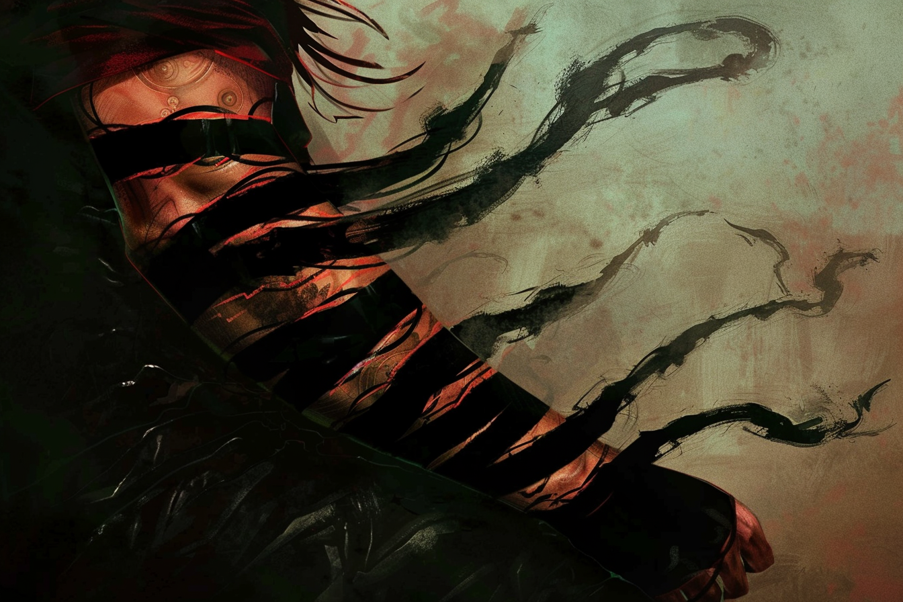

# Quêtes en cours

## Quête : L'Employeur de Rovtal

### Mission : Découvrir ses intentions
Les intentions exactes de l'employeur sont encore inconnues... Notamment pourquoi ils voulaient s'en prendre à [**Brumebourg**](../WORLDBUILDING/VILLES/Brumebourg.md).

> Nous devons découvrir le but des **Sombres Artistes** et des **Mains Noires**.

De toute évidence, le plan de l'employeur comprend au moins l'enlèvement de certaines personnes, comme **Iakob Samaras**. 

**Iakob Samaras** a été retrouvé mort et dépourvu de tout magie. Nous savons que [Griffes-Rouges](../WORLDBUILDING/PERSONNAGES/DVOLSTI/Griffes_Rouges.md) et [Paumes-Bleues](../WORLDBUILDING/PERSONNAGES/DVOLSTI/Paumes_Bleues.md) sont directement impliqués dans sa mort, d'une façon ou d'une autre.

Nous avons été témoins de l'absorption de tout l'éther de [Nikas](../WORLDBUILDING/PERSONNAGES/SOMBRES_ARTISTES/NikasPourokos.md) par la main de [Lazaros Alexandros](../WORLDBUILDING/PERSONNAGES/SOMBRES_ARTISTES/Lazaros_Alexandros.md), une **Main Noire**. Le corps sans vie de **Nikas** était ressemblait beaucoup trop à celui de **Iakob Samaras** pour que ce soit une coïncidence... **Iakob** a donc dû mourir pour la même raison. Est-ce lié aux expériences d'[Arkolapoulos](../WORLDBUILDING/PERSONNAGES/ENFANTS_DE_LA_RUE/Arkolapoulos_Prunos.md) ?

Nous avons alerté [Markellos Héjj](../WORLDBUILDING/PERSONNAGES/ROVTAL/Markellos_Héjj.md) et [Wardi](../WORLDBUILDING/PERSONNAGES/ROVTAL/Wardi_Piotr.md) de nos découvertes, et du lien entre tous les enlèvements, les **Sombres Artistes** et les **Mains Noires**, et la présence de ces acteurs dans les **Tréfonds** de la ville. 

**Markellos** nous a remonté ses inquiétudes quant à l'inaction des **Tréfonds** et de sa **police**, notamment en la personne de [Nyx Kwestyon](../WORLDBUILDING/PERSONNAGES/SOMBRES_ARTISTES/Nyx_Kwestyon.md). Afin de pouvoir enquêter librement, il nous a rédigé un laisser-passer officiel qui nous permet de nous y rendre, mais il compte sur notre **discrétion** à tout prix. **Wardi** est en charge de nous fournir en **objets spéciaux** pour notre enquête.

### Mission : Découvrir l'identité et la nature des Mains Noires
De toute évidence, quelque chose ne tourne pas rond autour de la nature des **Mains Noires**, quelque chose d'étrange enveloppe leur existence.

> Nous devrions nous renseigner sur qui et que sont les **Mains Noires**, et découvrir leurs faiblesses.

Nous avons fait la rencontre de [Lazaros Alexandros](../WORLDBUILDING/PERSONNAGES/SOMBRES_ARTISTES/Lazaros_Alexandros.md), une **Main Noire**, qui semblait pouvoir **se transformer** en brume noire épaisse, **manipuler l'obscurité** ambiante et en créer, **absorber la magie** des êtres vivants. Il portait également une drôle de marque en spirale sur tout le bras :

## Quête : Les Détournements au Port

### Mission : Enquêter sur Elena, la contremaîtresse

Nous avons été engagés par une journaliste, [Galiteia Botzaris](../WORLDBUILDING/PERSONNAGES/ROVTAL/GaliteiaBotzaris.md), afin d'enquêter sur la contremaîtresse du [Port de la Faille](../WORLDBUILDING/VILLES/Rovtal.md#port-de-la-faille), [Elena Kanakis](../WORLDBUILDING/PERSONNAGES/ROVTAL/ElenaKanakis.md). Selon elle, **Elena** serait mêlée à certaines activités illégales, et elle nous offre une récompense pour chaque information suppémentaire ou preuve que nous pouvons lui rapporter.

> Nous devons fouiller le reste de l'entrepôt pour essayer de découvrir des indices et preuves à fournir à **Galiteia**.

Nous nous sommes introduits dans l'entrepôt en nous faisant passer pour des gardes qui devaient mener une vérification de routine. Nous avons réussi à trouver une entrée secrète en faisant le tour de l'entrepôt.

Nous nous sommes introduits dans un sous-sol secret. Nous avons dû éliminés certains gardes qui ralentissaient notre progression. 

De toute évidence, certains gardes étaient en cours de négociation avec certains membres des [Sombres Artistes](../WORLDBUILDING/VILLES/Rovtal.md#les-sombres-artistes).

Nous avons trouvé **Elena** au dernier sous-sol, et elle a invoqué des élémentaires afin de ralentir notre progression. Durant notre combat, nous avons libéré deux prisonniers, dont une jeune centaure nommée [Laura](../WORLDBUILDING/PERSONNAGES/CENTAURES/LauraTolerentiaTrifolium.md).

## Quête : Les Tensions entre Nobles
### Mission : Se renseigner sur la situation à Dvolsti

Quelques jours après notre arrivée à [Rovtal](../WORLDBUILDING/VILLES/Rovtal.md), nous avons entendu parlé des répercussions de notre action à [Dvolsti](../WORLDBUILDING/VILLES/Dvolsti.md) : la Consule de **Dvolsti**, [Elèctre Alexandros](../WORLDBUILDING/PERSONNAGES/DVOLSTI/Elèctre_Alexandros.md), a été démise de ses fonctions pour être remplacée par [Emiliano Sfer](../WORLDBUILDING/PERSONNAGES/DVOLSTI/Emiliano_Sfer.md), le Consul adjoint.

> Nous pouvons nous renseigner sur la situation de la ville via un tiers, ou aller constater la situation de nous-même.

Nous avons appris dans le journal que la situation était tendue à **Dvolsti**, notamment car la ville se transforme lentement en un état policier, de crainte de la réssurgence des [Enfants de la Rue](../WORLDBUILDING/VILLES/Dvolsti.md#les-enfants-de-la-rue). 

Le journal parle également de rumeurs de réssurection des [Enfants de la Rue](../WORLDBUILDING/VILLES/Dvolsti.md#les-enfants-de-la-rue) par des membres encore en vie.

### Mission : Assister au bal de la famille Sfer
Nous avons été invités par [Etherios Sfer](../WORLDBUILDING/PERSONNAGES/...) à une fête organisée dans le [manoir Sfer](../WORLDBUILDING/VILLES/Rovtal.md#maison-de-la-famille-sfer), en l'honneur de la nomination d'[Emiliano Sfer](../WORLDBUILDING/PERSONNAGES/DVOLSTI/Emiliano_Sfer.md) en tant que Consul de [Dvolsti](../WORLDBUILDING/PERSONNAGES/DVOLSTI/Emiliano_Sfer.md).

> Le bal aura lieu demain. 

Nous avons appris que certains membres de la haute sphère de [Caproch](../WORLDBUILDING/VILLES/Caproch.md) seraient présents.

Nous avons reçu l'invitation formelle de la part d'**Etherios**, ce qui nous permet d'aller dans les **Tréfonds** officiellement, pour la durée de la soirée. La soirée se tiendra le surlendemain de la réception de l'invitation.

### Mission : Se rapprocher de la famille Alexandros
L'ancienne Consule de [Dvolsti](../WORLDBUILDING/VILLES/Dvolsti.md), [Elèctre Alexandros](../WORLDBUILDING/PERSONNAGES/DVOLSTI/Elèctre_Alexandros.md), étant démise de ses fonctions, elle ne devrait pas tarder à revenir à [Rovtal](../WORLDBUILDING/VILLES/Rovtal.md) auprès de sa famille.

> Nous pouvons essayer de contacter la famille nobme des **Alexandros** pour essayer d'en apprendre plus sur les événéments de **Dvolsti**.