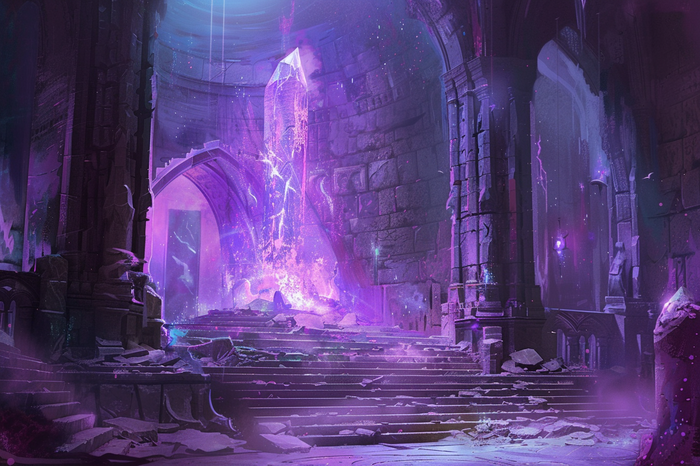

# Boss Fights

## Bakari à l'assaut du stabilisateur de Brumebourg

Ennemis : 
* [Bakari Mikhaïl](../STAT_BLOCKS/PERSONNAGES/BakariMikhail.md)
* 2 [Malfrats](../STAT_BLOCKS/CLASS/Malfrat.md)
* 2 [Eclaireurs](../STAT_BLOCKS/CLASS/Eclaireur.md)
* 6 [Bandits](../STAT_BLOCKS/CLASS/Bandit.md)
* (+ renforts éventuels en fonction du scénario)

Alliés : 
* [Trébyen](../WORLDBUILDING/PERSONNAGES/PNJ/Brumebourg.md#trébyen-kwestyon---membre-de-la-garde-de-therra) ([stats](../STAT_BLOCKS/CLASS/Chevalier.md#chevalier-saurien)) & [Trébwon]((../WORLDBUILDING/PERSONNAGES/PNJ/Brumebourg.md#trébwon-kwestyon---membre-de-la-garde-de-therra))([stats](../STAT_BLOCKS/CLASS/Chevalier.md#chevalier-saurien))
* (+ [Keno](../WORLDBUILDING/PERSONNAGES/PNJ/Brumebourg.md#keno-kutt---chef-de-la-garde-de-therra) ([stats](../STAT_BLOCKS/CLASS/Chevalier.md#chevalier-saurien)) en fonction du scénario)

**Objectif** : Le stabilisateur doit survivre. [**Bakari**](../WORLDBUILDING/PERSONNAGES/PNJ/EnfantsDeLaRue.md#bakari-mikhaïl---chef-de-groupe) possède des sorts de poches explosifs sur lui, au moins 3 doivent exploser à proximité du stabilisateur de leyline pour qu'il soit détruit.

**XP** : 360 XP par PJ

**Scope** : Difficile au niveau 2

**Trésor** : 100 PO, Rubis, Dague +1

**Images**

