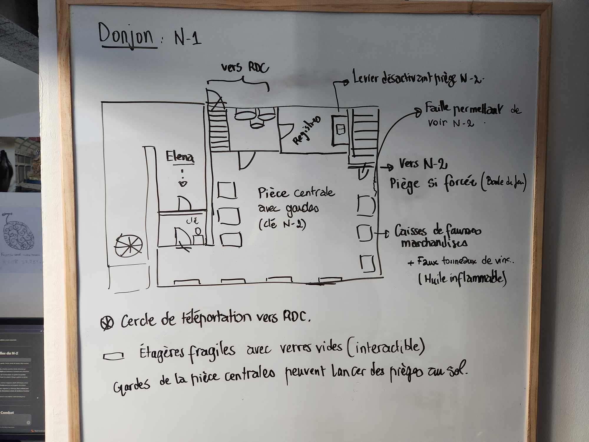
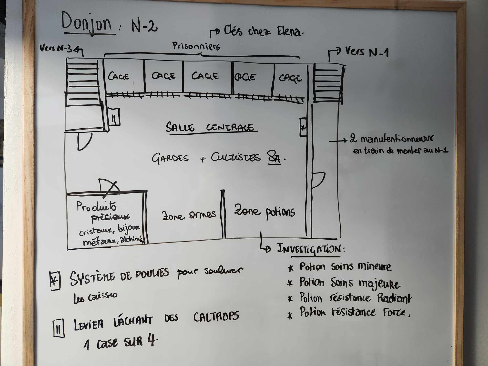
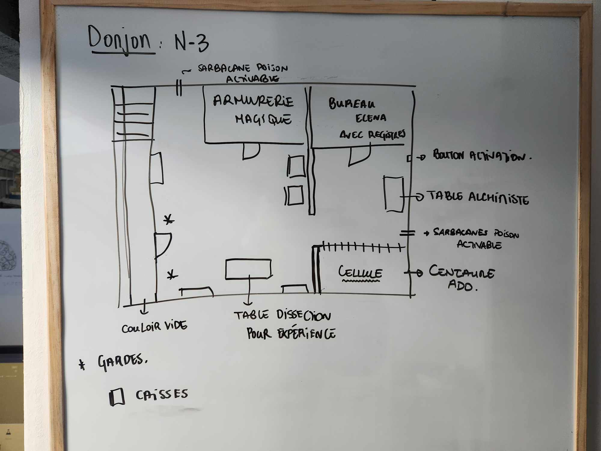

# Entrepôt scret du Port de Rovtal

## N-1 

* La porte près du cercle de téléportation est fermée et gardée par un [garde](../../STAT_BLOCKS/CLASS/Malfrat.md) ;
* 4 [gardes](../../STAT_BLOCKS/CLASS/Malfrat.md) sont en attente au niveau de la pièce centrale, l'un d'entre eux garde la clé pour aller au RDC et au N-2
* Les gardes peuvent prendre des actions pour verser de l'huile par terre et la mettre en feu
* Le forçage vers le N-2 lance le sort **Boule de Feu**. Le piège doit être désactivé dans la salle des registres, ou la clé doit être utilisée.

## N-2 

* 2 [gardes](../../STAT_BLOCKS/CLASS/Malfrat.md) sont dans le couloir d'entrée et remontent vers le N-1 ;
* Dans la salle centrale, en cours de négociation :
    * 1 [capitaine](../../STAT_BLOCKS/CLASS/CapitaineBandit.md) ;
    * 2 [gardes](../../STAT_BLOCKS/CLASS/Malfrat.md) ;
    * 2 [Cultistes des Sombres Artistes](../../STAT_BLOCKS/CLASS/FanatiqueDeSecte.md) (qui peuvent invoquer des élémentaires volants de [lumière](../../STAT_BLOCKS/ELEMENTAIRES/ElementaireVolantDeLumiere.md) ou [ombre](../../STAT_BLOCKS/ELEMENTAIRES/ElementaireVolantDOmbre.md)) ;
* 2 prisionniers dans les cages, dont un [guerrier](../../STAT_BLOCKS/CLASS/Chevalier.md).
* La zone avec marqué **Investigation** nécessite un jet, et le nombre d'objets trouvés dépend du score.

## N-3

* Les sarbacanes font faire un JdS de DEX (DD 15), sinon : 1d4 perforant + condition de poison.
* Le bouton d'activation permet d'utiliser les deux sarbacanes simultanément.
* La salle des registres contient le registre codé (voir les quêtes) ;
* 2 [Gardes](../../STAT_BLOCKS/CLASS/Chevalier.md) dans la salle centrale ;
* [Elena Kanakis](../../WORLDBUILDING/PERSONNAGES/ROVTAL/ElenaKanakis.md) à l'arrière ;