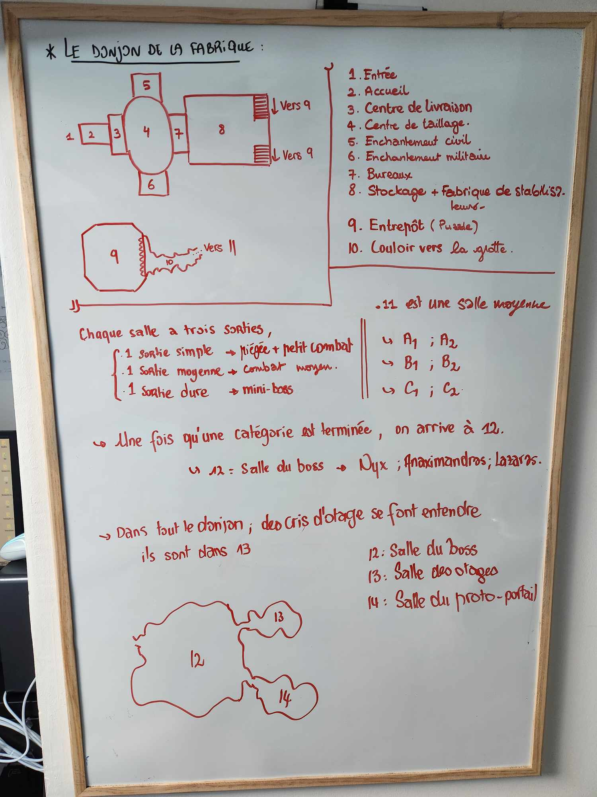

# La Fabrique de Cristaux de Rovtal

## L'étage public
1. Entrée
> Cette *salle* constitue l'extérieur de la **Fabrique**, et mène jusqu'à l'accueil. L'extérieur de la **Fabrique** est un tout petit peu en marge des **Tréfonds**. 
2. Accueil
> Cette salle contient des compotoirs pour faire office d'accueil à l'intérieur de la **Fabrique**. Il n'y a pas grand monde qui visite les lieux, mais le peu de monde est acceuilli ici.
3. Centre de livraison
> Cette salle contient du matériel afin de transporter les cristaux du fond de la Fabrique vers l'avant de la fabrique. Elle contient également tout le matériel d'emballage. Beaucoup de petits outils qui traînent.
4. Centre de taillage
> La plus grande pièce de la **Fabrique**. Elle sert à tailler l'ensemble des cristaux. Il y a plusieurs ateliers relativement modestes qui servent à la taille de cristaux mineurs, comme par exemple ceux de communication. D'autres plus grands ateliers, accompagnés de plus grandes machines, servent à tailler des critaux plus importants, qui servent à la lumière / chaleur des Tréfonds.
5. Enchantement civil
> Cette salle contient plusieurs petits ateliers qui servent à l'enchantement et la gravure de cristaux vierges. Le futur usage de ces cristaux sont civils, donc la plupart d'entre eux sont enchantés de sorts utilitaires. Il y a beaucoup de parchemins et de *recettes de cuisine* de sort.
6. Enchantement militaire
> Cette salle contient également plusieurs petits ateliers qui servent à l'enchantement et la gravure de cristaux vierges. Le futur usage de ces cristaux est militaire, donc la plupart d'entre eux sont enchantés de sorts de destruction (pour l'excavation par exemple). Les ateliers sont donc notamment plus protégés que dans la partie civile.
7. Bureaux
> Cette série de salle contient l'ensemble des bureaux de la Fabrique et comporte notamment tous les registres de production. Un de ses bureaux est celui des deux gérantes [Dorothea Zografos](../../WORLDBUILDING/PERSONNAGES/ROVTAL/DorotheaZografos.md) et [Valéria Samaras](../../WORLDBUILDING/PERSONNAGES/SOMBRES_ARTISTES/Valéria_Botzaris.md). La plupart de ces registres sont truqués (seule Valéria étant de mèche).
8. Stockage et Fabrique des Stabilisateurs
> Cette salle sert à l'entroposage des cristaux les plus importants, notamment ceux servant à fabriquer des stabilisateurs de leyline. Les cristaux les plus gros sont directement taillés et enchantés ici. Il existe directement un mécanisme (magique) ici qui permet de livrer directement ces cristaux depuis la **Surface**, la **Fabrique de Cristaux** donnant directement sur la devanture de **l'Ecole de Ethérologie**. Le passage se fait dans les deux sens mais ne peut être activé que depuis la **Fabrique**. Il consiste en un transport magique qui rend possible le fait de traverser la pierre qui constitue le plafond.

## L'étage caché
9. Entrepôt sécurisé
> Cette salle sert à stocker les quelques cristaux les plus importants, notamment les cristaux vierges qui servent dans la pièce du dessus. La pièce est généralement assez vide, et est protégée par du plomb pour prévenir tout sort de divination. Elle abrite également un passage secret vers les méandres des grottes. L'entrée est bloquée par un mécanisme.

*Mécanisme* - Au fond de la pièce se trouvent plusieurs grands coffres, tous fermés via des cadenas de très bonne facture (DD 17 Escamotage). Un de ces coffres est plus usé que les autres et contient en réalité une ouverture vers la grotte, avec une échelle permettant d'y aller, cependant il y a une illusion qui est projetée pour représenter le fond du coffre (il suffit de passer à travers).

*Combat* - En bas de l'échelle se trouve une salle des élémentaires qui se terrent qui attendent que quelqu'un vienne :
* 7 [Elémentaires volants de lumière](../../STAT_BLOCKS/ELEMENTAIRES/ElementaireVolantDeLumiere.md)
* 7 [Elémentaires volants d'ombre](../../STAT_BLOCKS/ELEMENTAIRES/ElementaireVolantDOmbre.md)

*Mécanisme 2* - Derrière les élémentaires se trouve l'entrée vers le système de grotte. Pour pouvoir y accéder, il faut écrire "**Komorath**" en insufflant de la magie à travers ses doigts. Un "**K**" est déjà clairement visible. En cas d'échec, le mur renvoie une *piqûre magique* et inflige **1d4** dégâts de force.

## Les méandres de la cave
Une fois la cave pénétrée en ayant écrit le nom de **Komorath**, il y a tout un système de cave qui se révèle. Un sort d'illusion est lancé sur tout le système de cave afin de cacher le chemin exact emprunté. De plus, un cristal magique se déclenche au passage de l'entrée afin de la sceller (plusieurs dizaines de centimètres de roche se créent).

Egalement, c'est à ce moment que des illusions sonores se font entendre : les **Mains Noires** (e.g. [Anaximandros Andreadis](../../WORLDBUILDING/PERSONNAGES/SOMBRES_ARTISTES/AnaximandrosAndreadis.md)) font de la provocation et créent des faux bruits d'otage qui se plaignent.

Durant le donjon, à chaque nouvelle pièce, il y a une épreuve qui se finit avec trois chemins plongés dans des ténêbres magiques. Chaque chemin est marqué d'un signe différent : un **cercle**, une **croix**, et un **trait vertical**. Chaque signe donne vers un nouveau type de pièce (respectivement une salle de combat, une salle de boss et une salle piégée).

Le but est d'arriver jusqu'à la fin du donjon. La pièce **12** est atteinte une fois qu'au moins une salle de chaque type est faite et que les deux salles d'un même type sont complétées.

### Salles piégées (Trait vertical)

* A1 : 
    * Plusieurs ombres se terrent sur le sol, et sont en réalité des **Elémentaires volants d'ombre**. Marcher sur ces ombres là provoquent une attaque gratuite et commence le combat.
    * La salle est plongée dans une obscurité modérée.
    * Il y a 8 [Elémentaires volants d'ombre](../../STAT_BLOCKS/ELEMENTAIRES/ElementaireVolantDOmbre.md)
* A2 : 
    * Des élémentaires de lumière sont nichés au plafond (et produisent de la lumière naturellement). Ils attaquent quiconque entre dans la salle.
    * Plusieurs stalactites sont piégés. A la fin de chaque ronde de combat, tout le monde effectue un jet de Dextérité DD 15 sous peine de subir 2d6 de dégâts perforants.

### Salles de combat (Cercle)
* B1 : 
    * 1 [Elémentaire corporel de lumière](../../STAT_BLOCKS/ELEMENTAIRES/ElementaireCorporelDeLumiere.md)
    * 1 [Elémentaire corporel d'ombre](../../STAT_BLOCKS/ELEMENTAIRES/ElementaireCorporelDOmbre.md)
* B2 : 
    * 1 [Elémentaire monstrueux d'ombre](../../STAT_BLOCKS/ELEMENTAIRES/ElementaireMonstrueuxDOmbre.md)

### Salle de boss (Croix)
* C1 
    * 1 [Elémentaire monstrueux d'ombre](../../STAT_BLOCKS/ELEMENTAIRES/ElementaireMonstrueuxDOmbre.md)
    * 1 [Elémentaire monstrueux de lumière](../../STAT_BLOCKS/ELEMENTAIRES/ElementaireMonstrueuxDeLumiere.md)
    * 1 [Elémentaire corporel de lumière](../../STAT_BLOCKS/ELEMENTAIRES/ElementaireCorporelDeLumiere.md)
    * 1 [Elémentaire corporel d'ombre](../../STAT_BLOCKS/ELEMENTAIRES/ElementaireCorporelDOmbre.md)
* C2
    * 1 [Elémentaire monstrueux d'ombre](../../STAT_BLOCKS/ELEMENTAIRES/ElementaireMonstrueuxDOmbre.md)
    * 1 [Elémentaire monstrueux de lumière](../../STAT_BLOCKS/ELEMENTAIRES/ElementaireMonstrueuxDeLumiere.md)
    * 3 [Elémentaires volants de lumière](../../STAT_BLOCKS/ELEMENTAIRES/ElementaireVolantDeLumiere.md)
    * 3 [Elémentaires volants d'ombre](../../STAT_BLOCKS/ELEMENTAIRES/ElementaireVolantDOmbre.md)

## Sous le stabilisateur
Une fois à bout des épreuves, on arrive sur la dernière salle (salle 12) qui contient [Anaximandros Andreadis](../../WORLDBUILDING/PERSONNAGES/SOMBRES_ARTISTES/AnaximandrosAndreadis.md) qui soumet les **Aventuriers** à l'épreuve. Il est lui-même ici pour prouver sa dévotion envers les **Mains Noires**, notamment [Etherios Sfer](../../WORLDBUILDING/PERSONNAGES/SOMBRES_ARTISTES/Ethérios_Sfer.md).

Cette partie du donjon se situe exactement sous le [Stabilisateur de Rovtal](../../WORLDBUILDING/VILLES/Rovtal.md#le-stabilisateur-naturel). A ce titre, il y a beaucoup de roches qui se teinte aussi naturellement en violet. Les salles 13 et 14 ont été créées artificellement en faisant exploser la roche directement.

12. Combat contre [Anaximandros](../../STAT_BLOCKS/CLASS/SombraurDruide.md)
> La salle est énorme et contient plusieurs stalagmites et stalactites. Dans cet antre, en tant qu'action, **Anaximandros** peut choisir d'invoquer un **élémentaire monstrueux** (1 seule fois). Les autres **Mains Noires** sont en observation en hauteur.
13. Salle des otages
> Dans cette salle, on retrouve plusieurs otages qui ont été déplacés afin de servir réserve magique pour ouvrir un portail vers [Le Plan de la Lumière et de l'Ombre](../../WORLDBUILDING/COSMOLOGIE/PLANS_ET_DIVINITES/Komorath.md). L'expérience n'est pas encore concluante, mais les Mains Noires ont réussi à créer plusieurs **Cristaux de Sang** (cristaux fabriqués à partir de l'essence des personnes). Plusieurs cadavres jonchent le sol de cette salle.
14. Salle du proto-portail
> Cette salle se situe exactement sous le stabilisateur. Relativement petite, elle servira à accueillir le **portail** une fois prêt.