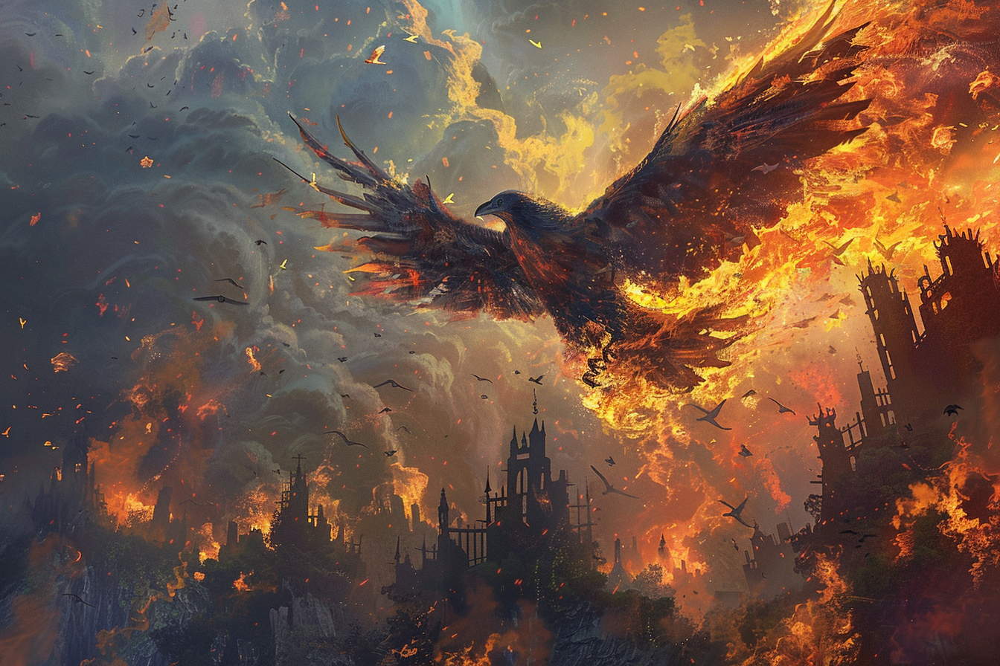

# Aigle-Corbeau Géant

**Grande Bête, Neutre**

---

**Classe d'Armure** 15 (Armure Naturelle)

**Points de Vie** 68

**Vitesse** 3 m, vol 16 m.

---

| FOR | DEX | CON | INT | SAG | CHA |
|:---:|:---:|:---:|:---:|:---:|:---:|
| 16 (+3) | 17 (+3) | 16 (+3) | 10 (+0) | 14 (+2) | 11 (+0) |

---

**Jets de Sauvegarde** Dex +6, Sag +5, Con +6

**Compétences** Perception +7

**Résistances aux Dégâts** Feu, Tonnerre

**Sens** Perception passive 17

**Niveau de Difficulté** 5 (1,800 XP)

---

**Lanceur de Sorts Inné.** La capacité de lancer des sorts innée de l'aigle géant est basée sur la Sagesse (DD de sauvegarde contre les sorts 13). Il peut lancer les sorts suivants de manière innée, sans nécessiter de composants matériels :

- À volonté : *Production de Flamme*, *Coup de Tonnerre*
- 3/jour chacun : *Mains Brûlantes*, *Vague Tonnante*
- 1/jour chacun : *Boule de Feu*, *Appel de la Foudre*

**Se Transformer en Roche.** Comme action bonus, l'aigle géant peut se transformer en **roche** ou reprendre sa **forme véritable**. Sous forme de rocher, il a une CA de 18, 40 points de vie temporaires et une résistance à tous les dégâts sauf les dégâts de force. Il ne peut pas se déplacer ni effectuer d'actions autres que se transformer de nouveau en sa forme d'aigle géant comme action bonus. Lorsqu'il reprend sa forme véritable, il perd tous les points de vie temporaires restants obtenus grâce à cette capacité.

**Vue Perçante.** L'aigle géant a l'avantage sur les tests de Sagesse (Perception) qui reposent sur la vue.

## Actions

**Multiattaque.** L'aigle géant effectue deux attaques : une avec son bec et une avec ses serres.

**Bec.** *Attaque d'Arme de Mêlée :* +6 pour toucher, portée 1.5 m, une cible. *Touché :* 10 (2d6 + 3) dégâts perforants.

**Serres.** *Attaque d'Arme de Mêlée :* +6 pour toucher, portée 1.5 m, une cible. *Touché :* 14 (2d10 + 3) dégâts tranchants.

**Plongée Tempête de Feu. (2 Charge / Long repos)** L'aigle géant plonge vers une cible, enveloppé de flammes. Toutes les créatures dans une ligne de 15 pieds doivent réussir un jet de sauvegarde de Dextérité DD 14, subissant 21 (6d6) dégâts de feu en cas d'échec, ou la moitié en cas de réussite. L'aigle géant reprend ensuite son vol normal.