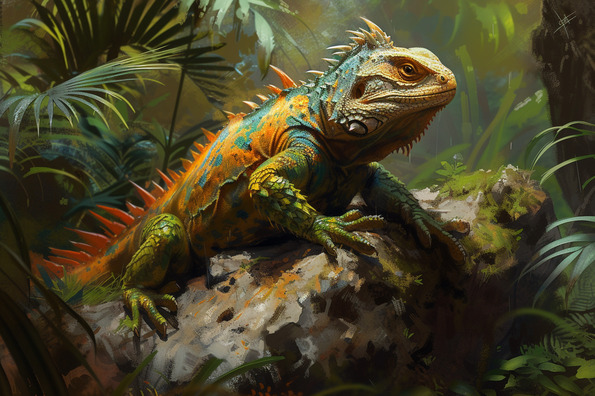
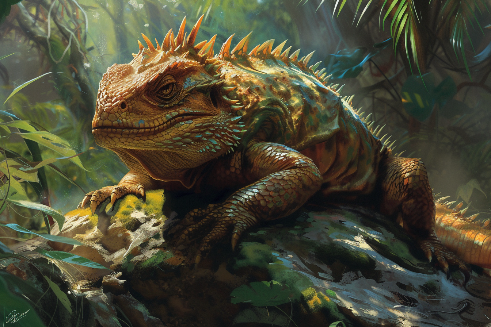

# Lézard

* **Classe d'armure** : 10
* **Points de vie** : 2
* **Vitesse** : 6 m, escalade 6 m

|    |FOR|DEX|CON|INT|SAG|CHA|
|----|---|---|---|---|---|---|
|Stat|2  |11 |10 |1  |8  |3  |
|Mod.|-4 |+0 |+0 |-5 |-1 |-4 |

* **Sens** : vision dans le noir 9, perception passive 9
* **Langue** : -
* **Facteur de puissance** 0 (10 PX)

#### > Actions
*Morsure* : 
* Attaque d'arme au corps à corps
    * +0 pour toucher
    * Allonge 1.5 m
    * Une cible
    * *Touché* : 1 dégâts perforants

# Lézard géant

* **Classe d'armure** : 12
* **Points de vie** : 19
* **Vitesse** : 9 m, escalade 9 m

|    |FOR|DEX|CON|INT|SAG|CHA|
|----|---|---|---|---|---|---|
|Stat|15 |12 |13 |2  |10 |5  |
|Mod.|+2 |+1 |+1 |-4 |+0 |-3 |

* **Sens** : vision dans le noir 9, perception passive 10
* **Langue** : -
* **Facteur de puissance** 1/4 (50 PX)

#### > Actions
*Morsure* : 
* Attaque d'arme au corps à corps
    * +4 pour toucher
    * Allonge 1.5 m
    * Une cible
    * *Touché* : 1d8+2 dégâts perforants