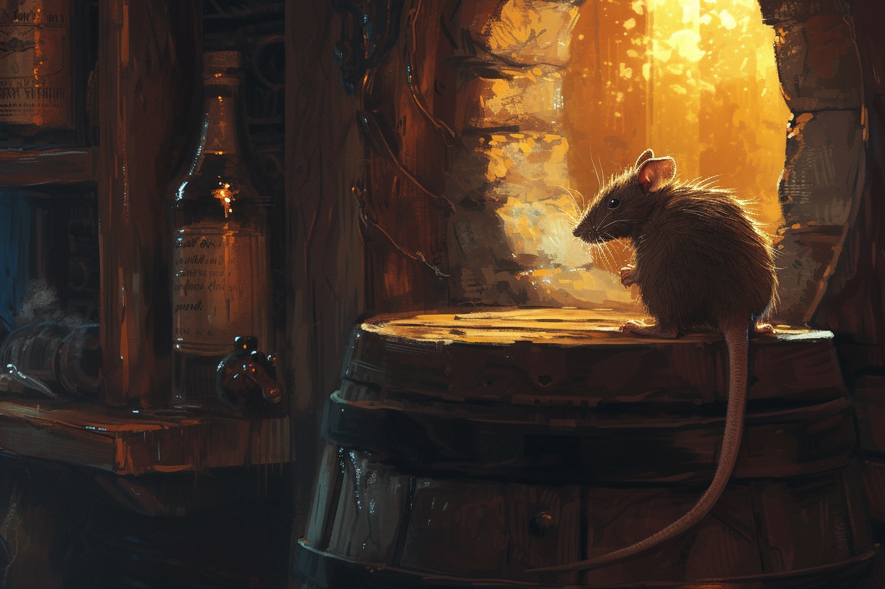
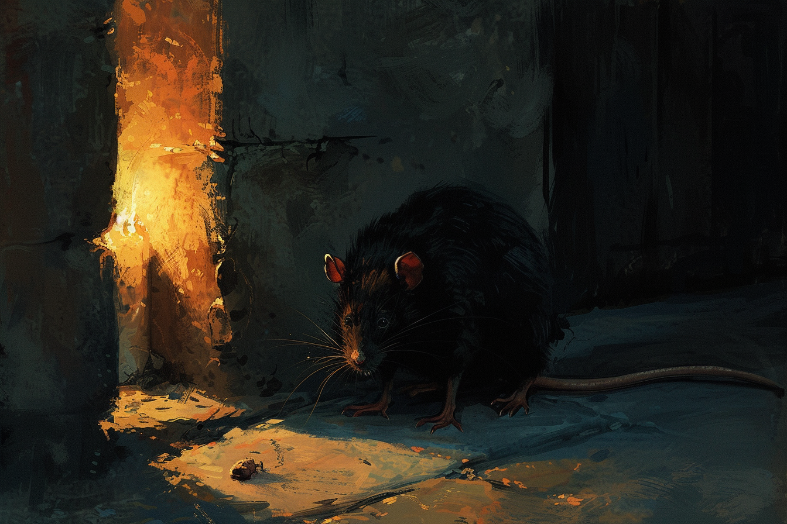

# Rat

* **Classe d'armure** : 10
* **Points de vie** : 2
* **Vitesse** : 6 m

|    |FOR|DEX|CON|INT|SAG|CHA|
|----|---|---|---|---|---|---|
|Stat|2  |11 |9  |2  |10 |4  |
|Mod.|-4 |+0 |-1 |-4 |+0 |-3 |

* **Sens** : vision dans le noir 9, perception passive 10
* **Langue** : -
* **Facteur de puissance** 0 (10 PX)

*Odorat aiguisé* - Le rat est avantagé lors des tests de Sagesse (Perception) basé sur l'odorat.

#### > Actions
*Morsure* : 
* Attaque d'arme au corps à corps
    * +0 pour toucher
    * Allonge 1.5 m
    * Une cible
    * *Touché* : 1 dégâts perforants

# Rat géant

* **Classe d'armure** : 12
* **Points de vie** : 7
* **Vitesse** : 9 m

|    |FOR|DEX|CON|INT|SAG|CHA|
|----|---|---|---|---|---|---|
|Stat|7  |15 |11 |2  |10 |4  |
|Mod.|-2 |+2 |+4 |-4 |+0 |-3 |

* **Sens** : vision dans le noir 18, perception passive 10
* **Langue** : -
* **Facteur de puissance** 1/8 (25 PX)

*Odorat aiguisé* - Le rat est avantagé lors des tests de Sagesse (Perception) basé sur l'odorat.

*Tactique de groupe* - Avantagé lors d'un jet d'attaque effectué contre une créature si au moins un de ses alliés se trouve à moins d'1m50 de sa cible et n'est si l'allié n'est pas neutralisé.

#### > Actions
*Morsure* : 
* Attaque d'arme au corps à corps
    * +4 pour toucher
    * Allonge 1.5 m
    * Une cible
    * *Touché* : 1d4+2 dégâts perforants