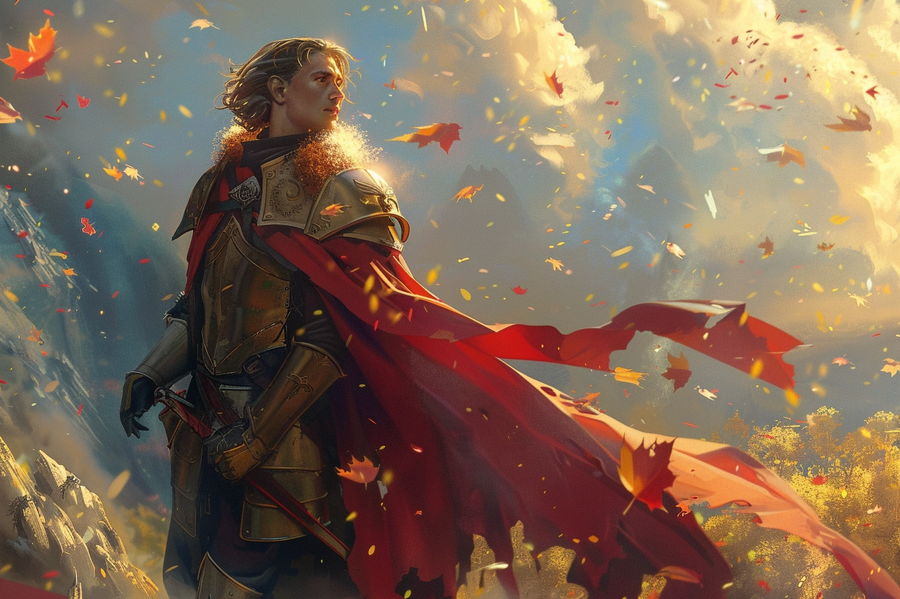
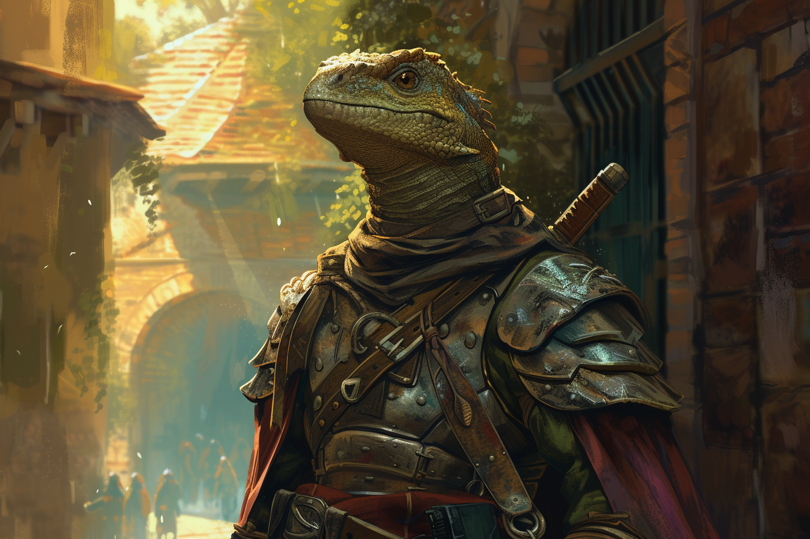

# Chevalier

* **Classe d'armure** : 18
* **Points de vie** : 52
* **Vitesse** : 9 m  

|    |FOR|DEX|CON|INT|SAG|CHA|
|----|---|---|---|---|---|---|
|Stat|16 |11 |14 |11 |11 |15 |
|Mod.|+3 |+0 |+2 |+0 |+0 |+2 |

* **Jets de sauvegarde** : Con +4, Sag +2
* **Sens** : Perception passive 10
* **Langue** : Une langue au choix
* **Facteur de puissance** 3 (700 PX)

*Brave* - Le chevalier est avantagé lors des jets de sauvegarde pour ne pas être effrayés.

#### > Actions
*Attaques multiples* : Le chevalier effectue deux attaques au corps à corps.

*Arbalète lourde* : 
* Attaque d'arme à distance
    * +2 pour toucher
    * Portée 30/120m
    * Une cible
    * *Touché* : 2d6+3 dégâts perforants
    
*Èpée à deux mains* : 
* Attaque d'arme au corps à corps
    * +5 pour toucher
    * Allonge 1.50m 
    * Une cible
    * *Touché* : 2d6+3 dégâts tranchants

*Meneurs d'hommes* : (Recharge après un repos long ou court) Pendant 1 minute, le chevalier peut lancer un ordre ou un avertissement spécial chaque fois qu'une créature non hostile située à 9 mètres ou moins dans son champ de vision effectue un jet d'attaque ou de sauvegarde. La créature peut ajouter 1d4 à son jet, à condition qu'elle entende et comprenne le chevalier. Une créature ne peut bénificier que d'un seul dé de meneur d'hommes à la fois. Cet effet prend fin si le chevalier est neutralisé.

#### > Réactions
*Parade* - Le chevalier ajoute 2 à sa CA contre une attaque au corps à corps qui devrait le toucher. Il doit voir son agresseur et manier une arme de corps à corps pour pouvoir parer de cette façon.

## Chevalier Saurien

* **Classe d'armure** : 18
* **Points de vie** : 52
* **Vitesse** : 9 m  

|    |FOR|DEX|CON|INT|SAG|CHA|
|----|---|---|---|---|---|---|
|Stat|16 |11 |14 |11 |11 |15 |
|Mod.|+3 |+0 |+2 |+0 |+0 |+2 |

* **Jets de sauvegarde** : Con +4, Sag +2
* **Sens** : Perception passive 10
* **Langue** : Une langue au choix
* **Facteur de puissance** 3 (700 PX)

*Brave* - Le chevalier est avantagé lors des jets de sauvegarde pour ne pas être effrayés.

#### > Actions
*Attaques multiples* : Le chevalier effectue deux attaques au corps à corps.

*Arbalète lourde* : 
* Attaque d'arme à distance
    * +2 pour toucher
    * Portée 30/120m
    * Une cible
    * *Touché* : 2d6+3 dégâts perforants
    
*Èpée à deux mains* : 
* Attaque d'arme au corps à corps
    * +5 pour toucher
    * Allonge 1.50m 
    * Une cible
    * *Touché* : 2d6+3 dégâts tranchants

*Meneurs d'hommes* - (Recharge après un repos long ou court) Pendant 1 minute, le chevalier peut lancer un ordre ou un avertissement spécial chaque fois qu'une créature non hostile située à 9 mètres ou moins dans son champ de vision effectue un jet d'attaque ou de sauvegarde. La créature peut ajouter 1d4 à son jet, à condition qu'elle entende et comprenne le chevalier. Une créature ne peut bénificier que d'un seul dé de meneur d'hommes à la fois. Cet effet prend fin si le chevalier est neutralisé.

#### > Actions bonus
*Mâchoires affamées* - (Recharge après un repos long ou court) Le chevalier se plonge dans une frénésie inarrêtable, il peut alors porter une attaque spécial en mordant une créature. Si elle touche, l'attaque fait 1d6+3 de dégâts et donne 2 points de vie temporaire au chevalier. 

#### > Réactions
*Parade* - Le chevalier ajoute 2 à sa CA contre une attaque au corps à corps qui devrait le toucher. Il doit voir son agresseur et manier une arme de corps à corps pour pouvoir parer de cette façon.