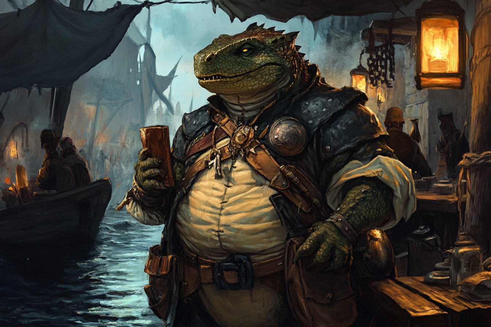

# Maître Voleur

* **Classe d'armure** : 16
* **Points de vie** : 84
* **Vitesse** : 9 m  

|    |FOR|DEX|CON|INT|SAG|CHA|
|----|---|---|---|---|---|---|
|Stat|11 |18 |14 |11 |11 |12 |
|Mod.|+0 |+4 |+2 |+0 |+0 |+1 |

* **Jets de Sauvegarde** DEX+7, INT+3
* **Compétences** : Acrobaties+7, Athélisme +3, Perception+3, Escamotage+7, Discrétion+7
* **Langue** : Une langue au choix
* **Facteur de puissance** 5 (1800 PX)

*Evasion* - Si le voleur est sujet à un effet qui lui permet de faire un **jet de sauvegarde** de **Dextérité** pour subir la moitié des dégâts, le voleur ne prend que la moitié des dégâts s'il rate, et aucun dégâts s'il réussit.

*Attaque sournoise (1/tour)* - Le voleur inflige **4d6** dégâts supplémentaires quand il touche une cible avec arme : 
* S'il a avantage pour toucher sa cible ;
* OU si la cible est à moins de 1.5m d'un allié du voleur et que le voleur n'est pas désavantagé. 

#### > Actions
*Attaques multiples* : Le maitre voleur effectue trois attaques au corps à corps ou une attaque à distance.

*Arbalète* : 
* Attaque d'arme à distance
    * +7 pour toucher
    * Portée 24/96m
    * Une cible
    * *Touché* : 1d8+4 dégâts perforants
    
*Epée courte* : 
* Attaque d'arme au corps à corps
    * +7 pour toucher
    * Allonge 1.50m 
    * Une cible
    * *Touché* : 1d6+4 dégâts contondants

#### > Actions bonus

*Ruse* - A chacun de ses tours, le voleur peut utiliser une action bonus pour *Se cacher*, *Foncer* ou *Se désengager*.
