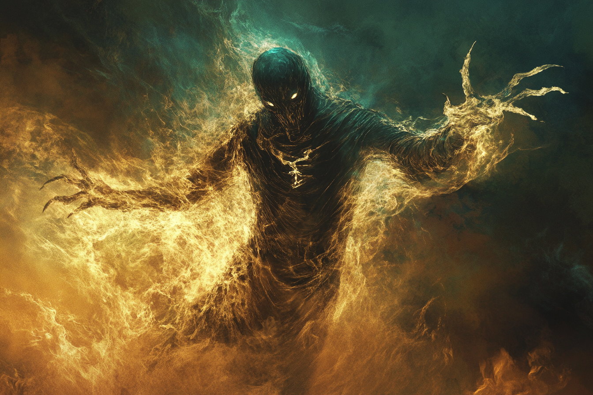

# Elémentaire Corporel de Lumière

* **Classe d'armure** : 15
* **Points de vie** : 50
* **Vitesse** : 9 m, 9m (vol)  

|    |FOR|DEX|CON|INT|SAG|CHA|
|----|---|---|---|---|---|---|
|Stat|6  |18 |14 |8  |16 |10 |
|Mod.|-2 |+4 |+2 |-1 |+3 |+0 |

* **Compétences** : Perception +5
* **Immunité contre les dégâts** de radiant
* **Résistance contre les dégâts** tranchants, radiants, perforants
* **Immunités aux conditions** : empoisonné
* **Sens** : vision aveugle 30 m, Perception passive 11
* **Langue** : Primordial
* **Facteur de puissance** 3 (700 PX)

*Explosion finale* - Quand l'élementaire meurt, il explose en une gerbe d'énergie éthérique. Les créatures situées à à **1.5m** ou moins de lui doivent effectuer un jet de sauvegarde de Dextérité **DD 14**.
* **Echec** : 2d6 dégâts de dégâts de Force
* **Réussite** : La moitié des ces dégâts

*Aura éblouissante* - Les créatures commençant leur tour à 3 mètres de l'élémentaire doivent faire un jet de Constitution **DD 13**. En cas d'échec, elles sont désavantagées sur leurs jets d'attaque tant qu'elles restent à 3 mètres ou moins de l'élémentaire.

*Incantation innée (1/jour)* -  L'élémentaire peut lancer **Guiding Bolt** de manière innée sans aucune composante matérielle. La caractéristique d'incantation de l'élémentaire est la **Sagesse**. +3 pour toucher

#### > Actions

*Attaques multiples* - L'élémentaire effectue deux attaques de *Rayon radiant*.

*Rayon radiant* : 
* Attaque d'arme à distance
    * +6 pour toucher
    * 9 m 
    * Une cible
    * *Touché* : 2d6+4 dégâts radiants

*Orbe lumineuse* - 2 fois / j
* L'élémentaire crée une zone de lumières magiques à une portée de 6 mètres. Les créatures commençant leur tour à 3 mètres de la zone doivent faire un jet de Constitution **DD 13**. En cas d'échec, elles sont désavantagées sur leurs jets d'attaque tant qu'elles restent à 3 mètres ou moins de la zone.

---
## Guiding Bolt

* Level 1 Evocation
* Casting Time: 1 action
* Range: 120 feet
* Components: V S
* Duration: 1 round

A flash of light streaks toward a creature of your choice within range. Make a ranged spell attack against the target. On a hit, the target takes 4d6 radiant damage, and the next attack roll made against this target before the end of your next turn has advantage, thanks to the mystical dim light glittering on the target until then.