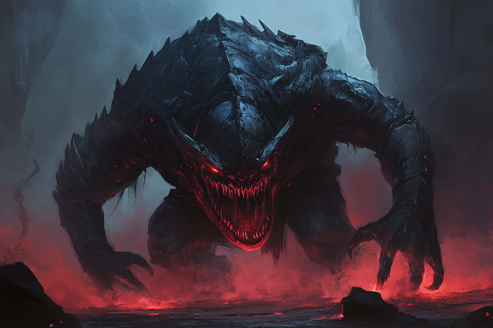

# Elémentaire Monstrueux d'Ombre

*Très grand*

* **Classe d'armure** : 15 (armure naturelle)
* **Points de vie** : 128
* **Vitesse** : 12 m

|    |FOR|DEX|CON|INT|SAG|CHA|
|----|---|---|---|---|---|---|
|Stat|18 |15 |16 |7  |14 |9  |
|Mod.|+4 |+2 |+3 |-2 |+2 |-1 |

* **Jets de sauvegardes** : Dex +5, Con +6
* **Compétences** : Discrétion +5, Perception +5
* **Immunité contre les dégâts** de force
* **Résistance contre les dégâts** feu, foudre, froid
* **Immunités aux conditions** : empoisonné
* **Sens** : vision aveugle 9 m, vision dans le noir 36m, Perception passive 15
* **Langue** : Primordial
* **Facteur de puissance** 5 (1800 PX)

*Explosion finale* - Quand l'élementaire meurt, il explose en une gerbe d'énergie éthérique. Les créatures situées à à **1.5m** ou moins de lui doivent effectuer un jet de sauvegarde de Dextérité **DD 16**.
* **Echec** : 3d6 dégâts de dégâts de Force
* **Réussite** : La moitié des ces dégâts

*Absorption d'ombre* - Si l'élémentaire est dans une obscurité magique ou totale, il regagne 5 points de vie au début de son tour.

*Incantation innée* -  La caractéristique d'incantation de l'élémentaire est la **Sagesse**. +5 pour toucher, DC 13
* 2/jour chacun : Invisiblité (soi-même uniquement), Déguisement
* 1/jour chacun : Pas de l'ombre, [Enchevêtrement](../../SORTS/NIVEAU1/Enchevetrement.md)

*Saut avec élan* - L'élémentaire peut sauter sur une longueur maximale de 12 mètres et une hauteur maximale de 6 mètres s'il prend son élan.

*Téméraire* - S'il rate son attaque, peut décider d'avoir **Avantage**. S'i le fait, les attaques contre lui ont avantage jusqu'à son prochain tour.

#### > Actions

*Attaques multiples* - L'élémentaire effectue trois attaque, deux avec ses poings et une de morsure

*Morsure* : 
* Attaque de corps à corps
    * +7 pour toucher
    * 1.5 m 
    * Une cible
    * *Touché* : 2d6+4 dégâts de force

*Poing* : 
* Attaque de corps à corps
    * +7 pour toucher
    * 1.5 m 
    * Une cible
    * *Touché* : 1d10+4 dégâts contondants

