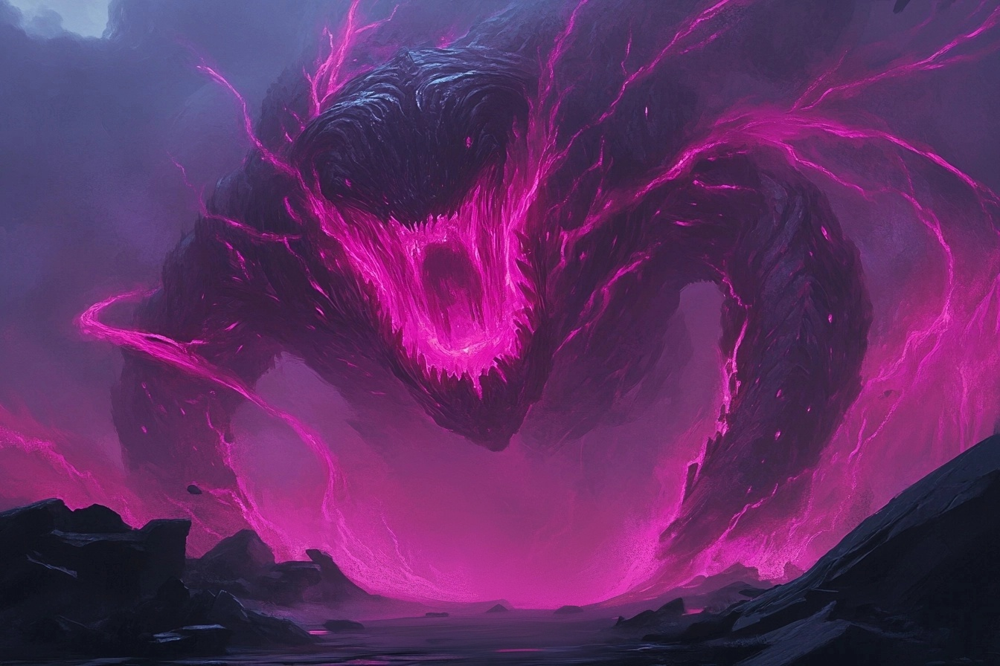

# Elémentaire Monstrueux de Lumière

*Très grand*

* **Classe d'armure** : 17 (armure naturelle)
* **Points de vie** : 94
* **Vitesse** : 12m  

|    |FOR|DEX|CON|INT|SAG|CHA|
|----|---|---|---|---|---|---|
|Stat|19 |11 |21 |2  |10 |5  |
|Mod.|+4 |+0 |+5 |-4 |+0 |+-3 |

* **Compétences** : Perception +6
* **Immunité contre les dégâts** de radiant
* **Résistance contre les dégâts** froid, feu, foudre
* **Immunités aux conditions** : empoisonné
* **Sens** : vision aveugle 9 m, vision dans le noir 18m, Perception passive 16
* **Langue** : Primordial
* **Facteur de puissance** 5 (1800 PX)

*Explosion finale* - Quand l'élementaire meurt, il explose en une gerbe d'énergie éthérique. Les créatures situées à à **1.5m** ou moins de lui doivent effectuer un jet de sauvegarde de Dextérité **DD 16**.
* **Echec** : 2d6 dégâts de dégâts de Force
* **Réussite** : La moitié des ces dégâts

*Aura éblouissante* - Les créatures commençant leur tour à 3 mètres de l'élémentaire doivent faire un jet de Constitution **DD 14**. En cas d'échec, elles sont désavantagées sur leurs jets d'attaque tant qu'elles restent à 3 mètres ou moins de l'élémentaire.

*Saut sans élan* - L'élémentaire saute sur une longueur de maximale de 9 mètres et une hauteur de 4.5 mètres, avec ou sans élan préalable.

#### > Actions

*Morsure* : 
* Attaque d'arme à distance
    * +7 pour toucher
    * 1.5 m 
    * Une cible
    * *Touché* : 3d12+4 dégâts perforants + 1d12 de radiants

*Saut meurtrier* - Après un saut de plus de 4.5m, l'élémentaire peut utiliser une action pour tomber sur une case contenant une ou plusieurs créatures. Toutes les créatures dans cet espace doivent réussir un JdS Force ou Dextérité (DD 16). 
* *Echec* - Elle subit 3d6+4 de tranchants et 3d6+4 de contondants et devient **à terre**.
* *Réussite* - Elle subit la moitié des dégâts et est repoussée de 1.5m. 

---
## Guiding Bolt

* Level 1 Evocation
* Casting Time: 1 action
* Range: 120 feet
* Components: V S
* Duration: 1 round

A flash of light streaks toward a creature of your choice within range. Make a ranged spell attack against the target. On a hit, the target takes 4d6 radiant damage, and the next attack roll made against this target before the end of your next turn has advantage, thanks to the mystical dim light glittering on the target until then.