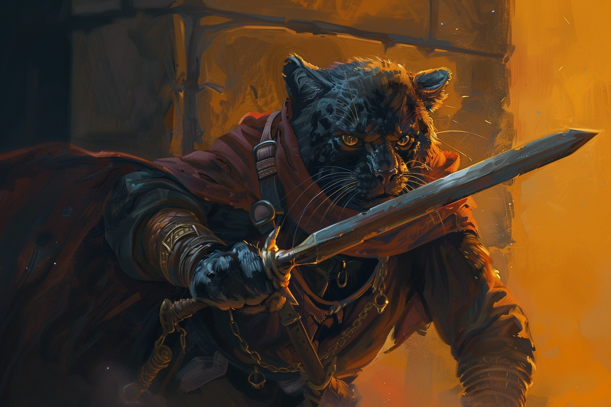

# [Bakari Mikhaïl](../../WORLDBUILDING/PERSONNAGES/PNJ/EnfantsDeLaRue.md#bakari-mikhaïl---chef-de-groupe)

* **Classe d'armure** : 15
* **Points de vie** : 65
* **Vitesse** : 9 m  

|    |FOR|DEX|CON|INT|SAG|CHA|
|----|---|---|---|---|---|---|
|Stat|15 |16 |14 |14 |11 |14 |
|Mod.|+2 |+3 |+2 |+2 |+0 |+2 |

* **Jets de sauvegarde** : For +4, Dex +5, Sag +2
* **Compétences** : Athlétisme +4, Tromperie +4
* **Sens** : Perception passive 10
* **Langue** : Commun et Panthéran
* **Facteur de puissance** 2 (450 PX)

#### > Actions
*Bond félin* : Bakari saute à une distance allant jusqu'à 3m en hauteur ou 6m à l'horizontale.

*Attaques multiples* : Bakari effectue trois attaques au corps à corps : deux avec son cimeterre et une avec sa dague, ou il effectue deux attaques à distance avec ses dagues.

*Cimeterre* : 
* Attaque d'arme au corps à corps
    * +5 pour toucher
    * Allonge 1.50m 
    * Une cible
    * *Touché* : 1d6+3 dégâts tranchants

*Dague* : 
* Attaque d'arme au corps à corps
    * +5 pour toucher
    * Allonge 1.50m ; Portée 6/18m
    * Une cible
    * *Touché* : 1d4+3 dégâts tranchants

#### > Réactions 
*Parade* : Bakari ajoute 2 à sa CA contre une attaque au corps à corps qui devrait le toucher. Il doit voir son agresseur et manier une arme de corps à corps pour pouvoir parer de cette façon.

#### > Objets 
* 5 sorts de poche explosifs qui peuvent être lancés : 2d6 de dégâts de force