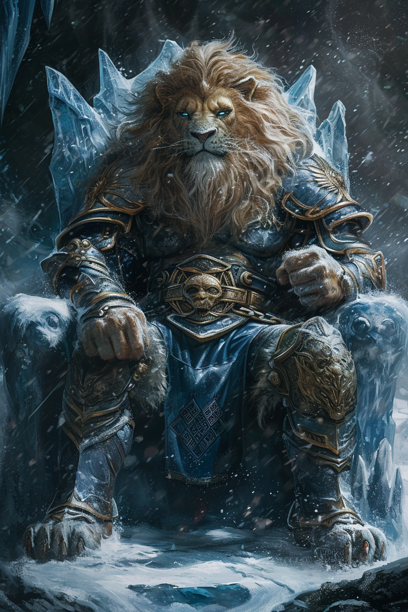

# Celis | | Plan des glaciers

 * **Divinité** : Celis, le Coeur de Glace
 * **Alignement** : Loyal Mauvais
 * **Domaine** : Froid, Conquête, Ambition
 * **Qualités** : Stratégique, Réservé
 * **Défauts**  : Impitoyable
 * **Symbole** : Sceptre avec un flocon de neige au bout
 * **Description** : Un Leonin en armure lourde, assis sur un trône de glace.
 * **Fait remarquable** : Celis aurait gelé une mer entière afin de permettre à ses fidèles de la traverser pour aller conquérir un autre pays.