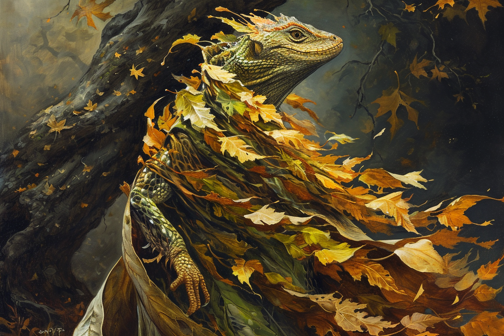
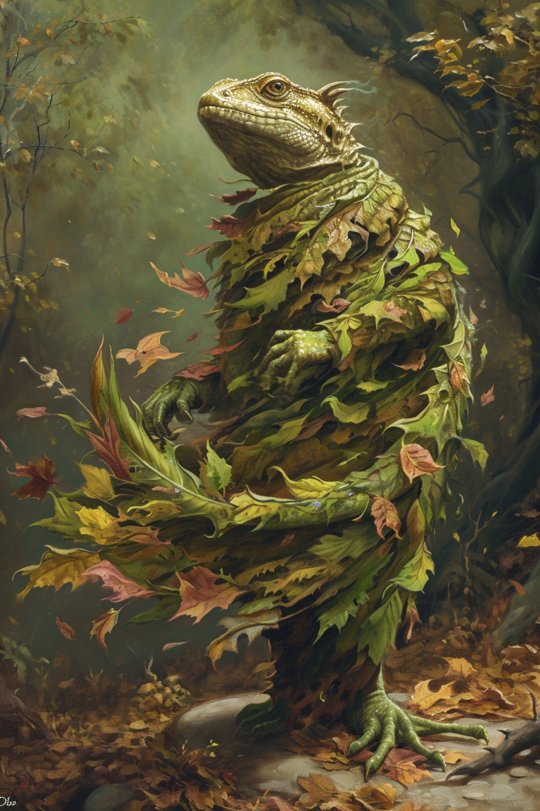

# Italis | | Plan de la vie et de la mort 

 * **Divinité** : Italis, Celui qui Commence et qui Finit
 * **Alignement** : Chaotique Bon
 * **Domaine** : La Mort et la Renaissance
 * **Qualités** : Impulsif, 
 * **Défauts**  : Injuste, Intervient sans qu'on lui demande
 * **Symbole** : Une feuille verte et une feuille morte
 * **Description** : Un Saurien, avec une robe en spirale de deux couleurs (couleur feuille verte, et couleur feuille morte). Il a deux doigts en l'air pour saluer.
 * **Fait remarquable** : Il est responsable de la création de la mort, afin que puisse renaître le monde et ne pas stagner.