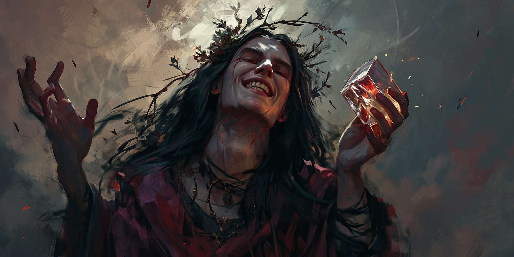
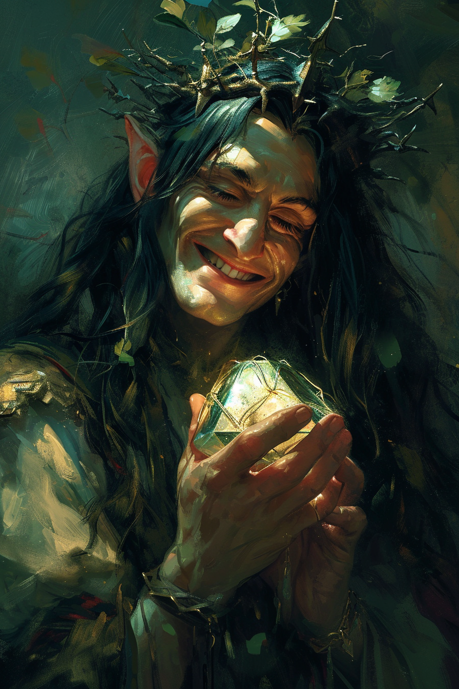

# Komorath | | Plan de la lumière, de l'ombre et des couleurs

 * **Divinité** : Komorath, le Prisme Brisé
 * **Alignement** : Chaotique Mauvais
 * **Domaine** : Tromperie, Illusion, Art, Art obscurs
 * **Qualités** : Créatif, Imprévisible
 * **Défauts**  : Cruel, Se délecte du désespoir
 * **Symbole** : Prisme brisé
 * **Description** : Un elfe aveugle qui tient un prisme tringulaire brisé dans sa main gauche, et avec une couronne d'épines. Arbore toujours un sourire.
 * **Fait remarquable** : Aurait plongé une grande armée dans un sommeil sans fin, l'éradiquant durant une guerre.