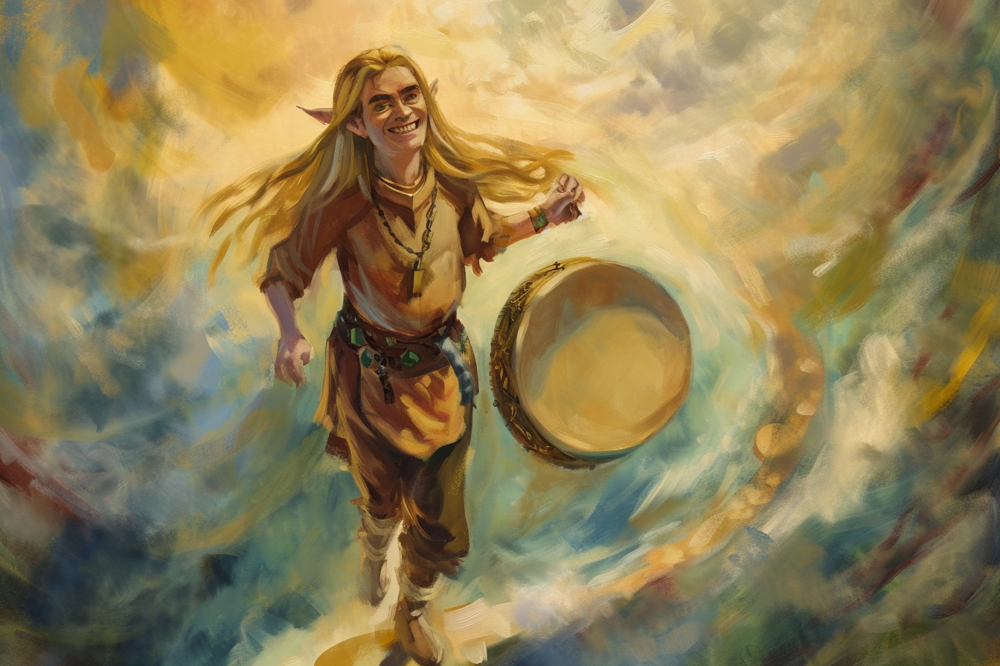
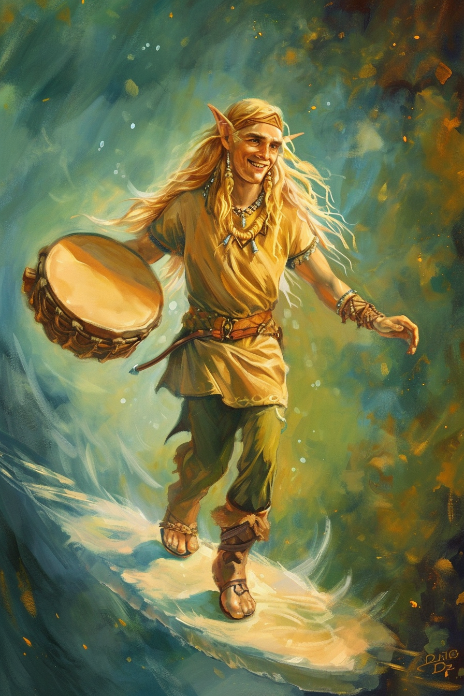

# Maunad | | Plan du son et de la musique

 * **Divinité** : Maunad, Compositeur des Cieux
 * **Alignement** : Loyal Bon
 * **Domaine** : Harmonie, Inspiration Artistique
 * **Qualités** : Inspiré, Bienveillant
 * **Défauts**  : Influence les émotions de manière subtile
 * **Symbole** : Un tambour et trois étoiles
 * **Description** : Un elfe tenant un tambour, marchant sur un nuage
 * **Fait remarquable** : Il aurait inspiré un compositeur mortel à créer une musique si douce qu'elle aurait appaisé une région en guerre.