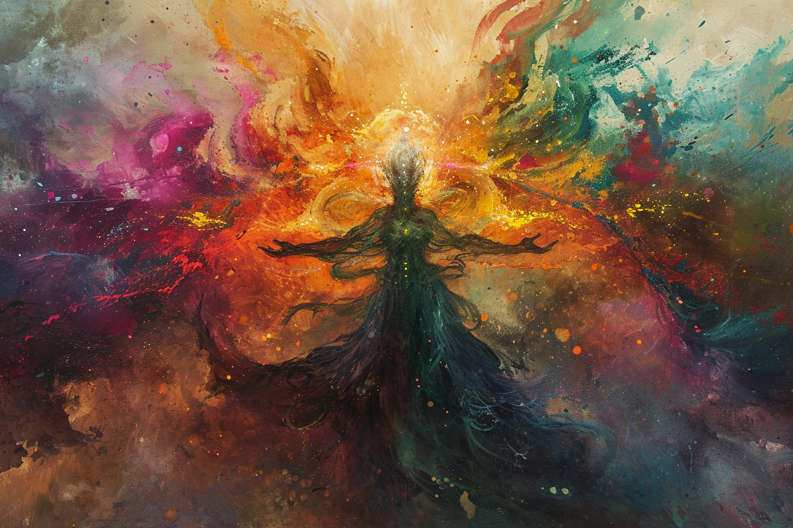
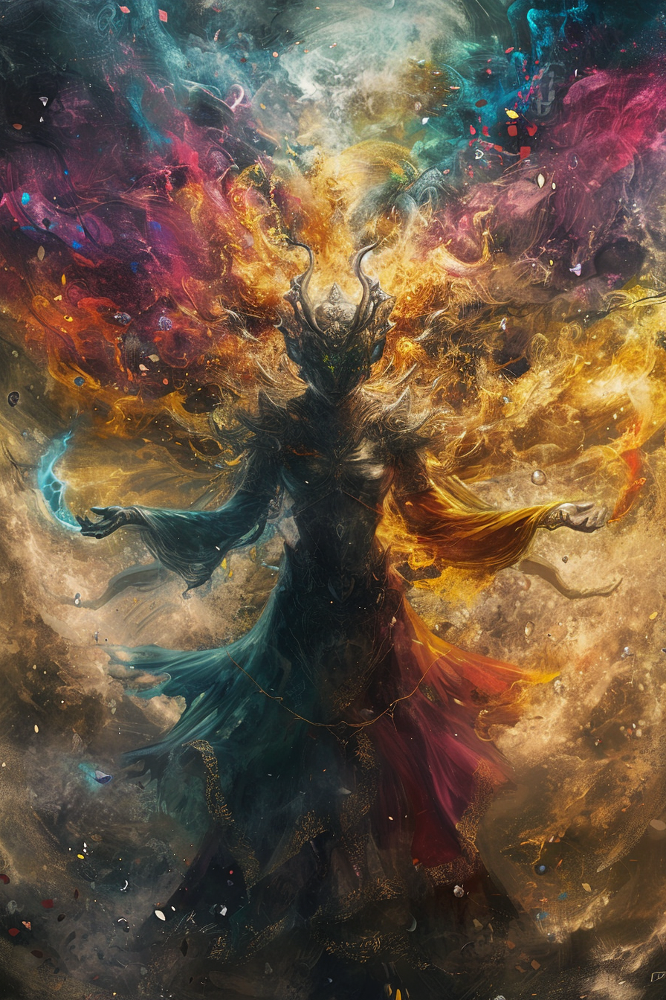

# Muhuta | | Plan de la transformation

 * **Divinité** : Muhuta, la Grande Plannificatrice
 * **Alignement** : True Neutral
 * **Domaine** : Transformation et Renouveau
 * **Qualités** : Méthaphorique, Curieuse
 * **Défauts**  : Instable, Peut provoquer des catastrophes
 * **Symbole** : Une spirale
 * **Description** : Une divinité féminine à très longue robe, avec plusieurs éléments qui orbitent autour d'elle. Elle est souvent représentée avec les deux mains tendues et avec quelque chose qui s'étend entre ses mains (des filaments, de la matière, etc.). On pense que ces éléments contiennent l'information essentielle qui fait chaque être (information génétique)
 * **Fait remarquable** : Il paraît que c'est elle qui a fait la diversité des races dans ce monde.