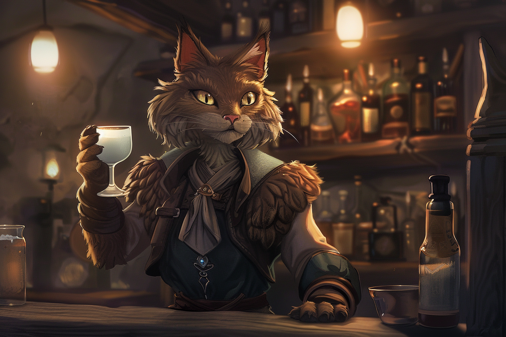

# Felicis
| | |
|-|-|
| | |
| | |

## Description
## Biologie
## Personnalité
## Noms & Patronymes
## Société
## Histoire

Les **Felicis** sont souvent pris de haut par les autres espèces de Félinoïdes, étant clairement la race la plus petite et avec l'espérance de vie la plus courte. De plus, les Felicis ronronnent légèrement quand ils s'expriment, ce qui est un trait jugé enfantin chez les autres **Félinoïdes**.

C'est une espèce généralement peu ambitieuse qui aime le confort et ne souhtaite fournir d'efforts qu'en cas de nécessité absolu. On dit souvent qu'un Felicis heureux est un Felicis qui arrive à vivre sans sortir de chez lui.

Il existe néanmoins quelques individus qui rêvent de profiter de leur vie au maximum, les poussant à vivre chaque jour comme si c'était le dernier.

Ils portent généralement le prénom qu'ils se sont donnés eux-mêmes, une fois la vie adulte atteinte. Ce prénom est très souvent constitué de deux syllabes uniquement. 