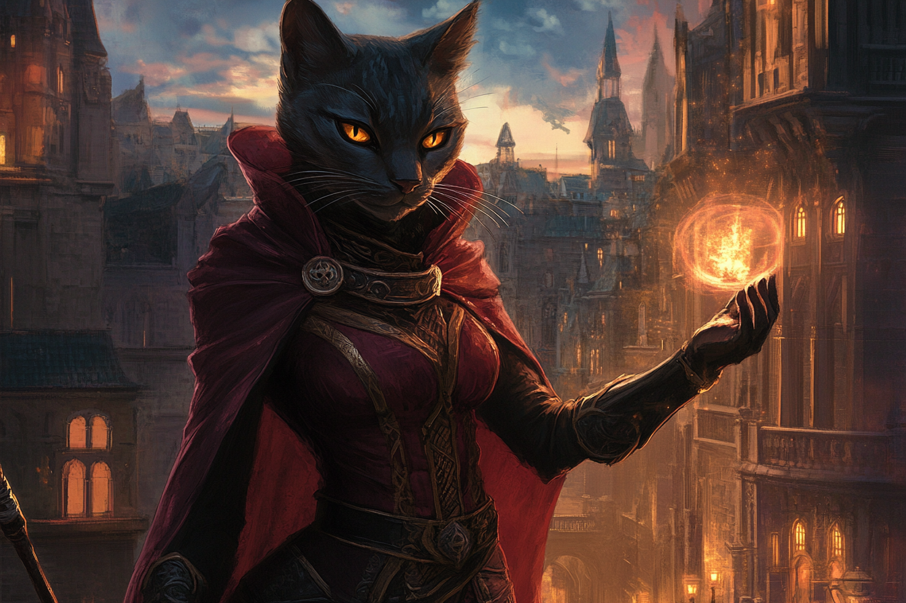

# Panthérans
| | |
|-|-|
| | |
| | |

## Description
## Biologie
## Personnalité
## Noms & Patronymes
## Société
## Histoire

Une espèce assez fière qui culturellement cherche à vivre dans le confort et qui sait saisir toute opportunité afin de pouvoir maintenir son niveau de vie. De ce fait, ils sont vus comme avares et prêt à tout pour monter socialement. 

Les **Panthérans** vivent génralement dans de petites communautés, n'aimant pas le brouhaha des villes. 

Avant l'âge adulte, ils ne portent que le prénom donné par leurs parents. Une fois assez âgés, ils choisissent un deuxième prénom, identique à l'un de leurs proches s'ils l'admirent (y compris leurs parents), ou totalement différent s'ils souhaitent marquer leur individualité. 

Lorsqu'ils parlent, les **Panthérans** ont tendance à particulièrement rouler les *R*. De plus, ils ont tendance à transformer tous les *S* en *CH/SH*.