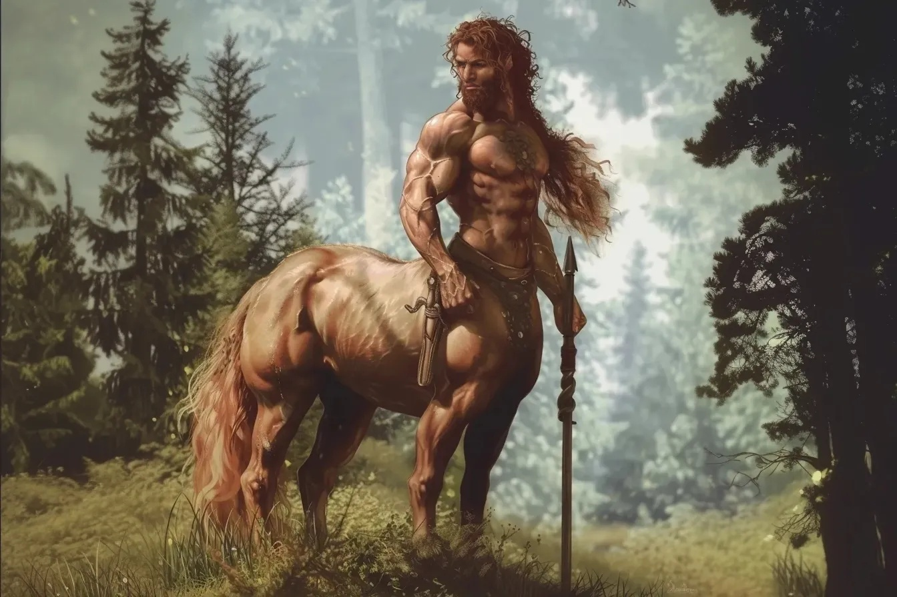

# Centaures
| | |
|-|-|
| | |
| | |

## Description
## Biologie
Les **centaures** vivent en moyenne jusqu'à **120 ans**, et atteigne leur taille adulte vers l'âge de **22 ans**.

Un centaure mesure environ **2m10** de la tête au sabot et pèse jusqu'à **500 kg**.
## Personnalité
## Noms & Patronymes
Les centaures ont un système de nommage de leurs membres assez particulier puisque composé de trois noms : 
* Leur prénom, donné à la naissance par leurs parents ;
* Leur nom de famille, transmis par leur mère ;
* Un surnom, donné par leurs proches, qui peut évoluer avec l'âge et leurs accomplissements.

Les noms et prénoms des centaures rappellent généralement des sonorités **latines**. Leur premier prénom ne porte généralement pas de contrainte particulière, leur deuxième prénom (surnom) est généralement une **vertue**, alors que les noms de familles se rapportent généralement à des noms de plantes ou de fleurs. 

**Premiers prénoms**
|Hommes|Femmes|
|-|-|
|Florens|Arilius|
|Olivarius|Aemilia|
|Julius|Laura|
|Cicéron|Henrica|
|Adrianus|Caelina|
|Carolus|Elodia|

**Deuxièmes prénoms**
* Celeritas ;
* Benignitas (gentillesse, bienveillance);
* Tolerentia ;
* Soliditas ;
* Perseverantia ;
* Animo (courage) ;
* Amicitia ;
* Amor ;

**Noms de famille**
* Calendula (souci) ;
* Persicum (cyclamen) ;
* Trifolium (trèfle);
* Quercus (chêne) ;
* Prunus (cerisier, amandier, prunier) ;
* Mentha (menthe) ;

## Société

Les **centaures** vivent généralement en clan nomade, se déplaçant de zone stable magiquement à une autre, s'arrêtant parfois à la lisière de villes peuplées pour échanger des ressources. 

Les centaures font partie des rares espèces conscientes à posséder un **coeur éthérique** (voir [bio-éthérologie](../ETHER/Bioetherologie.md)), qui est un organe qui permet de faire circuler l'éther à l'intérieur de leur corps ; là où pour les autres espèces le système éthérique est généralement passif (comme le système lymphatique).

Les **centaures** demandent régulièrement à leurs proches et aux personnes qui leur font entièrement confiance de leur tresser une mèche de leur cheveux, afin de symboliser leur lien. Généralement, le geste est réciproque, mais rien ne les y oblige.

## Histoire