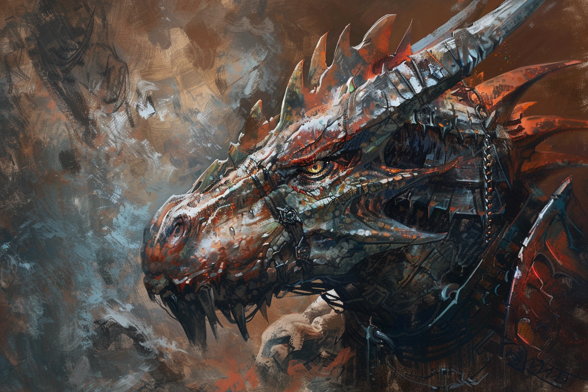

# Varanides
| | |
|-|-|
| | |
| | |

## Description
## Biologie
## Personnalité
## Noms & Patronymes
## Société
## Histoire

Les **Varanides** portent généralement des noms rappelant les sonorités **turques**.