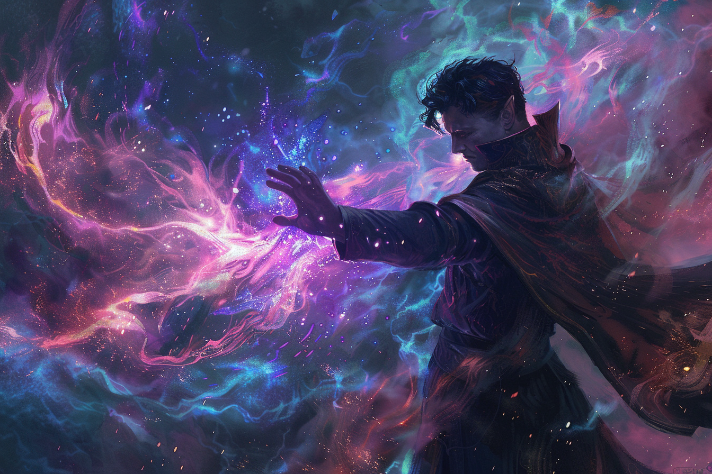
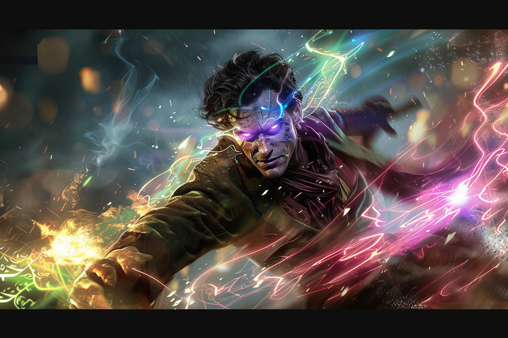
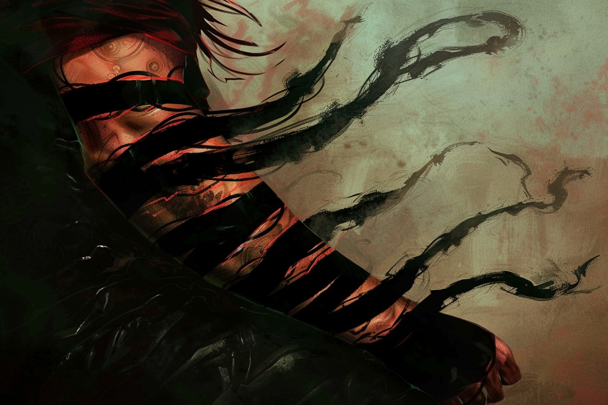
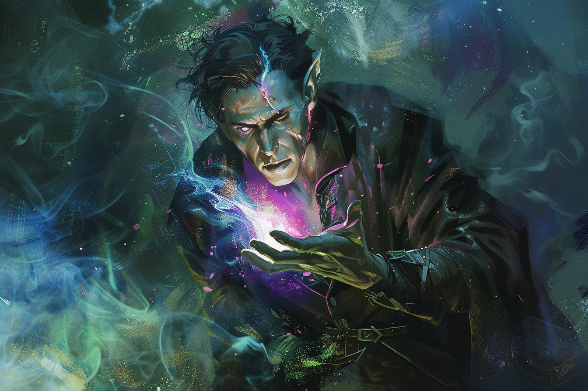

# Sombraur / Fils-Des-Ombres

## Résumé
Les **Sombraurs**, aussi appelés **Fils-Des-Ombres** / **Filles-Des-Ombres**, sont une espèce artificielle, semblables aux vampires dans les autres folklores, qui sont créés en suivant un rituel magique bien précis.

Devant se nourrir de magie régulièrement, c'est via cette consommation qu'ils arrivent à maintenir une plus grande espérance de vie que leur espèce d'origine.

Convaincus qu'ils passent un pacte avec la déité [Komorath](../../COSMOLOGIE/PLANS_ET_DIVINITES/Komorath.md), ils ne font en réalité que se lier via un rituel au **Plan de l'Ombre, de la Lumière et des Couleurs**.

## Transformation
Le **rituel** visant à transformer une personne en **Sombraur** est à la fois très lent et requiert une grande précision dans son exécution.

Durant plus de **8 heures de temps**, il nécessite l'intervention d'un mage très puissant, ou d'un **Sombraur**. Pour le mener, plusieurs ingrédients doivent être réunis : 
* **Une source magique** de grande puissance, comme un cristal magique, un alignement astral, ou une leyline puissante à proximité dans laquelle on puisse puiser ;
* **Un sacrifice de chair** sur la personne sur laquelle est mené le rituel (généralement une pointe de l'oreille) ;
* **Un catalyseur**, comme un cristal magique, qui sert à amplifier la puissance du rituel.

La source magique est alors consommé, catalysée, puis la envoyée via la blessure faite à la personne qui subit le rituel.

L'incantation suivante doit être prononcée en **langage magique** au moins 10 fois : 

> Ô Komorath, toi le Puissant parmi les Puissants
>
> Confère nous une partie de ton pouvoir
>
> Puisse-t-il nous apporter force et longévité
>
> Puisse-t-il maintenir nos ennemis à distance
>
> Ou nous donner la volonté de les anéantir
>
> Que nos sillons de leur soupir soient emplis

Une fois l'incantation prononcée, la magie pénètre à travers la blessure et commence à **modifier** le corps de l'initié. Au terme du rituel, une petite spirale **blanche**, **noire** et de **couleur** apparaît sur son bras gauche.

## Caractéristiques
### Soif de magie

Les **Sombraurs**, une fois transformés, acquièrent la possibilité d'absorber l'énergie magique d'être vivants par simple contact.

Un **Sombraur** peut survivre jusqu'à 4 jours sans absorber une seule goutte de magie. Passés ces 4 jours, ils se déssèchent petit à petit jusqu'à entrer en hibernation, qui ne cesse que lorsqu'ils entrent en contact avec une autre source de magie.

Plus la magie provient d'un être vivant à l'âme **complexe** (une personne ayant une âme plus complexe qu'un animal, qui a lui même une âme plus complexe qu'un végatal ou de la magie pure), plus cette magie nourrit efficacement le **Sombraur**, et lui redonne des forces. Ainsi, un **Sombraur** *végétarien* sera plus faible qu'un qui ne s'impose pas ce régime.

### Longévité
Le processus de **vieillissement** des **Sombraurs** est fortement ralenti une fois transformés : ils vieillissent entre 10 et 20 fois plus lentement que leur espèce d'origine ; et ne vieillissent pas lors qu'ils sont en **hibernation**.

Le retard provoqué dans le vieillissement est d'autant plus important que la qualité de la magie qu'ils absorbe est grande : un **Sombraur** se nourrissant que de d'énergie végétale vieillira à pein plus vite qu'une personne normale.

### Pouvoirs magiques supplémentaires

Les **Sombraurs** acquièrent des pouvoirs magiques supplémentaires à leur transformation, grâce à leur connexion plus grande avec la source magique avec laquelle ils se sont liés.

Ils peuvent manipuler plusieurs types de magie différentes avec une grande aisance, toute avec un lien très étroit avec les couleurs, la lumière, la vision et les illusions.

On comptera par exemple :

* Création d'**illusions** ;
* **Hallucinations** ;
* Changement de l'apparence d'une **personne** ou d'un **objet** ;
* **Obstruction de la vision**.

### Vitesse et force augmentées

Les **Sombraurs** sont plus rapides et plus forts après leur transformation.

Leur **force** est comparable à celle des plus puissants membres de son espèce d'origine.

Leur **vitesse** peut être augmentée l'espace d'un court instant, juste assez pour disparaître aux yeux de leurs adversaires, donnant l'impression de s'être téléporté.

### Régénération accélérée

Les **Sombraurs** bénificient d'une **régénration** accélérée pour leurs blessures : en l'espace de quelques minutes, ils peuvent faire se refermer une blessure béante ; en l'espace d'une heure, ils peuvent resouder une partie de leur corps qui a été sectionnée.

### Marque des ombres

Chaque **Sombraur** porte sur l'un de ses bras la **Marque des Ombres**, un attribut physique qu'il reçoit lors de la complétion de sa transformation.

Cette marque est légèrement différente pour chaque individu, mais elle se manifeste systématiquement comme une spirale colorée, qui zèbre le bras de noir et/ou blanc, ainsi que d'une autre couleur.

Cette marque agit comme **catalyseur** de la magie du **Sombraur**, et commence en étant assez petite, située au niveau du poignet. Elle remonte le bras de son propriétaire à mesure qu'il vieillit. Au moment où elle touche enfin le coeur de l'individu, ce dernier ressent une douleur intense : elle signe son arrêt de mort dans les semaines à venir.

### Changement de la couleur des yeux et du sang

La couleur du **sang** des **Sombraur** est d'un noir intense.

Au repos, les yeux des **Sombraurs** semblent parfaitement normaux. Cependant, dès qu'ils utilisent les pouvoirs qu'ils ont acquis à travers leur transformation, leurs yeux changent subitement de couleur pour la durée de l'incantation et ils s'injectent de leur sang noir. On peut discerner un crépitement au fond de leur regard.

### Léthalité des éléments chlorés

Les **Sombraur** sont sensibles au **chlore** et à toutes les substances qui en sont composées : le simple contact leur provoque une brûlure intense, qui peut conduire jusqu'à la mort si le composé n'est pas évacuer.

On note notamment :
* Sel ; 
* Eau salée ;
* Algues marines ;
* Chlore gazeux ; 
* Etc.

### Hypersensibilité à la lumière naturelle

Les **Sombraurs** souffrent tous de **photophobie** et d'une **hypersensibilité** à la lumière naturelle. 

Il leur est possible de rester dans un environnement lumineux quelques instants, mais au bout d'une **dizaine** de minutes, leurs yeux commencent à rougir et à produire des larmes, et ils commencent à ressentir des **démengeaisons** et leur **peau qui brûle**.

### Aversion à la nourriture
En échange de leur capacité d'absorption de l'énergie magique, ils exècrent toute nouriture et toute boisson, leur goût devenant **insupportable**. Ils peuvent cependant toujours manger et boire normalement, leurs corps gardant intactes leurs faculté de digestion.