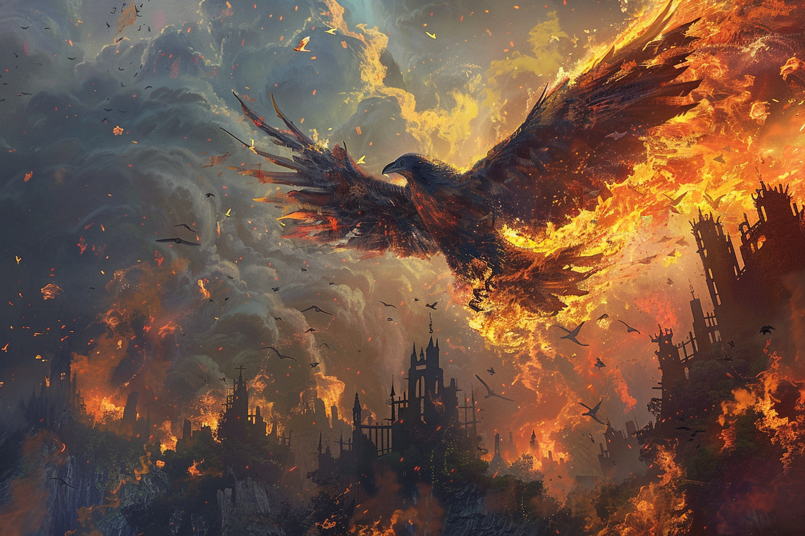
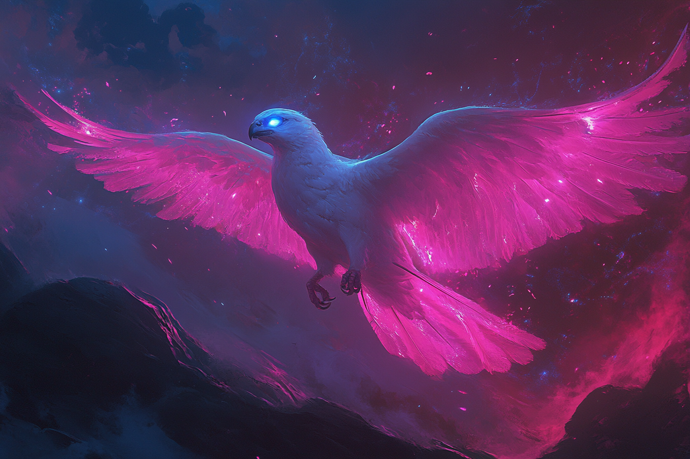
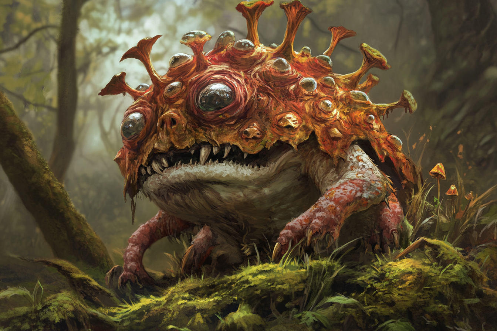
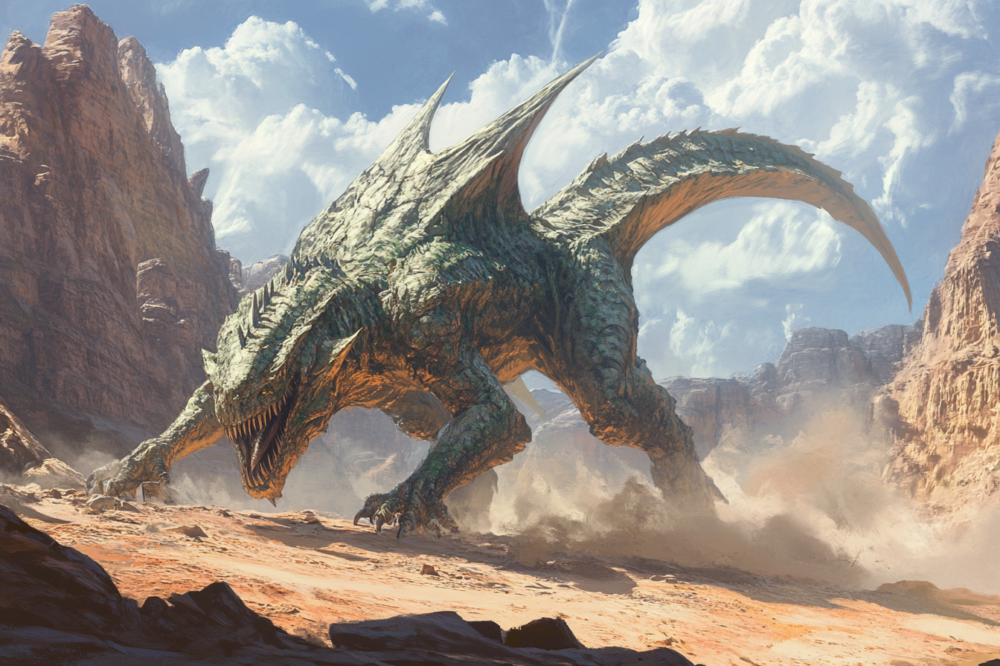
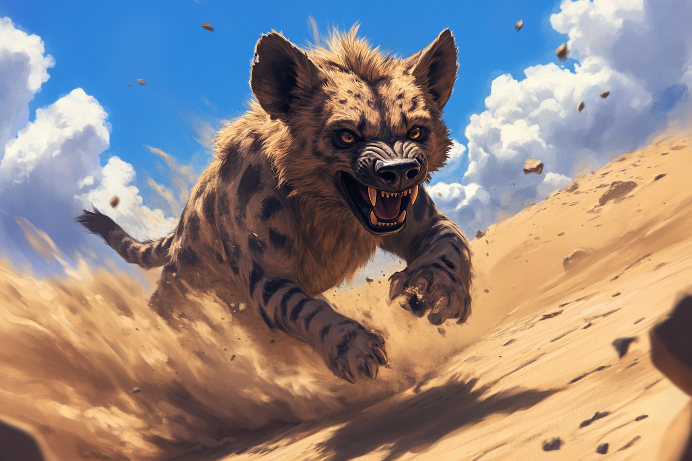

# Espèces animales

* Dinosaures
* Rapaces
* Ours rocheux
* Cerfs

## Aigle-Corbeau Géant

Les **Aigles-Corbeaux géants** sont des animaux pouvant atteindre une envergure de 10 mètres avec les ailes déployées.

Ils ont une affinité naturelle à la magie, qui leur permet de lancer des sorts élémentaires simples dans des environnements riche en mana, ainsi que de se métamorphoser, par exemple en roche.

Ces créatures vivent généralement dans les montagnes, et aiment bien faire leur nid dans des grottes, car elles ne supportent pas être observées.

Elles se nourrissent de tout ce qu'elles peuvent trouver, notamment les personnes qui s'aventureraient trop loin toutes seules.

## Colombe de minuit

## Crapaud-Champignon

Extrêmement toxique, les champignons qui poussent sur son dos font partie des substance les plus hallucinogènes au monde.

## Gargadon

## Hyène des sables

Les **Hyènes des Sable** sont des animaux qui adorent se terrer dans la terre, attendant qu'une proie passe à proximité pour lui sauter dessus.

## Renard change-forme / Renard-caméléon