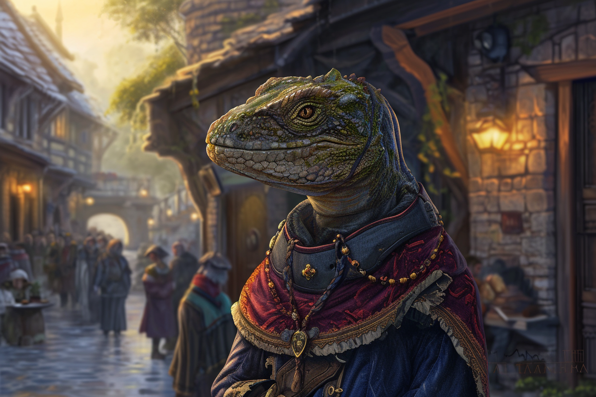
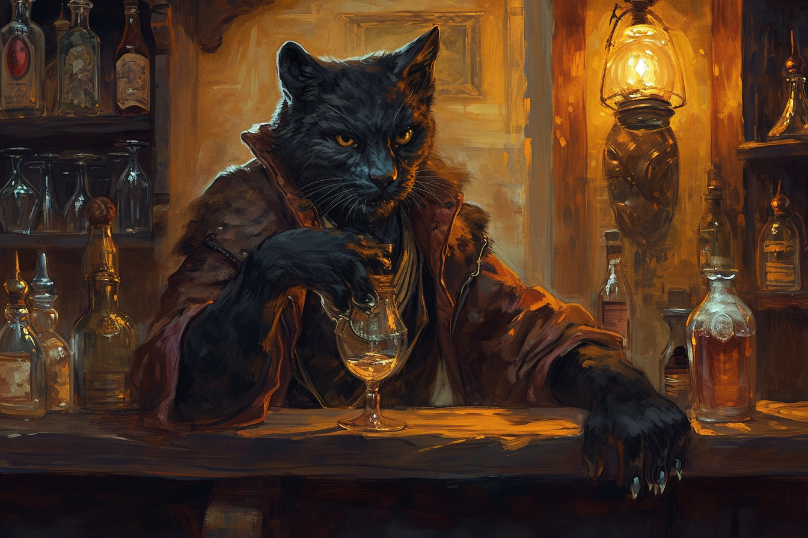
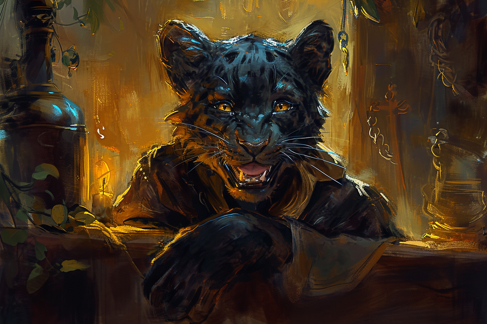
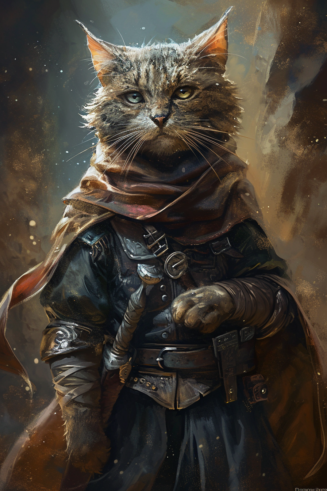
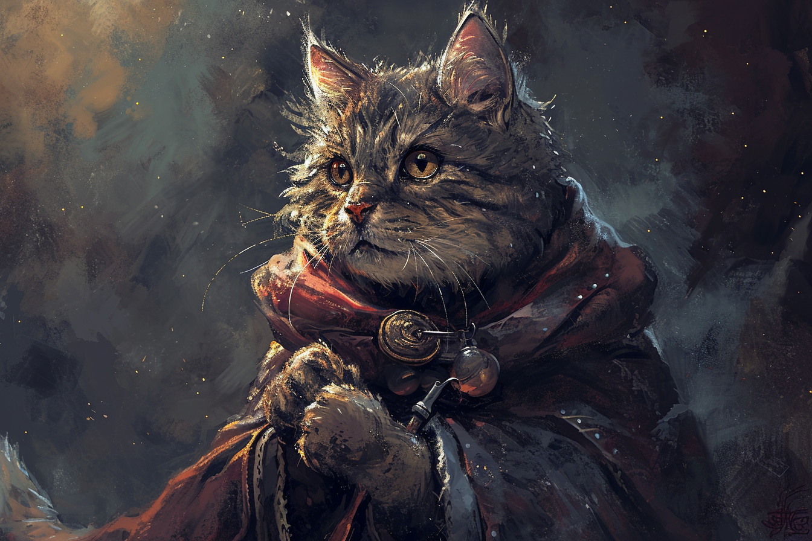
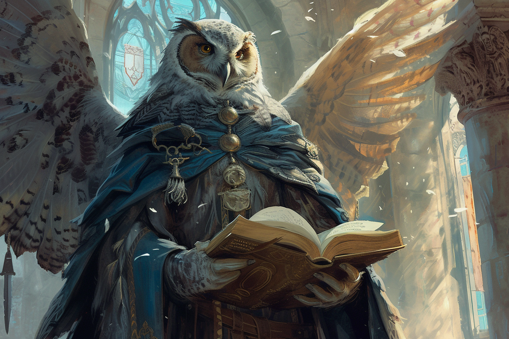
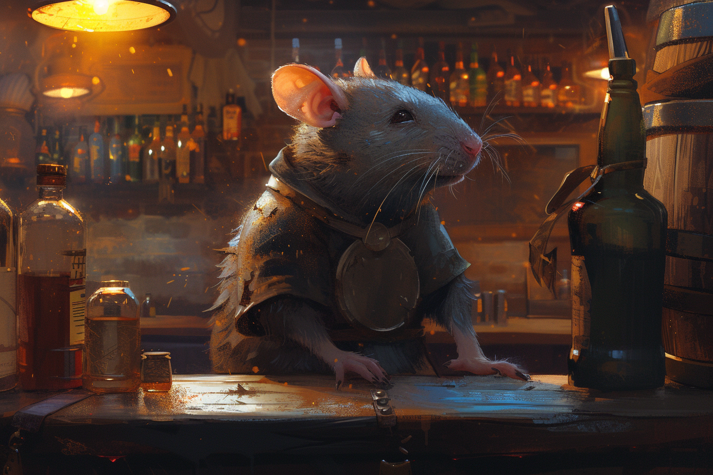

# Espèces conscientes

## Synthèse

| Espèce        | Race | Taille| Poids | Âge |
| ---           | ---  | --- | --- | --- |
| Humain        |---|1m70| 70 kg |70 ans|
| Elfe          |||||
|               |Elfe de feu|1m70|70 kg|210 ans|
|               |Elfe de bois|1m85|70 kg|250 ans|
| Reptiloïde    |||||
|               |Saurien|1m55|70 kg|60 ans|
|               |Alligatoride|1m80|110 kg|70 ans|
|               |Tortuguéen|1m50|140 kg|200 ans|
|               |Varanide|1m70|75 kg|90 ans|
| Félinoïde     |||||
|               |Léonin|1m85|120 kg|80 ans|
|               |Tigrylien|1m75|100 kg|70 ans|
|               |Panthéran|1m70|90 kg|80 ans|
|               |Felicis|1m20|35 kg|40 ans|
| Minotaure     |||||
|               |Minotaure des plaines|2m00|170 kg|65 ans|
| Avemain       |||||
|               |Strixien|1m60|60 kg|100 ans|
|               |Aquilin|1m75|70 kg|80 ans|
|               |Corvidé|1m50|45 kg|70 ans|
|               |Ibisside|1m85|70 kg| 90 ans|
| Rongeoïde     |||||
|               |Surissien|1m20|30 kg|40 ans|
|               |Ratussien|1m50|55 kg|40 ans|
| Centaure      |---|2m10|500 kg|120 ans|

## Humain

## Elfe
### Elfe des bois

## Reptiloïde
### Saurien

Une pratique saurienne courante est de prendre le nom de famille de son conjoint ou de sa conjointe si sa famille est jugée plus puissante et influente que la sienne.

## Félinoïde
### Léonins
Les **Léonins** sont connus pour pour faire rouler les *R* **au fond de leurs gorges** en parlant ([exemple audio](https://en.wikipedia.org/wiki/Voiced_uvular_trill)). Il leur arrive de prononcer ce son tout seul dans le cas où ils sont mécontents. Ils détestent qu'on prenne ce son pour un *ronronnement*.

### Panthéran

Une espèce assez fière qui culturellement cherche à vivre dans le confort et qui sait saisir toute opportunité afin de pouvoir maintenir son niveau de vie. De ce fait, ils sont vus comme avares et prêt à tout pour monter socialement. 

Les **Panthérans** vivent génralement dans de petites communautés, n'aimant pas le brouhaha des villes. 

Avant l'âge adulte, ils ne portent que le prénom donné par leurs parents. Une fois assez âgés, ils choisissent un deuxième prénom, identique à l'un de leurs proches s'ils l'admirent (y compris leurs parents), ou totalement différent s'ils souhaitent marquer leur individualité. 

Lorsqu'ils parlent, les **Panthérans** ont tendance à particulièrement rouler les *R*. De plus, ils ont tendance à transformer tous les *S* en *CH/SH*.

### Felicis

Les **Felicis** sont souvent pris de haut par les autres espèces de Félinoïdes, étant clairement la race la plus petite et avec l'espérance de vie la plus courte. De plus, les Felicis ronronnent légèrement quand ils s'expriment, ce qui est un trait jugé enfantin chez les autres **Félinoïdes**.

C'est une espèce généralement peu ambitieuse qui aime le confort et ne souhtaite fournir d'efforts qu'en cas de nécessité absolu. On dit souvent qu'un Felicis heureux est un Felicis qui arrive à vivre sans sortir de chez lui.

Il existe néanmoins quelques individus qui rêvent de profiter de leur vie au maximum, les poussant à vivre chaque jour comme si c'était le dernier.

Ils portent généralement le prénom qu'ils se sont donnés eux-mêmes, une fois la vie adulte atteinte. Ce prénom est très souvent constitué de deux syllabes uniquement. 

## Minotaure

## Avemain 
### Strixien 

## Rongeoïde
### Surissien

### Ratussien

## Centaure