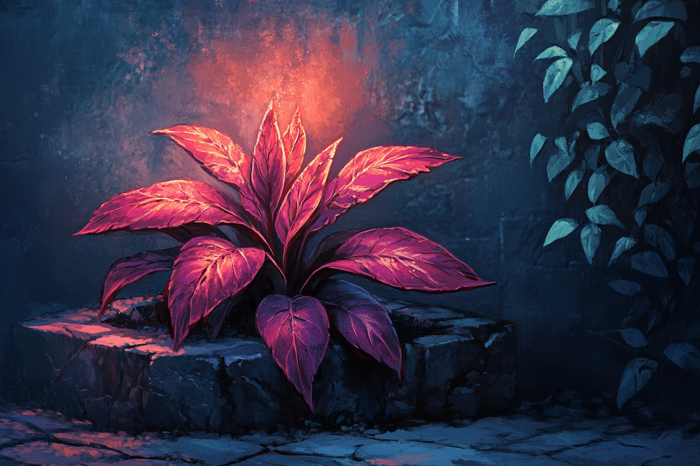

# Espèces végétales

## Baies

### Baies de feu
De petites baies rouges qui poussent sur des buissons en forêt. Leur noyau fait une très bonne épice piquante, tandis que leur chair produit de petites étincelles quand écrasée.

## Plantes à bulbe
### Mandragore nocture

Plante ne poussant que la nuit, elle a été cultiviée et sélectionnée par les habitants de [Rovtal](../VILLES/Rovtal.md) pour ses propriétés sédatives et narcotiques.

Elle est reconnaissable car elle brille en rouge dès qu'éclairée par les lunes.

On s'en sert également pour en faire de l'encre **rouge**.