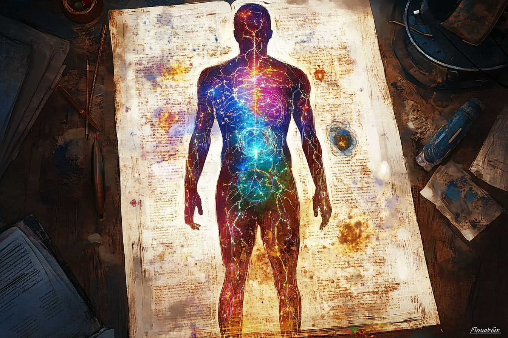
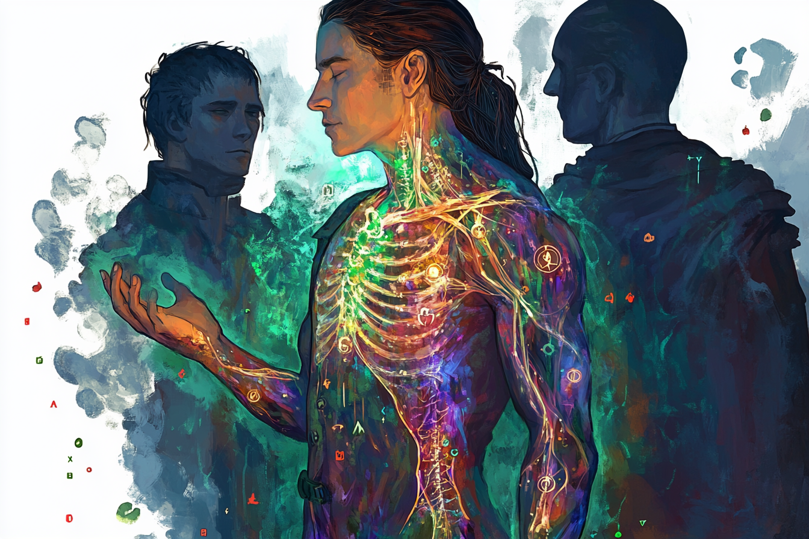

# Bio-étherologie

## Introduction
L'ensemble des êtres vivants ont en leur sein des organes qui réagissent avec les **éthers**. La bio-éthérologie consiste à étudier le lien entre les êtres vivants et les **éthers**.

On note notamment :
* Le système **éthérique**, qui parcourt le corps de chacun, à l'instar du système sanguin ou du système lymphatique ;
* Le **coeur éthérique**, organe jouant le rôle de pompe, chez les centaures notamment.

## Nécessité de l'éther pour la survie

La plupart des êtres vivants ont besoin d'éther pour pouvoir survivre.

Dans les milieux peu éthérés naturellement, c'est l'éther des êtres vivants qui est le premier à être aspiré vers d'autres plans, plutôt que le **Plan Matériel**.

Au contraire, les endroits qui sont les plus éthérés naturellement, notamment les lieux où les **leylines** sont présentes, sont plus cléments envers les êtres vivants, car leur éther moins asprié *en proportion*.