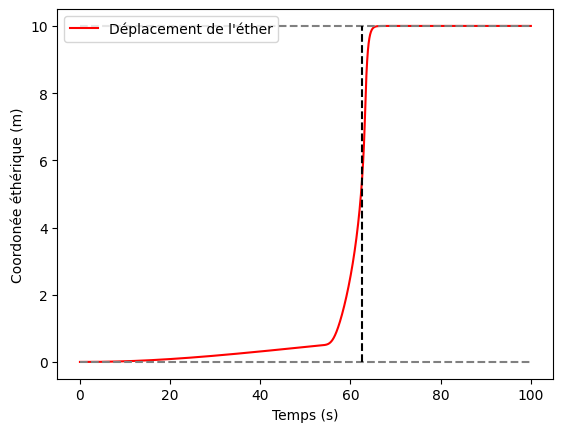

# Etherologie

## Introduction
L'**Ether** est un type de substance qui réagit avec tout type de matière, et qui régit beaucoup des principes physiques fondamentaux. L'**Ethérologie** consiste en l'étude de l'**éther** sous toutes ses formes, et son utilisation dans le quotidien.

Les **éthers** se présentent sous des formes très différentes, bien que la plupart se trouvent à l'état *gazeux*. Les **mages** sont ceux qui peuvent naturellement manipuler les **éthers** pour les manifester dans le monde, et les combiner pour manifester des effets spectaculaires.

La source primaire des **éthers**

## Les types d'éthers
On distingue **4 types d'éthers** :
* Les éthers [**élémentaires**](./EthersElementaires.md), qui réagissent et résonnent fortement avec les différents types de matière et composés chimiques ;
* Les éthers [**dynamiques**](./EthersDynamiques.md), qui sont les éthers qui sont le plus suceptibles d'être mises en mouvement, accélérés, et suivre des trajectoires complexes ;
* Les éthers [**solvants**](./EtherSolvants.md), qui sont les éthers qui ont beaucoup de simplicité à se lier à d'autres éthers, et qui par eux-mêmes peuvent traverser et se lier à d'autres matières ;
* Les éthers [**structuraux**](./EthersStructuraux.md), qui sont les éthers qui réagissent facilement entre eux afin de prendre des formes complexes.

## Les propriétés et principales équations

### Dimension éthérique
L'ensemble des **plans** de l'univers sont en réalité superposés les uns aux autres, vivant tous dans un monde **quadri-dimensionnel**. Chaque plan vit alors dans un espace qui lui est propre, et est plus au moins proches des autres plan selon la quatrième dimension, appelée **dimension éthérique**, notée généralement $\varepsilon$.

Les **plans** ne sont pas pour autant **parallèle** ; en effet, deux plans peuvent être plus ou moins proches l'un de l'autre en fonction du point tridimensionnel. Dans les positions où les plans sont relativement proches, il devient alors très simples de faire circuler des éthers entre ces plans, alors que dans les endroits éloignés, ces plans ne communiquent quasiment pas.

### Le mana
Le **mana** est la quantité d'énergie que peut libérer un **éther** par sa consommation. Un **éther** avec un mana élevé réagit beaucoup plus facilement avec le reste des forces qui l'animent.

On mesure le **mana** via une unité dédié, l'**Ethérium**, noté $E$.

### Mouvement éthérique
Les **plans** d'existence sont en perpétuel mouvement les uns par rapport aux autres, entrant parfois en collision les uns par rapport aux autres, et se croisant alors, à l'image des plaques tectoniques, mais sur des temps caractéristiques beaucoup plus court (de l'ordre de la semaine).

Dans le **Plan Matériel**, cette collision explique le mouvement perpétuel des **lignes ley**. Le mouvement des lignes ley correspond en réalité aux endroits où un plan externe est en contact avec le **plan Matériel**. 

### Force de rappel planaire - Stabilisation planaire
Les éthers peuvent être arrachés à leur plan vers d'autres plans, notamment le **Plan Matériel**.

Dans ce cas-là, un éther **arraché** subit une force d'attraction vers son plan d'origine ainsi que tous les plans dans lequel il serait plus stable que le plan dans lequel il est actuellement, en plus de la force d'attraction stabilisatrice qu'exerce le plan dans lequel il est.

Un **éther** est donc inlassablement    attiré vers les plans dans lequel il est le plus stable.

La force de stabilisation et les forces de rappels s'expriment de la manière suivante :

$$F_{i}(\varepsilon(t), t) = \frac{\lambda_{i}}{(\varepsilon(t)-\varepsilon_{i})^{2}}f_i(t)$$

en notant que dans le cas où $|\varepsilon(t)-\varepsilon_i|<\varepsilon_c$, alors

$$F_{i}(\varepsilon(t), t) = \frac{\lambda_{i}(\varepsilon(t)-\varepsilon_{i})}{\varepsilon_c^3}f_i(t)$$

S'il s'agit d'un plan attracteur, 

$$f_i(t) = \frac{t^2}{t^2 + \tau_{c,i}^2 } = 1- \frac{\tau_{c,i}^2}{t^2+\tau_{c,i}^2 }$$

et, dans le cas du plan stabilisateur 

$$f_i(t) = 1$$

avec : 
|Symbole|Unité|Description |
|-|-|-|
|$$F_{i}$$|$N$|Force attractrice du plan $i$ |
|$$\varepsilon$$|$m$|Coordonnée éthérique de l'éther|
|$$\varepsilon_{i}$$|$m$|Coordonnée éthérique du plan|
|$$\lambda_{i}$$|$N.m^2$|Constante d'attraction éthérique|
|$$\varepsilon{i}$$|$m$|Distance éthérique critique|
|$$f_i$$|$-$|Composante temporelle de la force attractrice|
|$$\tau_ {c,i}$$|$s$|Temps caractéristique d'attraction|

Il vient alors naturellement un parallèle entre les **forces d'attraction éthérique** et les **forces de gravitation classiques**, avec une force qui évolue en inverse du carré de la distance au-delà d'un distance critique, et linéaire en deça de cette distance. Cette **distance critique** correspond réellement à la *taille* du plan attracteur.

Ainsi, de fait, l'attraction qu'exerce un plan sur un éther est nulle au moment de l'arrachement, puis augmente de plus en plus, jusqu'à atteindre un maximum. L'augmentation soudaine de la force d'attraction est la raison principale pour laquelle les éthers sont soumis à des phénomènes dits de **claquage éthérique**, où ils retournent violemment vers leurs plans d'origine.

### Dynamique des éthers arrachés - Claquage éthérique
Un éther **arraché** se comporte alors selon l'équation suivante :

$$\frac{e}{\rho_{\varepsilon}} \ddot{\varepsilon}(t) + c\dot{\varepsilon}(t) + \sum_{i=0}^{\infty}{F_{i}(\varepsilon(t), t)} = 0$$

avec

|Symbole|Unité|Description|
|-|-|-|
|$e$|$E$|Inertie de mana| 
|$\rho_{\varepsilon}$|$E/kg$|Mana massique|
|$c$|$kg.s^{-1}$|Amortissement inter-planaire| 

> **Note** : 
>
> L'équation ci-dessus peut-être retravailler pour être exprimée en fonction des quantités de **mana** plutôt que des quantités massiques.

Cela se traduit dans les faits par des phénomènes de **claquage** soudains, où l'éther est attiré subitement vers un autre plan d'existence.

Ci-dessous, une illustration d'un système simple à deux plans, avec en **gris** les coordonnées éthériques (relatives) des plans.

> **Note** :
> 
> On peut noter dans les faits que le coefficient d'amortissement inter-planaire est généralement très élevé, ce qui explique une absence totale d'oscillation post-claquage.

### Principe d'interaction des éthers
Une paire d'**éthers** est systématiquement soumise à deux forces **internes**:
* Une force d'**attraction**, notée $f_a$ ;
* Une force de **répulsion**, notée $f_r$.

Ces deux forces sont dirigés d'un éther vers l'autre, et leur amplitude a une forme similaire :

$$f_a(\Delta x) = \frac{A}{x^a}$$
$$f_r(\Delta x) = \frac{R}{x^r}$$ 

avec dans le cas général $r>a$. Les constantes $A$, $R$, $a$ et $r$ dépendent intégralement des deux éthers concernés.

On peut alors exhiber une **distance critique** à laquelle les deux forces s'équilibrent. On pose alors :

$$\Delta x_c = (\frac{R}{A})^{\frac{1}{r-a}}$$

Cette distance dicte par la suite les **états physiques** des mélanges d'éther.

> **Note** :
> 
> Les éthers **structuraux** sont la classe d'éthers qui ont une distance critique $\Delta x_c$ avec les autres éthers et entre eux. Ils peuvent alors former aisément des liaisons et former des structures complexes.   

### Principe d'orthogonalisation
Lorsque plusieurs éthers interagissent, il est possible que certains d'entre eux voient leurs coordonnées éthériques évoluer pour se ranger orthogonalement selon la dimension éthérique.

Cette orthogonalisation peut se rapprocher d'une sorte de magnétisation, puisque les éthers se rangent alors plus selon la coordonée éthérique que selon les coordonnées spatiales.

Des éthers maintenus en position coordonnée éthérique légèrement décalée sont beaucoup moins sujets aux interactions avec les composés de coordonnée éthérique et spatiales différentes.

> **Note** :
> 
> Les éthers **solvants** sont la classe d'éthers sont capables d'agencer un grand nombre d'autres éthers orthogonalement, de les maintenir en position, et sont ceux qui, facilement, peuvent rester dans le plan courant.

### Principe de décharge éthérique

> **Note** :
> 
> Ethers dynamique / élémentaire

### Stabilisation des éthers
En dehors de l'attraction *naturelle* des plans, il est possible d'agir sur les **éthers** afin de les stabiliser.