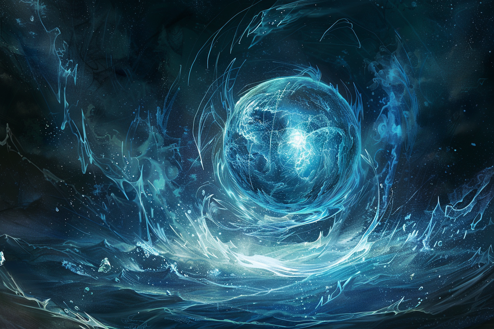
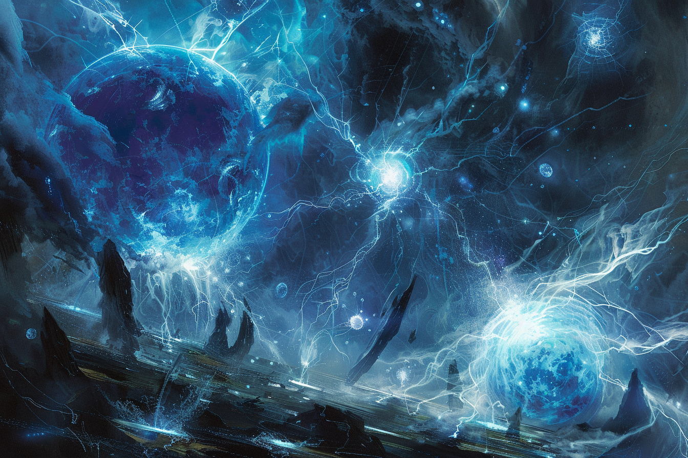

# Les Ethers Elémentaires

## [Plan de la Lave et du Feu](../COSMOLOGIE/PLANS_ET_DIVINITES/Ingar.md)
### Geshnum - Ether du Feu

### Kezhum - Ether de la Cendre

## [Plan de l'Eau](../COSMOLOGIE/PLANS_ET_DIVINITES/Qwar.md)
### Fetlum - Ether de l'Eau

## [Plan de la Tempête](../COSMOLOGIE/PLANS_ET_DIVINITES/Fuurma.md)
### Pekrum - Ether de la Foudre

## [Plan du Métal et de la Roche](../COSMOLOGIE/PLANS_ET_DIVINITES/Ronar.md)
### Gerbum - Ether de la Pierre

### Dehbum - Ether de l'Argile

## [Plan de la Lumière, des Ombres et des Couleurs](../COSMOLOGIE/PLANS_ET_DIVINITES/Komorath.md)
### Dhenmum - Ether de la Lumière 

### Bemrum - Ether de l'Ombre

## [Plan de la Vie et de la Mort](../COSMOLOGIE/PLANS_ET_DIVINITES/Italis.md)
### Tevlum - Ether de l'Âme

### Deykum - Ether de la Matière Organique
