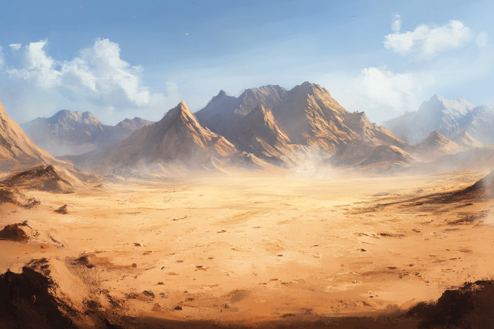
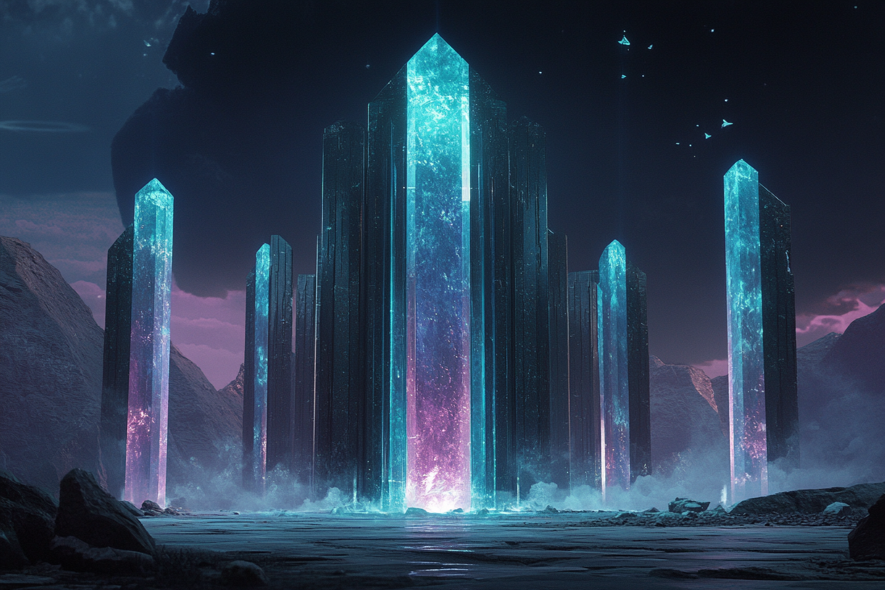
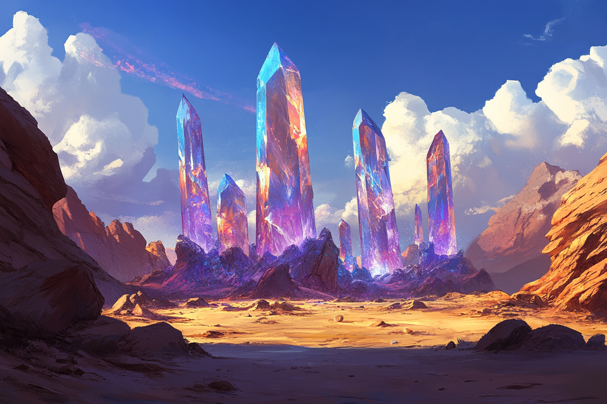
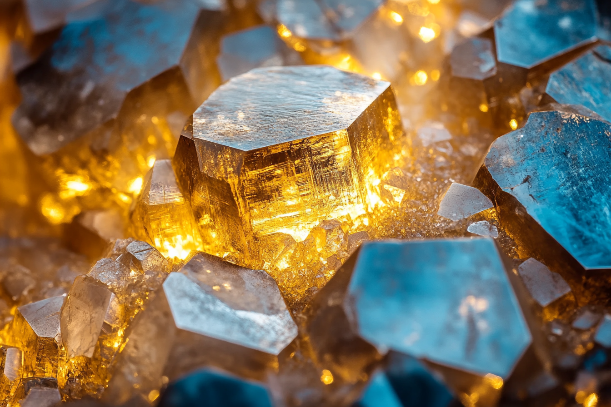

# L'Horizon de Sable

L'**Horizon de Sable** est le nom donné au désert à l'Est de la Côte Epineuse.

## Sites cristallins

Parsemés dans le désert, on trouve beaucoup de **sites cristallins**, des sites où l'on retrouve des **stabilisteurs naturels de leylines**. 

Trop peu de ces sites réunissent les conditions nécessaires pour vivre décemment, donc la plupart de ces sites sont exploités afin de fabriquer d'autres cristaux, notamment par la ville de [Caproch](../VILLES/Caproch.md).

## Orichalque

L'**Orichalque** est un métal se trouvant en grande quantité dans certaines régions du désert.

Connu pour ses propriétés de **bonne conduction éthérique** et son interaction particulière avec les **éthers** lors de sa forge, il partage également d'autres propriétés propres aux métaux, comme leur bonne conductions thermique et leur malléabilité.