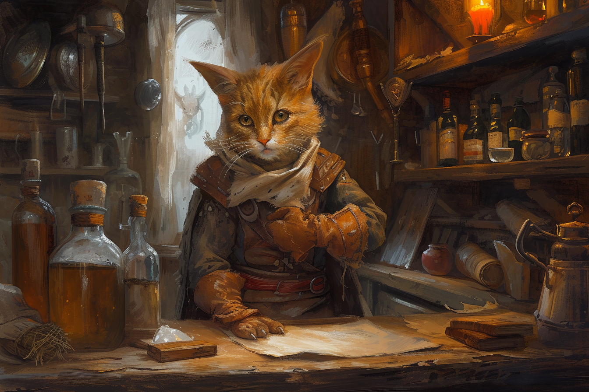

# Brego - Chef du chantier naval

## Infos 

| Âge | Espèce | Occupation | Alignement | MBTI |
| --- | ------ | ---------- | ---------- | ---- |
| 25 ans | Felicis | Chef du chantier naval | Lawful Neutral | ENFP |

## Localisation actuelle
[**Brumebourg**](../../VILLES/Brumebourg.md)

## Filiations
## Groupes 

## Caractéristiques
* Propriétaire de [**La Fière Barque**](../../VILLES/Brumebourg.md#la-fière-barque---chantier-naval).
* Malgré le fait qu'il construise des bâteaux, n'a jamais navigué, car il déteste l'eau et avoir le pelage mouillé.
* Son agilité lui permet de monter très facilement sur le mât des bâteaux qu'il répare.
* Il adore tailler des marches en bois, et il est très bon.

## Événements marquants

## Combat
S.O.
