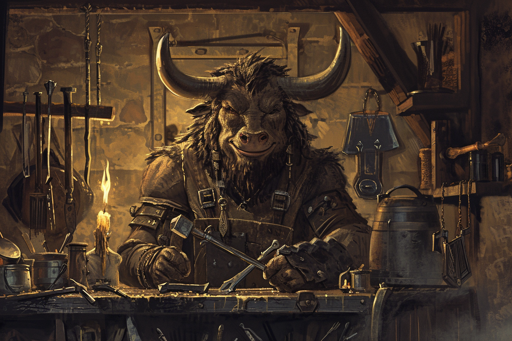

# Brumebourg

---

### Fern Sfer - Mari de l'Envoyée de Rovtal

* Nom : **Fern Sfer**, né *Fern Héjj*
* Âge : **42 ans**
* Espèce : **Saurien**
* Alignement : **Lawful Good**
* MBTI : **INFP**
* Filiations : **Therra Sfer** (femme)
* Description : 
    * Mari de l'envoyée de Rovtal, il a pris le nom de sa femme afin de s'affilier à sa famille, plus puissante (pratique Saurienne courante).
    * Il adore profiter du paysage bucolique de Brumebourg et demander si tout va bien à tout le monde.
---

### Kramer Grishka - Barman

* Nom : **Kramer Grishka**
* Âge : **35 ans**
* Espèce : **Panthèran**
* Alignement : **Neutral Good**
* MBTI : **ISTP**
* Filiations : [**Lana Spat**](#lana-spat---tavernière) (femme), [**Fego**](#fego---enfant) (fils), [**Bakari Mikhaïl**](./EnfantsDeLaRue.md#bakari-mikhaïl---chef-de-groupe) (cousin)
* Description : 
    * Un des deux propriétaires du **Chat en Boule**.
    * Ni sait ni lire ni écrire.
    * A un mauvais accent mexicain.
    * Il vivait à [**Dvolsti**](../../VILLES/Dvolsti.md) jusqu'à il y a 15 ans, où il a déménagé avec sa femme pour venir à Brumebourg. Il n'a gardé aucun contact avec sa famille à **Dvolsti**, notamment avec son cousin [Bakari](./EnfantsDeLaRue.md#bakari-mikhaïl---chef-de-groupe).
---

### Lana Spat - Tavernière

* Nom : **Lana Spat**
* Âge : **37 ans**
* Espèce : **Panthèran** (50%), **Felicis** (50%)
* Alignement : **Chaotic Good**
* MBTI : **ISFP**
* Filiations : **Kramer Grishka** (mari), **Fego** (fils)
* Description :
    * Une des deux propriétaires du **Chat en Boule**.
    * Elle vivait à [**Dvolsti**](../../VILLES/Dvolsti.md) jusqu'à il y a 15 ans, où elle a déménagé avec son mari pour venir à Brumebourg.
---

### Fego - Enfant

* Nom : **Fego**
* Âge : **5 ans**
* Espèce : **Panthèran** (75%), **Felicis** (25%)
* Alignement : **Chaotic Good**
* MBTI : **ESFP**
* Filiations : **Kramer Grishka** (père), **Lana Spat** (mère)
* Description : 
    * Fils des propriétaires du **Chat en Boule**.
---

### Vick Ohm - Artisan Forgeron

* Nom : **Vick Ohm**
* Âge : **44 ans**
* Espèce : **Minotaure**
* Alignement : **Lawful Neutral**
* MBTI : **ESTJ**
* Filiations : -
* Description : 
    * Propriétaire de la **Corne d'Acier**.
---

### Brego - Chef du chantier naval

* Nom : **Grego**
* Âge : **25 ans**
* Espèce : **Felicis**
* Alignement : **Lawful Neutral**
* MBTI : **ENFP**
* Filiations : -
* Description : 
    * Propriétaire de **La Fière Barque**.
    * Malgré le fait qu'il construise des bâteaux, n'a jamais navigué, car il déteste l'eau et avoir le pelage mouillé.
    * Son agilité lui permet de monter très facilement sur le mât des bâteaux qu'il répare.
    * Il adore tailler des marches en bois, et il est très bon.
---

### Kaill Kutt - Epicier

* Nom : **Kaill Kutt**
* Âge : **49 ans**
* Espèce : **Saurien**
* Alignement : **Loyal Good**
* MBTI : **ESFJ**
* Filiations : **Kela Kutt** (femme), **Keno Kutt** (frère)
* Description : 
    * Propriétaire de **La Langue qui Pique**.
    * Originaire de **Rovtal**, il s'est installé à **Brumebourg** avant que son frère soit muté.
    * Il adore proposer des échantillons gratuits aux gens qu'il apprécie beaucoup.
---

### Nofret Aalis - Clerc en chef du temple

* Nom : **Nofret Aalis**
* Âge : **47 ans**
* Espèce : **Strixien**
* Alignement : **Neutral Good**
* MBTI : **INFJ**
* Filiations : -
* Description : 
    * Vénère [**Italis**](../../COSMOLOGIE/PLANS_ET_DIVINITES/Italis.md) (le temple lui est dédié).
---

### Keno Kutt - Chef de la garde de [Therra](#therra-sfer---envoyée-de-rovtal)

* Nom : **Keno Kutt**
* Âge : **37 ans**
* Espèce : **Saurien**
* Alignement : **Loyal Good**
* MBTI : **ESTJ**
* Filiations : **Kaill Kutt** (frère)
* Description : 
    * Chef de la garde, envoyé par Rovtal en même temps que [Thera Sfer](#therra-sfer---envoyée-de-rovtal), entre autres pour assurer sa protection.
    * Il aime bien les villageois de **Brumebourg**, qu'il regarde un peu de haut malgré lui.
    * Il aimerait bien retourner **Rovtal** s'il en avait l'occasion.
    * Il s'ennuie un peu lors de son travail, il en profite quelques fois pour faire des siestes, longuement méritées vu qu'il s'octroie souvent les gardes de nuit.
---

### Trébwon Kwestyon - Membre de la garde de [Therra](#therra-sfer---envoyée-de-rovtal)

* Nom : **Trébwon Kwestyon**
* Âge : **33 ans**
* Espèce : **Saurien**
* Alignement : **Lawful Good**
* MBTI : **ISTJ**
* Filiations : **Trébyen Kwestyon** (frère)
* Description : 
    * Membre de la garde, envoyé par Rovtal en même temps que [Keno](#keno-kutt---chef-de-la-garde-de-therra).
    * Il adore regarder le feu brûler.
---

### Trébyen Kwestyon - Membre de la garde de [Therra](#therra-sfer---envoyée-de-rovtal)

* Nom : **Trébyen Kwestyon**
* Âge : **30 ans**
* Espèce : **Saurien**
* Alignement : **Neutral Good**
* MBTI : **ISTP**
* Filiations : **Trébwon Kwestyon** (frère)
* Description : 
    * Membre de la garde, envoyé par Rovtal en même temps que [Keno](#keno-kutt---chef-de-la-garde-de-therra).
    * C'est un très bon coureur. Il se lève parfois le matin pour faire un jogging tout seul.
---

### Klem Thab - Menuisier

* Nom : **Klem Theb**
* Âge : **99 ans**
* Espèce : **Elfe des bois**
* Alignement : **Chaotic Good**
* MBTI : **INFP**
* Filiations : -
* Description : 
    * Propriétaire du **Bois Vert**, la menuiserie.
    * Se lève de bon matin pour aller découper du bois.
---

### Joland Rouk - Fermier

* Nom : **Joland Rouk**
* Âge : **35 ans**
* Espèce : **Humain**
* Alignement : **True Neutral**
* MBTI : **ENTP**
* Filiations : -
* Description : 
    * Il adore avoir des débats inutiles, pour peu qu'il ait le dernier mot.
    * Propriétaire de **La Ferme de la Colline**.
---
