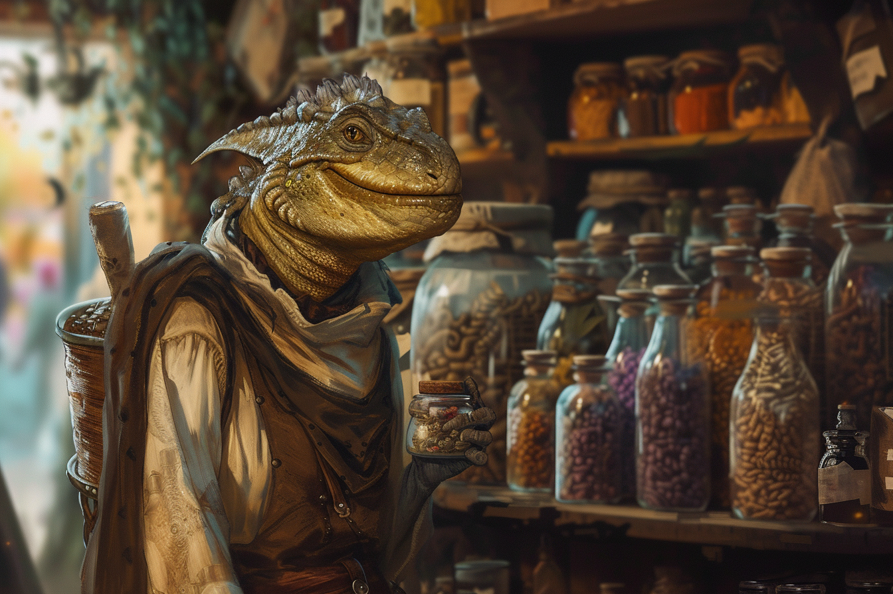

# Kaill Kutt - Epicier

## Infos 

| Âge | Espèce | Occupation | Alignement | MBTI |
| --- | ------ | ---------- | ---------- | ---- |
| 49 ans | Saurien | Epicier | Lawful Good | ESFJ |

## Localisation actuelle
[**Brumebourg**](../../VILLES/Brumebourg.md)

## Filiations
* [**Keno Kutt**](./Keno_Kutt.md) (frère)
* [**Timotheos Kutt**](../ROVTAL/Timotheos_Kutt.md) (cousin germain)

## Groupes 
* [**Famille Kutt**](../ROVTAL/GROUPES/Famille_Kutt.md)

## Caractéristiques
* Propriétaire de [**La Langue qui Pique**](../../VILLES/Brumebourg.md#la-langue-qui-pique---epicerie).
* Originaire de **Rovtal**, il s'est installé à **Brumebourg** avec sa famille avant que son frère soit muté.
* Il adore proposer des échantillons gratuits aux gens qu'il apprécie beaucoup.

## Événements marquants
* **423** : S'est installé avec sa famille à **Brumebourg**.

## Combat
S.O.