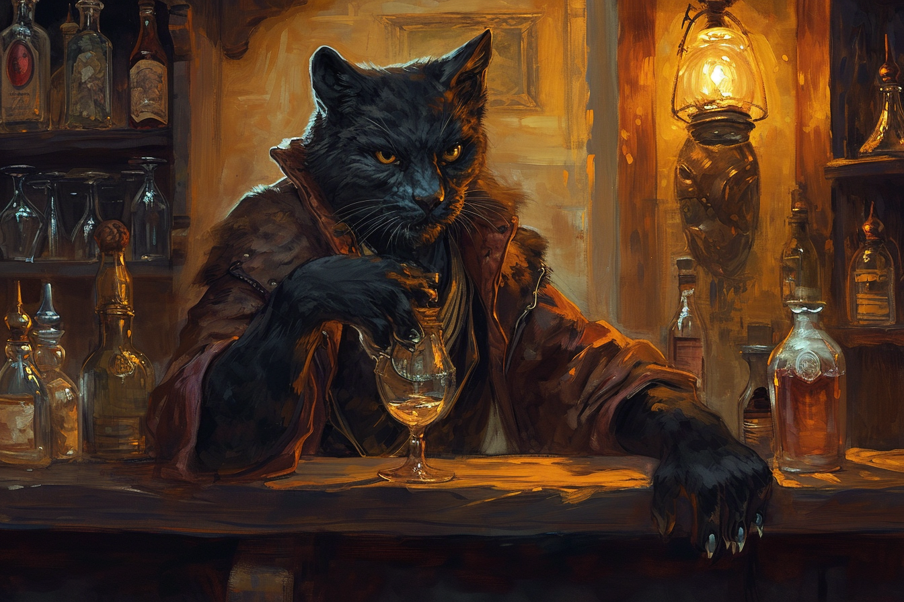

# Kramer Grishka - Barman

## Infos 

| Âge | Espèce | Occupation | Alignement | MBTI |
| --- | ------ | ---------- | ---------- | ---- |
| 35 ans | Panthéran | Barman | Neutral Good | ISTP |

## Localisation actuelle
[**Brumebourg**](../../VILLES/Brumebourg.md)

## Filiations
* [**Lana Spat**](./Lana_Spat.md) (femme)
* [**Fego**](./Fego.md) (fils)
* [**Bakari Mikhaïl**](../ENFANTS_DE_LA_RUE/Bakari_Mikhail.md) (cousin)

## Groupes 

## Caractéristiques
* Un des deux propriétaires du [**Chat en Boule**](../../VILLES/Brumebourg.md#le-chat-en-boule---taverne).
* Ni sait ni lire ni écrire.
* A un mauvais accent mexicain.
* Il vivait à [**Dvolsti**](../../VILLES/Dvolsti.md) jusqu'à il y a 15 ans, où il a déménagé avec sa femme pour venir à Brumebourg. Il n'a gardé aucun contact avec sa famille à **Dvolsti**, notamment avec son cousin [Bakari](../ENFANTS_DE_LA_RUE/Bakari_Mikhail.md).

## Événements marquants
* **417** : Est arrivée à **Brumebourg** depuis [**Dvolsti**](../../VILLES/Dvolsti.md) avec sa femme.

## Combat
S.O.
