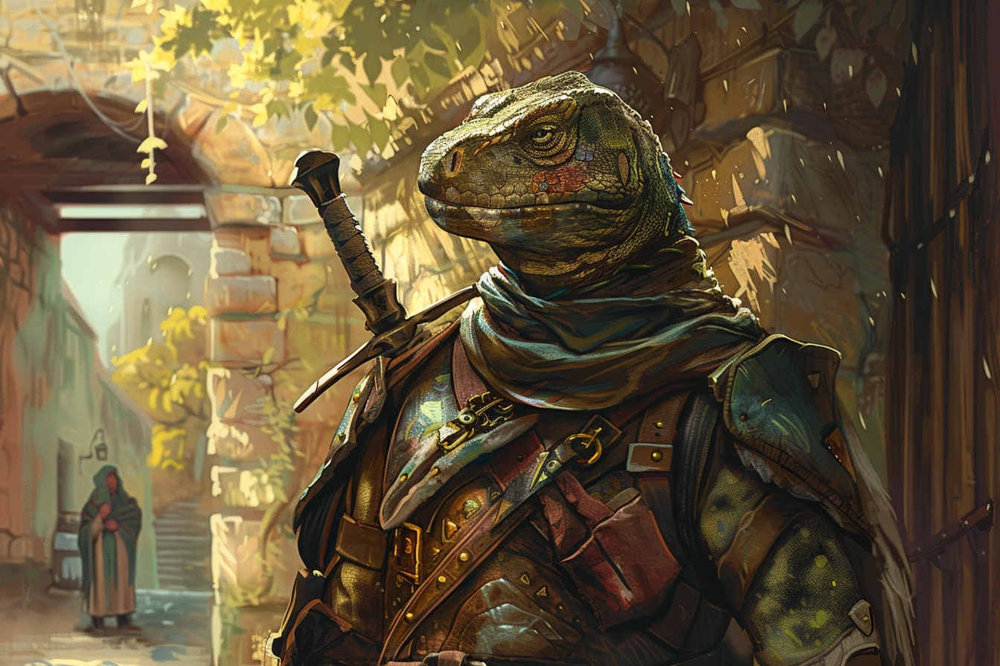

# Trébwon Kwestyon - Membre de la garde de [Therra](./Therra_Sfer.md)

## Infos 

| Âge | Espèce | Occupation | Alignement | MBTI |
| --- | ------ | ---------- | ---------- | ---- |
| 33 ans | Saurien | Membre de la garde | Lawful Good | ISTJ |

## Localisation actuelle
[**Brumebourg**](../../VILLES/Brumebourg.md)

## Filiations
* [**Trébyen Kwestyon**](./Trébyen_Kwestyon.md) (frère)

## Groupes 
* [**Famille Kwestyon**](../ROVTAL/GROUPES/Famille_Kwestyon.md)

## Caractéristiques
* Membres de la garde, envoyé par Rovtal en même temps que [**Keno**](./Keno_Kutt.md).
* Il adore regarder le feu brûler.

## Événements marquants
* **429** : S'est installé à **Brumebourg** pour servir de garde de [**Therra**](./Therra_Sfer.md).

## Combat
[Stats](../../../STAT_BLOCKS/CLASS/Chevalier.md#chevalier-saurien)