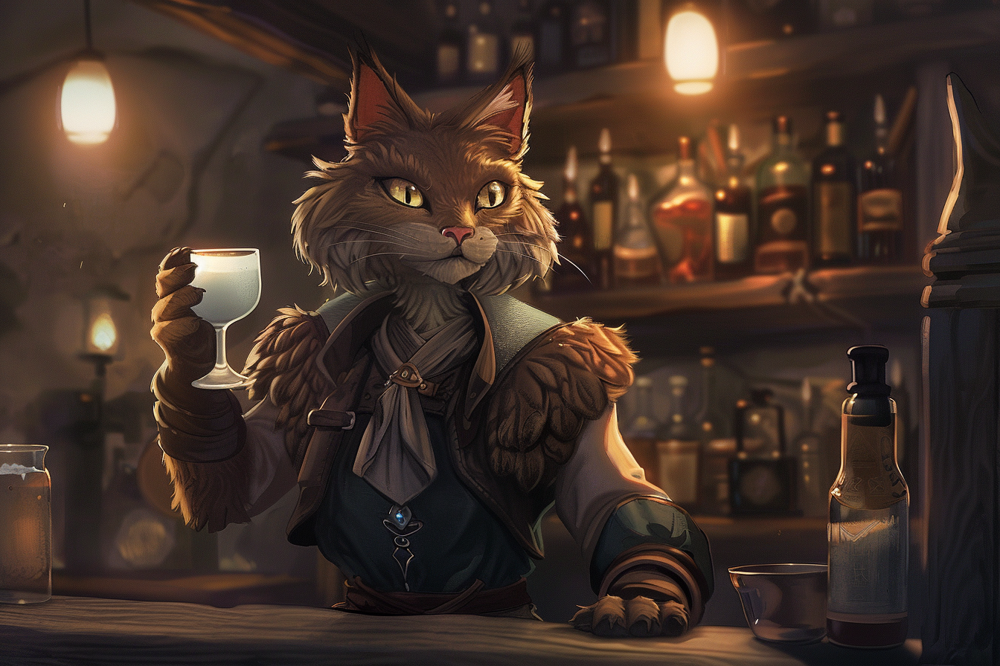

# :skull::skull::skull: Mila - Aubergiste :skull::skull::skull:

## Infos 

| Âge | Espèce | Occupation | Alignement | MBTI |
| --- | ------ | ---------- | ---------- | ---- |
| 27 ans | Felicis | Aubergiste | Chaotic Good | ESFP |

## Localisation actuelle
[**Dvolsti**](../../VILLES/Dvolsti.md)

## Filiations
* [**Rueko**](./Rueko.md) (sa femme)

## Groupes 

## Caractéristiques
* 

## Événements marquants
* **431** : A contracté un prêt avec son mari pour pouvoir vivre selon leurs hauts standards de vie.
* **13 Kegn 432** : Meurtre par [**Djibril Niil**](../ENFANTS_DE_LA_RUE/Djibril_Niil.md)

## Combat
S.O.

## Roleplay
* Ronronner les R