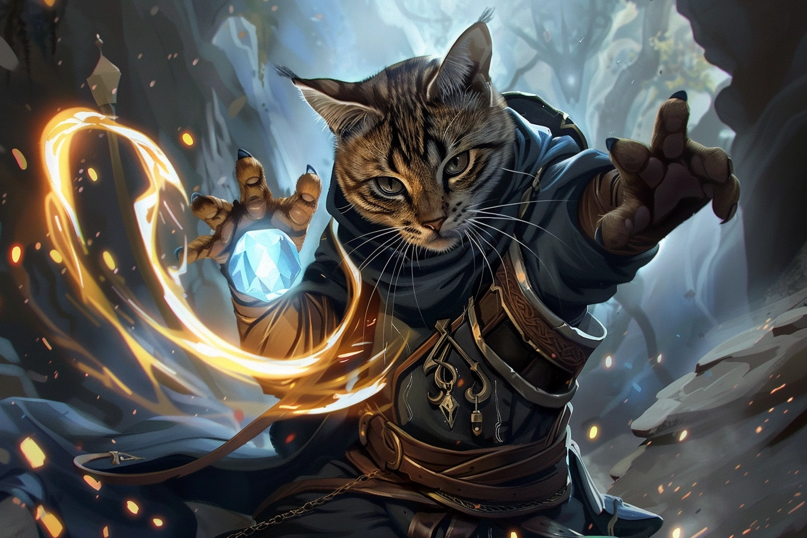
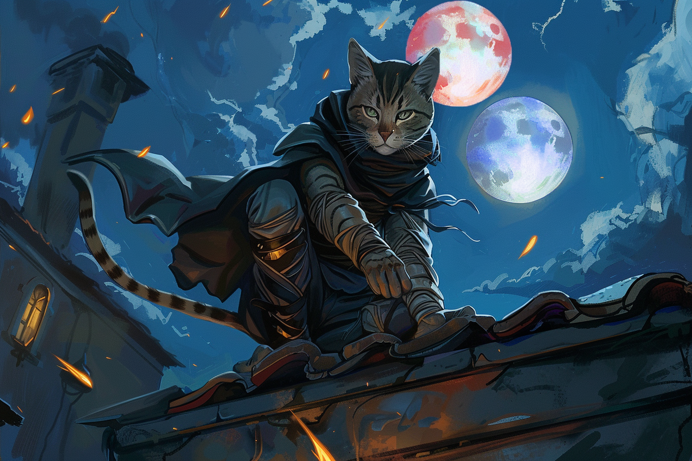

# Paumes-Bleues - Chef de division

## Infos 
| Âge | Espèce | Occupation | Alignement | MBTI |
| --- | ------ | ---------- | ---------- | ---- |
| 26 ans | Felicis/Sombraur | - | Lawful Neutral | INTJ |

## Localisation actuelle
[Dvolsti](../../VILLES/Dvolsti.md)

## Filiations
* [Griffes-Rouges](./Griffes_Rouges.md) (soeur)

## Groupes 
[Les Enfants de la Rue](./_Organisation.md)

## Caractéristiques
* Il occupe le rôle de chef de division en binôme avec sa soeur.
* Sa soeur et lui se montrent très méfiants vis-à-vis des autres membres des [**Enfants de la Rue**](../../VILLES/Dvolsti.md#les-enfants-de-la-rue).
* Depuis qu'il a appris la nature de la récompense promise par les [**Sombres Artistes**](../../VILLES/Rovtal.md#les-sombres-artistes) (devenir un [**Sombraur**](../../ESPECES/Especes_Magiques.md#sombraur)), il cherche à s'accaparer la récompense avec sa soeur. 
* Sa soeur et lui comptent assassiner [**Arkolapoulos**](./Arkolapoulos_Prunos.md) et réduire à néant les [**Enfants de la Rue**](../../VILLES/Dvolsti.md#les-enfants-de-la-rue) afin de faire régner le chaos en ville, afin de pouvoir se transformer en [**Sombraurs**](../../ESPECES/Especes_Magiques.md#sombraur).

## Événements marquants
* **13 Tewl 432** : A appris avec sa soeur l'identité des employeurs des [**Enfants de la Rue**](../../VILLES/Dvolsti.md#les-enfants-de-la-rue) pour la destruction du **stabilisateur de leyline** de [**Brumebourg**](../../VILLES/Brumebourg.md) : les [**Sombres Artistes**](../../VILLES/Rovtal.md#les-sombres-artistes) ; ainsi que la nature de la récompense promise à [**Arkolapoulos**](./Arkolapoulos_Prunos.md) : devenir un [**Sombraur**](../../ESPECES/Especes_Magiques.md#sombraur).
* **16 Tewl 432** : Avec sa soeur, entre en contact avec les [**Sombres Artistes**](../../VILLES/Rovtal.md#les-sombres-artistes) qui lui promettent de la transformer lui et sa soeur en **Sombraurs** pour peu qu'ils fassent régner le chaos dans [**Dvolsti**](../../VILLES/Dvolsti.md) en plus de détruire le stabilisateur de [**Brumebourg**](../../VILLES/Brumebourg.md). Cette promesse reviendrait à trahir [**Arkolapoulos**](./Arkolapoulos_Prunos.md)
* **14 Kegn 432** : S'allie avec sa soeur aux Aventuriers pour défaire [**Arkolapoulos**](../ENFANTS_DE_LA_RUE/Arkolapoulos_Prunos.md).
* **16 Kegn 432** : Découvre les expériences d'**Arkolapoulos** sur l'extraction de l'énergie magique des êtres vivants et le communique aux [Sombres Artistes](../../VILLES/Rovtal.md#les-sombres-artistes).
* **18 Kegn 432** : Devient un Sombraur après avoir livré les résultats des expériences d'Arkolapoulos à [**Federi Gox**](../SOMBRES_ARTISTES/Federi_Gox.md).

## Combat
[Stats](../../../STAT_BLOCKS/PERSONNAGES/PaumesBleues.md)

## Roleplay
* Thothoter
* Ronronner les R
