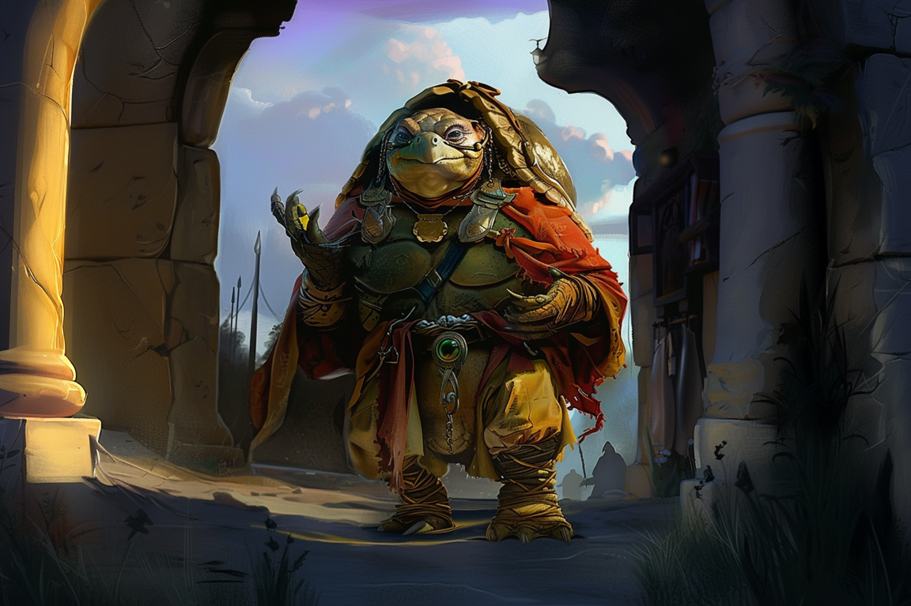

# Arkolapoulos Prunos - Leader

## Infos 
| Âge | Espèce | Occupation | Alignement | MBTI |
| --- | ------ | ---------- | ---------- | ---- |
| 185 ans | Tortuguéen | Leader | Lawful Evil | ENFJ |

## Localisation actuelle
[Dvolsti](../../VILLES/Dvolsti.md)

## Filiations
* [Cicéron Prunos Pupillus](./Cicéron_Prunos_Pupillus.md) (enfant adoptif)

## Groupes 
[Les Enfants de la Rue](./_Organisation.md)

## Caractéristiques
* Chef de l'entreprise [**Olives et Sardines**](../../VILLES/Dvolsti.md#olives-et-sardines).
* Fondateur du restaurant caritatif [**la Taverne Familiale**](../../VILLES/Dvolsti.md#la-taverne-familiale).
* C'est le plus grand chef d'entreprise de tout **Dvolsti**, et son manoir est de fait le plus beau bâtiment de toute la ville.
* Son fils adoptif, **Cicéron**,  est issu de l'activité de **trafic de personnes** qui est orchestrée par les **Enfants de la Rue**. Il ne le sait cependant pas.

## Événements marquants

## Combat