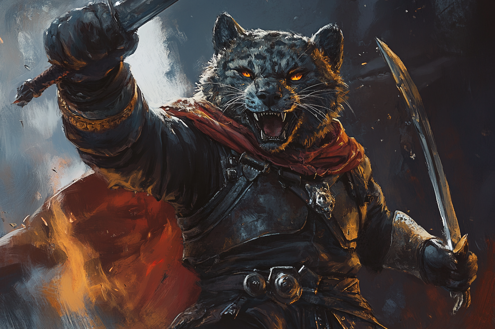
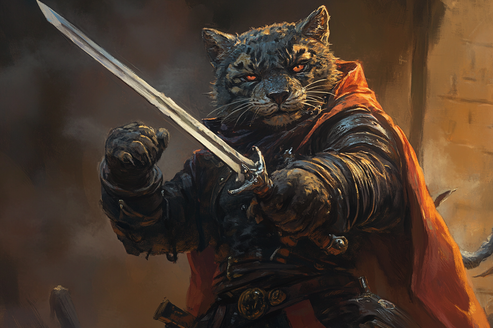

# :skull::skull::skull: Bakari Mikhaïl - Chef de groupe :skull::skull::skull:

## Infos 

| Âge | Espèce | Occupation | Alignement | MBTI |
| --- | ------ | ---------- | ---------- | ---- |
| 29 ans | Panthéran | Chef de groupe des Enfants de la Rue | Neutral Evil | ESTP |

## Filiations
* [**Kramer Grishka**](../BRUMEBOURG/Kramer_Grishka.md) (cousin)
* [**Bakari Phréoh**](./Bakari_Phéroh.md) (mentor)

## Groupes 
* [**Enfants de la Rue**](../../VILLES/Dvolsti.md#les-enfants-de-la-rue)

## Caractéristiques
* En tant que chef de groupe, il porte toujours sur lui le signe qui lui permet de s'identifier auprès des autres (une pièce avec l'emblème des Enfants de la Rue).
* Il provient d'une famille très modeste et s'est tourné vers les **Enfants de la Rue** afin de vivre dans un plus grand luxe. 
* Il est facilement appâté par le gain. 
* Il voit les personnes les plus faibles comme une simple ressource.
* Il a choisi son prénom d'adulte en hommage à son mentor, [Bakari Phéroh](./Bakari_Phéroh.md), qui l'a introduit au monde de la criminalité.

## Événements marquants
* **419** : A rejoint les **Enfants de la Rue**.
* **9 Kegn 432** : A été tué par [Patrik](../Patrik.md.md) lors de l'attaque de l'hôtel de ville de **Brumebourg**.

## Combat
[Stats](../../../STAT_BLOCKS/PERSONNAGES/BakariMikhail.md)