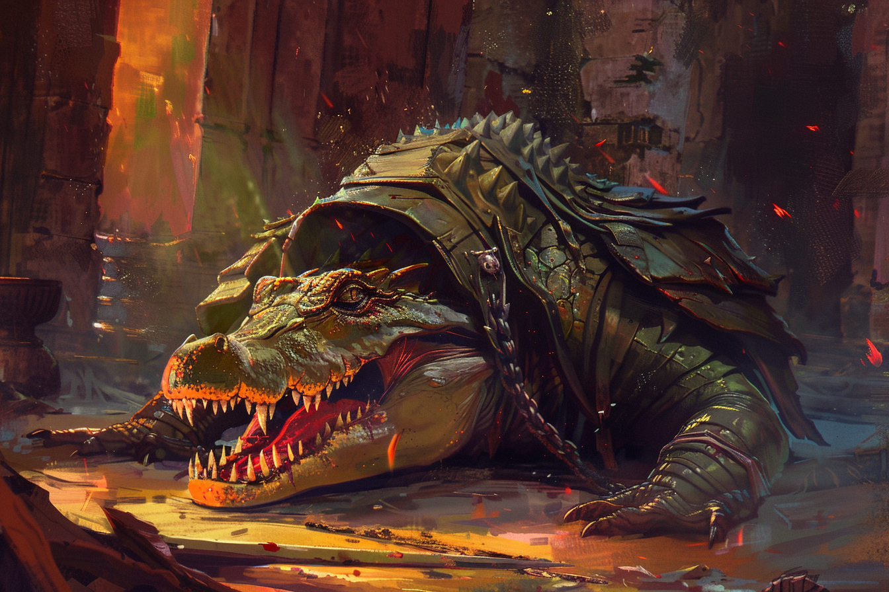

# :skull::skull::skull: Bakari Phéroh :skull::skull::skull: - Chef de division

## Infos 
| Âge | Espèce | Occupation | Alignement | MBTI |
| --- | ------ | ---------- | ---------- | ---- |
| 40 ans | Alligatoride | Chef de division | Lawful Evil | ENTJ |

## Localisation actuelle
[Dvolsti](../../VILLES/Dvolsti.md)

## Filiations
* [Bakari Mikhaïl](./Bakari_Mikhail.md) (pupille)

## Groupes 
[Les Enfants de la Rue](./_Organisation.md)

## Caractéristiques
* C'est le rival *cordial* de [Bakari Mikhaïl ](./Bakari_Mikhail.md).

## Événements marquants
* **15 Kegn 432** : Tué par les Aventuriers lors de l'assaut des [Oliveraies](../../VILLES/Dvolsti.md#les-oliveraies).

## Combat
[Stats](../../../STAT_BLOCKS/PERSONNAGES/BakariPhéroh.md)

