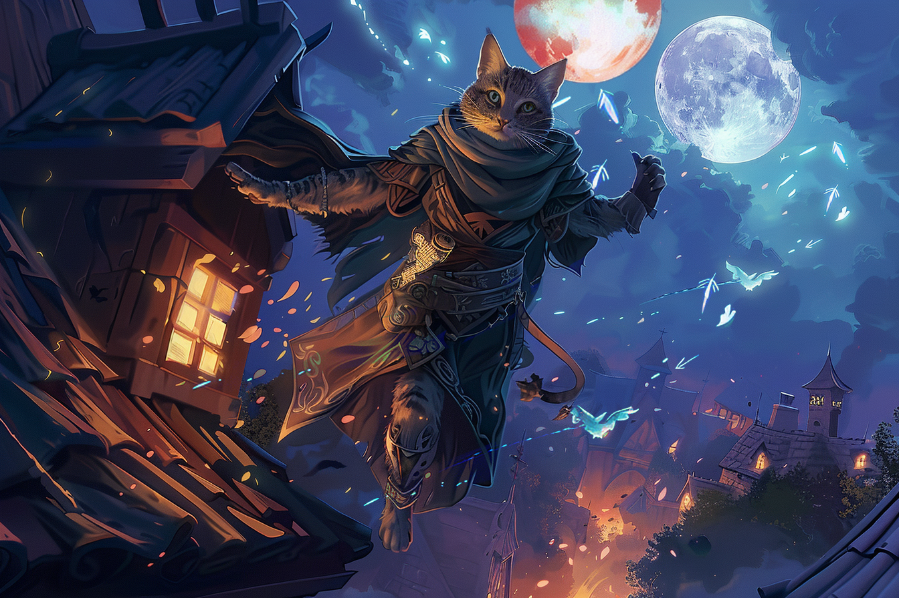

# Griffes-Rouges - Cheffe de division

## Infos 
| Âge | Espèce | Occupation | Alignement | MBTI |
| --- | ------ | ---------- | ---------- | ---- |
| 26 ans | Felicis | Cheffe de division | Lawful Neutral | INFJ |

## Localisation actuelle
[Dvolsti](../../VILLES/Dvolsti.md)

## Filiations
* [Paumes-Bleues](./Paumes_Bleues.md) (frère)

## Groupes 
[Les Enfants de la Rue](./_Organisation.md)

## Caractéristiques
* Elle occupe le rôle de cheffe de division en  binôme avec son frère.
* Elle a une ancienne dette envers [**Bakari Mikhaïl**](./Bakari_Mikhail.md), dont elle s'est acquittée en l'aidant à localiser le stabilisateur de leyline au sein de [Brumebourg](../../VILLES/Brumebourg.md) lors de la mission de sabotage des Enfants de la Rue de ce village.
* Son frère et elle se montrent très méfiants vis-à-vis des autres membres des [**Enfants de la Rue**](../../VILLES/Dvolsti.md#les-enfants-de-la-rue).
* Depuis qu'elle a appris la nature de la récompense promise par les [**Sombres Artistes**](../../VILLES/Rovtal.md#les-sombres-artistes) (devenir un [**Sombraur**](../../ESPECES/Especes_Magiques.md#sombraur)), elle cherche à s'accaparer la récompense avec son frère. 
* Son frère et elle comptent assassiner [**Arkolapoulos**](./Arkolapoulos_Prunos.md) et réduire à néant les [**Enfants de la Rue**](../../VILLES/Dvolsti.md#les-enfants-de-la-rue) afin de faire régner le chaos en ville, afin de pouvoir se transformer en [**Sombraurs**](../../ESPECES/Especes_Magiques.md#sombraur).

## Événements marquants
* **13 Tewl 432** : A appris avec son frère l'identité des employeurs des [**Enfants de la Rue**](../../VILLES/Dvolsti.md#les-enfants-de-la-rue) pour la destruction du **stabilisateur de leyline** de [**Brumebourg**](../../VILLES/Brumebourg.md) : les [**Sombres Artistes**](../../VILLES/Rovtal.md#les-sombres-artistes) ; ainsi que la nature de la récompense promise à [**Arkolapoulos**](./Arkolapoulos_Prunos.md) : devenir un [**Sombraur**](../../ESPECES/Especes_Magiques.md#sombraur).
* **16 Tewl 432** : Avec son frère, entre en contact avec les [**Sombres Artistes**](../../VILLES/Rovtal.md#les-sombres-artistes) qui lui promettent de la transformer elle et son frère en **Sombraurs** pour peu qu'ils fassent régner le chaos dans [**Dvolsti**](../../VILLES/Dvolsti.md) en plus de détruire le stabilisateur de [**Brumebourg**](../../VILLES/Brumebourg.md). Cette promesse reviendrait à trahir [**Arkolapoulos**](./Arkolapoulos_Prunos.md)
* **9 Kegn 432** : A aidé [Bakari Mikhaïl](./Bakari_Mikhail.md) pour son assaut de l'hôtel de ville de [**Brumebourg**](../../VILLES/Brumebourg.md).

## Combat
[Stats](../../../STAT_BLOCKS/PERSONNAGES/GriffeRouges.md)

## Roleplay 
* Ronronner les R