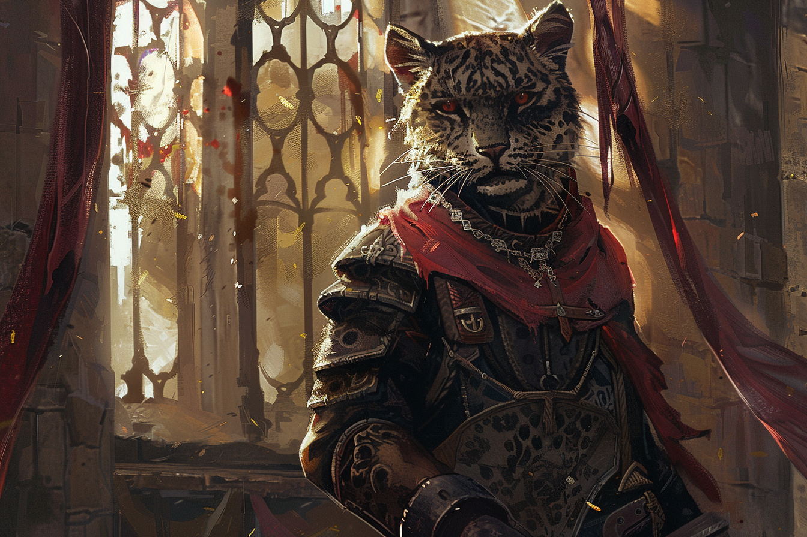

# Misha Vladimov - Chef de groupe

## Infos 
| Âge | Espèce | Occupation | Alignement | MBTI |
| --- | ------ | ---------- | ---------- | ---- |
| 28 ans | Panthéran | Chef de groupe | Lawful Evil | ISTJ |

## Localisation actuelle
[Dvolsti](../../VILLES/Dvolsti.md)

## Filiations
* 

## Groupes 
[Les Enfants de la Rue](./_Organisation.md) (Division des Renseignements)

## Caractéristiques
* Surnommé le Tortionnaire par les autres membres des **Enfants de la Rue**, il n'hésite pas à pousser ses victimes à bout afin d'avoir les informations qu'il convoite.

## Événements marquants

## Combat

## Roleplay
* Parler en "Tché" et en roulant les R.