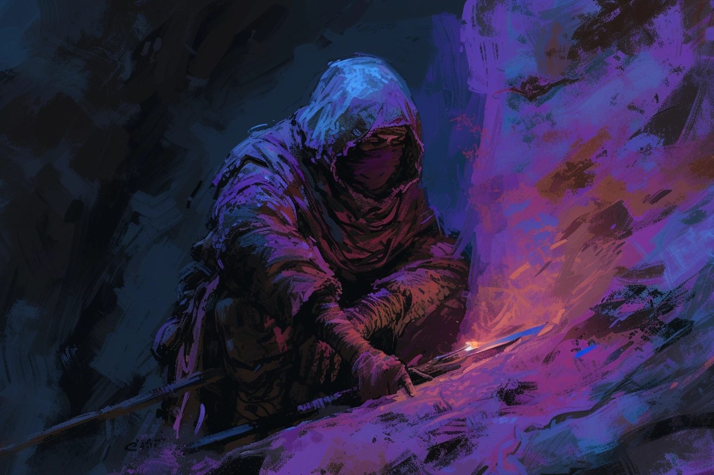

# :skull::skull::skull: Phane Miton - Membre :skull::skull::skull:

## Infos 
| Âge | Espèce | Occupation | Alignement | MBTI |
| --- | ------ | ---------- | ---------- | ---- |
| 31 ans | Humain | Membre | Lawful Evil | ISTJ |

## Localisation actuelle
[Dvolsti](../../VILLES/Dvolsti.md)

## Filiations
* 

## Groupes 
[Les Enfants de la Rue](./_Organisation.md)

## Caractéristiques
* Nouveau membre des **Enfants de la Rue**, cherche juste à faire ses preuves
* Ne parle quasiment jamais
* A un grief contre [**Bakari Mikhaïl**](./Bakari_Mikhail.md)

## Événements marquants
* **14 Kegn 432** : Assassinat par les **Aventuriers**

## Combat
[Stats](../../../STAT_BLOCKS/CLASS/CapitaineBandit.md)

## Roleplay
* Parler d'une voix basse et grave
* Parler rarement