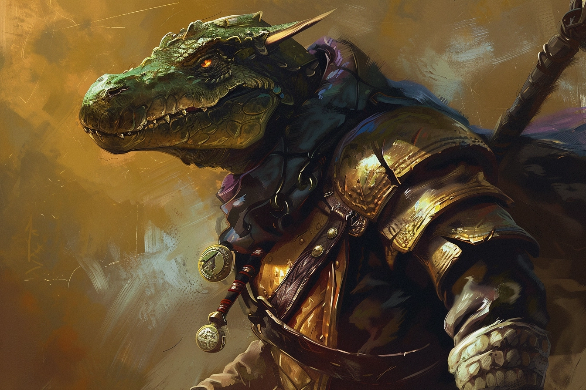
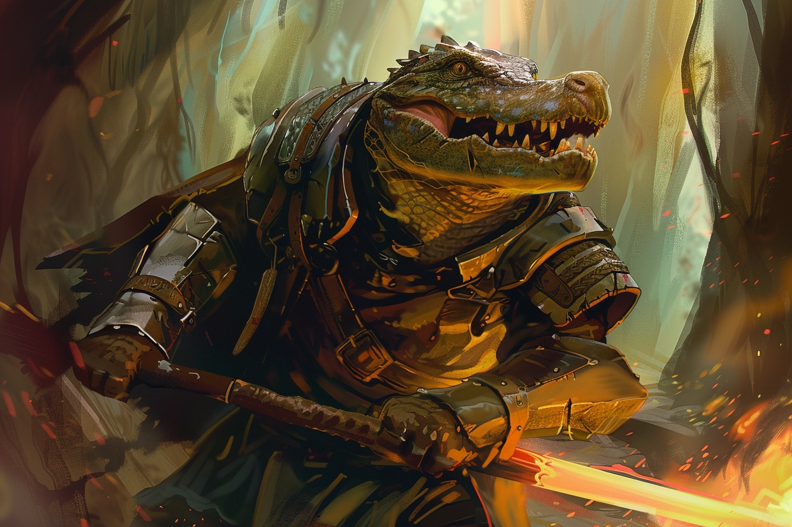
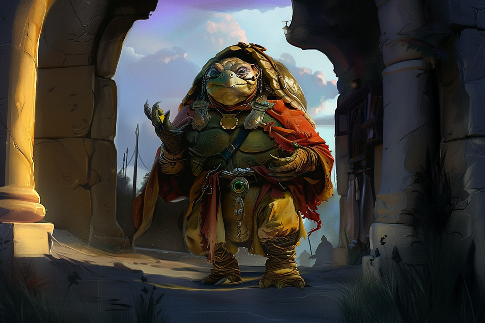

# Les Enfants de la Rue

## Les Enfants de la Rue - Division Armée

### Minno - Novice

* Nom : **Minno**
* Âge : **17 ans**
* Situation : **Emprisonné** ([Brumebourg](../../VILLES/Brumebourg.md))
* Espèce : **Felicis** (M)
* Alignement : **Chaotic Neutral**
* MBTI : **INTP**
* Filiations : **Enfants de la Rue** (novice)
* Description : 
    * Furtif et de nature méfiante envers tout le monde, il est souvent avec son amie [Fééli](#fééli---novice)
---

### Fééli - Novice

* Nom : **Fééli**
* Âge : **18 ans**
* Situation : **Emprisonné** ([Brumebourg](../../VILLES/Brumebourg.md))
* Espèce : **Felicis** (F)
* Alignement : **Chaotic Evil**
* MBTI : **ENFP**
* Filiations : **Enfants de la Rue** (novice)
* Description : 
    * Espiègle malgré tout, elle traîne toujours avec son ami de toujours, [Minno](#minno---novice)
---

### Grégwa Uut - Membre

* Nom : **Grégwa Uut**
* Âge : **27 ans**
* Situation : **Emprisonné** ([Brumebourg](../../VILLES/Brumebourg.md))
* Espèce : **Humain**
* Alignement : **True Neutral**
* MBTI : **ISTJ**
* Filiations : **Enfants de la Rue** (membre)
* Description : 
    * Il a réussi à faire ses preuves récemment au sein des Enfants de la Rue, il a la tâche de surveiller les quelques novices sous ses ordre, dont [Minno](#minno---novice) et [Fééli](#fééli---novice).
    * Il a rejoint les **Enfants de la Rue** parce qu'il voulait sortir de la pauvreté. 
    * Il a été recruté par quelqu'un de plus ancien et plus gradé que lui, et ne sait donc pas grand chose de l'organisation en elle-même.
    
---

### Bakari Mikhaïl - Chef de groupe

* Nom : **Bakari Mikhaïl**
* Âge : **29 ans**
* Situation : **Décédé** ([Brumebourg](../../VILLES/Brumebourg.md))
* Espèce : **Panthéran**
* Alignement : **Neutral Evil**
* MBTI : **ESTP**
* Filiations : **Enfants de la Rue** (chef de groupe), [**Kramer Grishka**](./Brumebourg.md#kramer-grishka---barman) (cousin), [**Bakari Phéroh**](#bakari-phéroh---chef-de-division) (mentor)
* Description : 
    * En tant que chef de groupe, il porte toujours sur lui le signe qui lui permet de s'identifier auprès des autres (une pièce avec l'emblème des Enfants de la Rue).
    * Il provient d'une famille très modeste et s'est tourné vers les **Enfants de la Rue** afin de vivre dans un plus grand luxe. 
    * Il est facilement appâté par le gain. 
    * Il a rejoint les **Enfants de la Rue** il y a déjà plus de 13 ans.
    * Il voit les membres les plus faibles comme une simple ressource.
    * Il a choisi son prénom d'adulte en hommage à son mentor, [Bakari Phéroh](#bakari-phéroh---chef-de-division), qui l'a introduit au monde de la criminalité.
    * Il a été tué par [**Patrik**](../PJ/Patrik.md) alors qu'il menait un assaut sur le stabilisateur de leyline de [**Brumebourg**](../../VILLES/Brumebourg.md).
    
---

### Djibril Niil - Chef de groupe

* Nom : **Djibril Niil**
* Âge : **33 ans**
* Espèce : **Alligatoride**
* Alignement : **Chaotic Evil**
* MBTI : **INTP**
* Filiations : **Enfants de la Rue** (chef de groupe)
* Description : 
    * C'est le rival *cordial* de [Bakari Mikhaïl](#bakari-mikhaïl---chef-de-groupe).
    
---

### Bakari Phéroh - Chef de division

* Nom : **Bakari Mikhaïl**
* Âge : **40 ans**
* Espèce : **Alligatoride**
* Alignement : **Lawful Evil**
* MBTI : **ENTJ**
* Filiations : **Enfants de la Rue** (chef de division), [**Bakari Mikhaïl**](#bakari-mikhaïl---chef-de-groupe) (pupille)
* Description : 
    * 

## Les Enfants de la Rue - Division des Renseignements

### Griffes-Rouges - Cheffe de division

* Nom : **Griffes-Rouges**
* Âge : **26 ans**
* Espèce : **Felicis**
* Alignement : **Lawful Neutral**
* MBTI : **INFJ**
* Filiations : **Enfants de la Rue** (cheffe de division), [**Paumes-Bleues**](#paumes-bleues---chef-de-division) (frère)
* Description : 
    * Elle occupe le rôle de cheffe de division en  binôme avec son frère.
    * Elle a une ancienne dette envers [**Bakari Mikhaïl**](#bakari-mikhaïl---chef-de-groupe), dont elle s'est acquittée en l'aidant à localiser le stabilisateur de leyline au sein de [Brumebourg](../../VILLES/Brumebourg.md) lors de la mission de sabotage des Enfants de la Rue de ce village.
    
---

### Paumes-Bleues - Chef de division

* Nom : **Paumes-Bleues**
* Âge : **26 ans**
* Espèce : **Felicis**
* Alignement : **Lawful Neutral**
* MBTI : **INTJ**
* Filiations : **Enfants de la Rue** (chef de division), [**Griffes-Rouges**](#griffes-rouges---cheffe-de-division) (soeur)
* Description : 
    * Il occupe le rôle de chef de division en binôme avec sa soeur.

## Les Enfants de la Rue - Division Logistique

### Elvira Phrodita - Cheffe de division

* Nom : **Elvira Phrodita**
* Âge : **37 ans**
* Espèce : **Saurienne**
* Alignement : **True Neutral**
* MBTI : **ENTP**
* Filiations : **Enfants de la Rue** (cheffe de division)
* Description : 
    * 

## Les Enfants de la Rue - Etat Major

### Arkolapoulos Prunos - Leader

* Nom : **Arkolapoulos Prunos**
* Âge : **185 ans**
* Espèce : **Tortuguéen**
* Alignement : **Lawful Evil**
* MBTI : **ENFJ**
* Filiations : **Enfants de la Rue** (Leader)
* Description : 
    * 
    
---

### Cicéron Prunos Pupillus - Bras Droit

* Nom : **Arkolapoulos Prunos**
* Âge : **32 ans**
* Espèce : **Centaure**
* Alignement : **True Neutral**
* MBTI : **ISFP**
* Filiations : **Enfants de la Rue** (Bras Droit)
* Description : 
    * 
    
---
