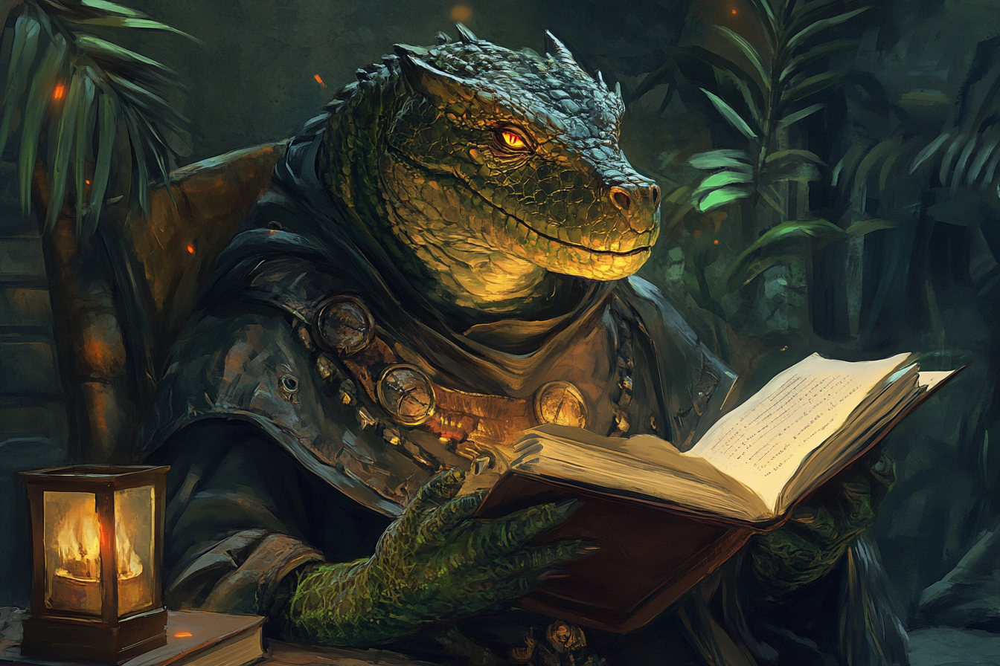

# Georgios Botzaris - Chef de la Guilde des Ingénieurs

## Infos 

| Âge | Espèce | Occupation | Alignement | MBTI |
| --- | ------ | ---------- | ---------- | ---- |
| 51 ans | Saurien | Chef de la Guilde des Ingénieurs | True Neutral| INTP |

## Localisation actuelle
[**Rovtal**](../../VILLES/Rovtal.md)

## Filiations
* [Vladimeros Botzaris](./VladimerosBotzaris.md) - Fils

## Groupes 
* [La Guilde des Ingénieurs](../../../WORLDBUILDING/VILLES/Rovtal.md#la-guilde-des-ingénieurs)

## Caractéristiques
* 

## Événements marquants
* **417** : Devient chef de la guilde des ingénieurs

## Combat
S.O.

## Roleplay
* Pauses sauriennes
* Parler calmement et être posé
* Divaguer de temps en temps