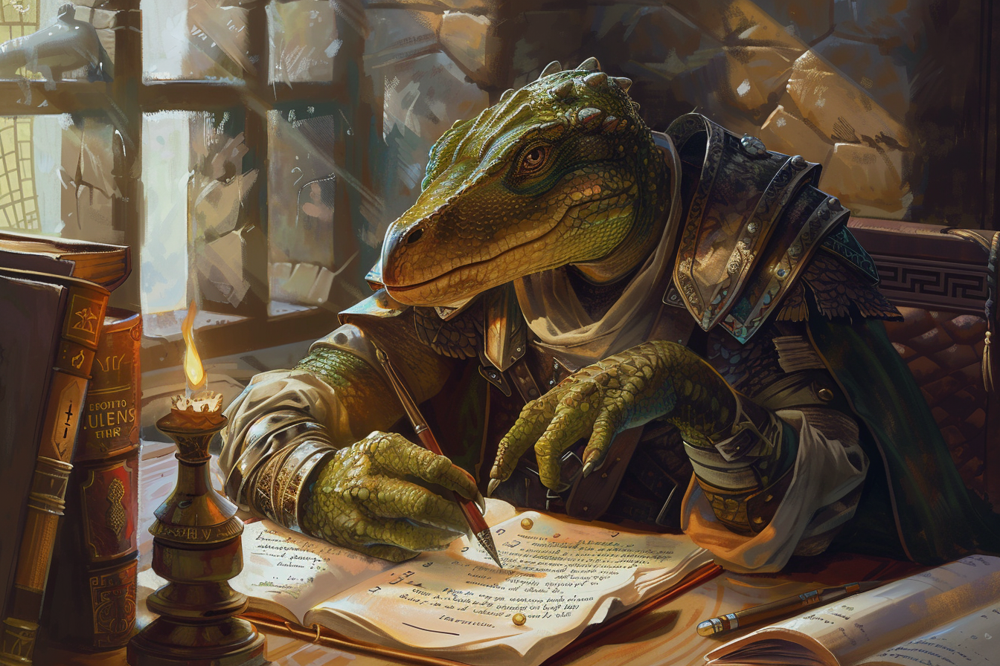

# Vladimeros Botzaris - Intendant de la Guilde des Ingénieurs

## Infos 

| Âge | Espèce | Occupation | Alignement | MBTI |
| --- | ------ | ---------- | ---------- | ---- |
| 27 ans | Saurien | Intendant de la guilde des Ingénieurs | Lawful Neutral| ENTJ |

## Localisation actuelle
[**Rovtal**](../../VILLES/Rovtal.md)

## Filiations
* [Georgios Botzaris](./GeorgiosBotzaris.md) - Père

## Groupes 
* [La Guilde des Ingénieurs](../../../WORLDBUILDING/VILLES/Rovtal.md#la-guilde-des-ingénieurs)

## Caractéristiques
* Il fait également la visite guidée de la Guilde des Ingénieurs à tous les visiteurs qui viennent, et leur présente les projets du moment.

## Événements marquants
* **417** : Devient chef de la guilde des ingénieurs

## Combat
S.O.

## Roleplay
* Pauses sauriennes
* Parler calmement et être posé
* Divaguer de temps en temps