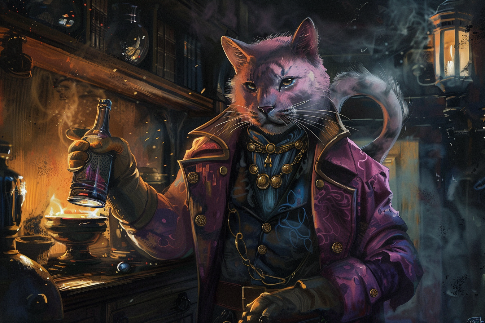

# Wardi Piotr - Détective 

## Infos 

| Âge | Espèce | Occupation | Alignement | MBTI |
| --- | ------ | ---------- | ---------- | ---- |
| 36 ans | Panthéran | Détective | Chaotic Good | ENTP |

## Localisation actuelle
(Enquête) [**Dvolsti**](../../VILLES/Dvolsti.md)

## Filiations
* 

## Groupes 
* [**Police de Rovtal**](./GROUPES/Police_de_Rovtal.md)

## Caractéristiques
* Mage émérite, il s'est hissé très vite dans la police de **Rovtal** grâce à ses facultés de déduction, de persuasion, et à sa magie.

## Événements marquants
* **410** : Lorsqu'il était enfant, ses expérimentations sur ses capacités magiques ont mal tourné, et tout son pelage noir est devenu rose. C'est après cet événement qu'il a décidé de s'appeler **Wardi** qui est un mot **Alligatoride** voulant dire *rose*.
* **2 Kegn 429** : A fait le déplacement depuis [**Rovtal**](../../VILLES/Rovtal.md) pour enquêter sur les [**Enfants de la Rue**](../../VILLES/Dvolsti.md#les-enfants-de-la-rue), et notamment sur le trafic de cristaux magiques.

## Combat
S.O.