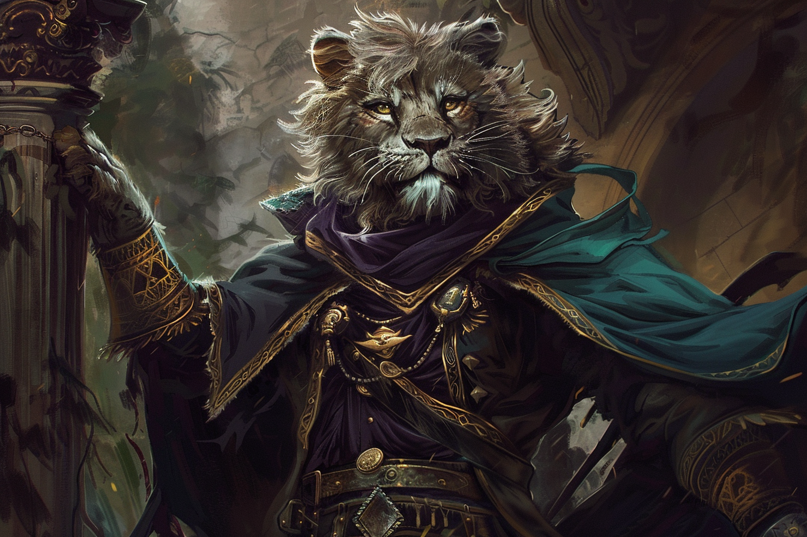
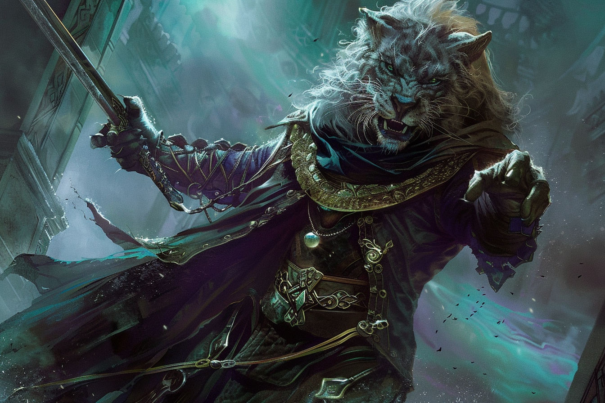

# Alvaro Shenzi - Main Noire

## Infos 
| Âge | Espèce | Occupation | Alignement | MBTI |
| --- | ------ | ---------- | ---------- | ---- |
| 432 ans | Léonin / Sombraur | Main Noire | Neutral Evil | ENTP |

## Localisation actuelle
[Rovtal](../../VILLES/Rovtal.md)

## Filiations

## Groupes 
[Les Sombres Artistes](../../VILLES/Rovtal.md#les-sombres-artistes)

## Caractéristiques
* Un véritable montre, il aime faire souffrir ses victimes en plus de leur arracher de l'énergie magique.
* C'est [Federi Gox](./Federi_Gox.md) qui l'a élevé, recueilli après que **Federi** ait anéanti son clan.
* Il n'est pas élevé dans le secret de l'identité de **Federi**, et insiste pour être transformé, ce qu'il acceptera une fois **Alvaro** devenu adulte.

## Événements marquants
* **0** : Naissance, puis [**catastrophe magique**](../../AUTRES/CatastropheMagique.md), son clan peine à survivre.
* **1** : Son clan, très affaibli, rencontre [**Federi Gox**](./Federi_Gox.md), qui n'avait pas consommé de magie depuis longtemps. La rencontre est fatale pour beaucoup d'entre eux, sauf **Alvaro**, que **Federi** recueille car il n'arrive pas à le tuer.
* **21** : Transformation d'[Alvaro](./Alvaro_Shenzi.md) par [**Federi Gox**](./Federi_Gox.md).
* **37** : Rencontre avec [**Maria Ufassa**](./Maria_Ufassa.md).
* **95** : Installation à [**Rovtal**](../../VILLES/Rovtal.md).

## Combat

## Roleplay
* Accent espagnol
* Très aggressif